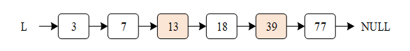

# Rust 改写 RT-Thread 系统 可行性报告
**OooooS小组(罗浩民 陈琳波 刘时 赵于洋 李丁)**

## 目录
- [Rust 改写 RT-Thread 系统 可行性报告](#rust-改写-rt-thread-系统-可行性报告)
  - [目录](#目录)
  - [1 理论依据](#1-理论依据)
    - [1.1 RT-Thread内核分析](#11-rt-thread内核分析)
      - [1.1.1 线程管理](#111-线程管理)
        - [线程控制块](#线程控制块)
        - [调度过程](#调度过程)
        - [系统线程](#系统线程)
        - [线程栈](#线程栈)
        - [线程切换](#线程切换)
        - [rust改写方案](#rust改写方案)
      - [1.1.2 内存管理](#112-内存管理)
        - [具体管理方式](#具体管理方式)
        - [使用 Rust 进行改写分析](#使用-rust-进行改写分析)
        - [可能的解决方案](#可能的解决方案)
      - [1.1.3 时钟管理](#113-时钟管理)
        - [clock.c](#clockc)
        - [timer.c](#timerc)
      - [1.1.4 线程间同步与通信](#114-线程间同步与通信)
        - [模块内容与特点](#模块内容与特点)
        - [Rust改写的考虑](#rust改写的考虑)
      - [1.1.5 中断管理](#115-中断管理)
        - [模块内容与特点](#模块内容与特点-1)
        - [提供的服务](#提供的服务)
        - [Rust改写的可行性分析](#rust改写的可行性分析)
        - [可能的解决方案](#可能的解决方案-1)
      - [1.1.6 原子操作](#116-原子操作)
        - [模块内容与特点](#模块内容与特点-2)
        - [提供的服务](#提供的服务-1)
        - [Rust改写的可行性分析](#rust改写的可行性分析-1)
        - [可能的解决方案](#可能的解决方案-2)
    - [1.2 Rust改写的可行性](#12-rust改写的可行性)
  - [2 技术依据](#2-技术依据)
    - [2.1 Rust与C的联合编译](#21-rust与c的联合编译)
      - [2.1.1 Cargo](#211-cargo)
        - [Rust调用C](#rust调用c)
        - [C 调用 Rust](#c-调用-rust)
      - [2.1.2 Scons](#212-scons)
        - [SCons介绍](#scons介绍)
        - [SCons构建Rust和C交叉编译的优势](#scons构建rust和c交叉编译的优势)
        - [SCons构建RT-Thread的优势](#scons构建rt-thread的优势)
        - [劣势与挑战](#劣势与挑战)
        - [使用Scons生成C的静态库](#使用scons生成c的静态库)
        - [Scons下在C中调用rust生成的静态库](#scons下在c中调用rust生成的静态库)
      - [2.1.3 meson](#213-meson)
        - [Meson介绍](#meson介绍)
        - [配置meson系统环境](#配置meson系统环境)
        - [创建Meson测试项目](#创建meson测试项目)
        - [目标主机架构](#目标主机架构)
        - [可能存在的问题](#可能存在的问题)
      - [2.1.4 构建框架选择](#214-构建框架选择)
      - [2.1.5 rttrust 工具介绍](#215-rttrust-工具介绍)
    - [2.2 调试与验证的可行性](#22-调试与验证的可行性)
      - [rt-thread 启动流程与移植目录结构分析](#rt-thread-启动流程与移植目录结构分析)
      - [PlatformIO平台简介以及编译流程分析](#platformio平台简介以及编译流程分析)
      - [上板运行——基于CubeMX+PlatformIO+rt-thread的部署方法](#上板运行基于cubemxplatformiort-thread的部署方法)
      - [模拟器验证方案](#模拟器验证方案)
        - [QEMU简介](#qemu简介)
        - [模拟](#模拟)
        - [调试](#调试)
  - [3 参考文献](#3-参考文献)

## 1 理论依据
### 1.1 RT-Thread内核分析
#### 1.1.1 线程管理

RT-Thread 中的线程采用抢占式调度机制，同时支持时间片轮转调度方式。高优先级线程可以打断低优先级线程，而低优先级线程只有在高优先级线程阻塞或结束后才能获得调度权。

系统支持 256 个优先级（0 到 255），数值越小优先级越高。优先级 0 是最高优先级，255 分配给空闲线程使用，用户通常不使用。在资源紧张的系统中，可以根据实际需求选择支持 8 或 32 个优先级。

当所有就绪线程都链接到对应的优先级队列时，调度器会通过位图算法快速定位最高优先级的线程。位图算法的时间复杂度为 O(1)，与就绪线程的数量无关。

RT-Thread 内核允许创建相同优先级的线程。相同优先级的线程采用时间片轮转方式进行调度，只有在没有更高优先级就绪线程时才有效。系统中的线程数量不受限制，仅取决于系统提供的内存资源。调度器会尽可能保证高优先级线程的运行。

线程调度的原则是：当线程状态发生变化，并且当前运行的线程优先级低于优先级队列中最高优先级时，会立即进行线程切换（除非系统处于中断处理或禁止切换的状态）。

##### 线程控制块

线程控制块（`rt_thread`）用于管理线程的属性和状态，包括：

- 线程名称、类型和标志位
- 栈指针、入口函数指针、参数、栈地址和栈大小
- 错误代码和线程状态
- 当前优先级和初始优先级
- 内置线程定时器和退出清除函数

线程控制块通过链表（`rt_list_t`）存储，链表服务在 `rtservice.c` 中实现，线程相关行为在 `thread.c` 中定义。

##### 调度过程

调度函数 `rt_schedule` 的主要逻辑如下：

1. 禁用中断，保护临界区。
2. 检查调度器是否启用。
3. 获取最高优先级的就绪线程。
4. 如果当前线程优先级低于最高优先级，切换到最高优先级线程。
5. 保存当前线程的上下文，恢复目标线程的上下文。
6. 启用中断，完成调度。

```c
void rt_schedule(void)
{
    rt_base_t level;
    struct rt_thread *to_thread;
    struct rt_thread *from_thread;

    /* disable interrupt */
    level = rt_hw_interrupt_disable();

    /* check the scheduler is enabled or not */
    if (rt_scheduler_lock_nest == 0)
    {
        rt_ubase_t highest_ready_priority;

        if (rt_thread_ready_priority_group != 0)
        {
            /* need_insert_from_thread: need to insert from_thread to ready queue */
            int need_insert_from_thread = 0;

            to_thread = _scheduler_get_highest_priority_thread(&highest_ready_priority);

            if ((rt_current_thread->stat & RT_THREAD_STAT_MASK) == RT_THREAD_RUNNING)
            {
                if (rt_current_thread->current_priority < highest_ready_priority)
                {
                    to_thread = rt_current_thread;
                }
                else if (rt_current_thread->current_priority == highest_ready_priority && (rt_current_thread->stat & RT_THREAD_STAT_YIELD_MASK) == 0)
                {
                    to_thread = rt_current_thread;
                }
                else
                {
                    need_insert_from_thread = 1;
                }
                rt_current_thread->stat &= ~RT_THREAD_STAT_YIELD_MASK;
            }

            if (to_thread != rt_current_thread)
            {
                /* if the destination thread is not the same as current thread */
                rt_current_priority = (rt_uint8_t)highest_ready_priority;
                from_thread         = rt_current_thread;
                rt_current_thread   = to_thread;

                RT_OBJECT_HOOK_CALL(rt_scheduler_hook, (from_thread, to_thread));

                if (need_insert_from_thread)
                {
                    rt_schedule_insert_thread(from_thread);
                }

                rt_schedule_remove_thread(to_thread);
                to_thread->stat = RT_THREAD_RUNNING | (to_thread->stat & ~RT_THREAD_STAT_MASK);

                /* switch to new thread */
                RT_DEBUG_LOG(RT_DEBUG_SCHEDULER,
                        ("[%d]switch to priority#%d "
                         "thread:%.*s(sp:0x%08x), "
                         "from thread:%.*s(sp: 0x%08x)\n",
                         rt_interrupt_nest, highest_ready_priority,
                         RT_NAME_MAX, to_thread->name, to_thread->sp,
                         RT_NAME_MAX, from_thread->name, from_thread->sp));

                if (rt_interrupt_nest == 0)
                {
                    extern void rt_thread_handle_sig(rt_bool_t clean_state);

                    RT_OBJECT_HOOK_CALL(rt_scheduler_switch_hook, (from_thread));

                    rt_hw_context_switch((rt_ubase_t)&from_thread->sp,
                            (rt_ubase_t)&to_thread->sp);

                    /* enable interrupt */
                    rt_hw_interrupt_enable(level);

                    goto __exit;
                }
                else
                {
                    RT_DEBUG_LOG(RT_DEBUG_SCHEDULER, ("switch in interrupt\n"));

                    rt_hw_context_switch_interrupt((rt_ubase_t)&from_thread->sp,
                            (rt_ubase_t)&to_thread->sp);
                }
            }
            else
            {
                rt_schedule_remove_thread(rt_current_thread);
                rt_current_thread->stat = RT_THREAD_RUNNING | (rt_current_thread->stat & ~RT_THREAD_STAT_MASK);
            }
        }
    }

    /* enable interrupt */
    rt_hw_interrupt_enable(level);

__exit:
    return;
}
```

##### 系统线程

- **空闲线程**：系统创建的最低优先级线程，状态始终为就绪态。当没有其他就绪线程时，调度器会切换到空闲线程。空闲线程用于回收被删除线程的资源，并提供钩子函数接口以执行功耗管理、看门狗喂狗等任务。
- **主线程**：系统启动时创建，入口函数为 `main_thread_entry()`，用户的应用程序入口函数 `main()` 从这里开始运行。

##### 线程栈

线程栈的初始化函数 `rt_hw_stack_init` 用于设置线程的栈帧，包括：

- 初始化寄存器（r0-r12、lr、pc、psr 等）
- 设置入口函数、参数和退出函数
- 返回初始化后的栈地址

##### 线程切换

线程切换通过汇编代码实现，主要步骤包括：

1. **中断控制**：
    - `rt_hw_interrupt_disable`：禁用全局中断，保护临界区。
    - `rt_hw_interrupt_enable`：恢复中断状态。
2. **上下文切换**：
    - 触发 PendSV 异常，延迟上下文切换。
    - 保存当前线程的寄存器状态到栈，恢复目标线程的寄存器状态。
3. **首次任务切换**：
    - 设置目标线程的栈指针，确保高优先级中断可抢占。
4. **硬件异常处理**：
    - `HardFault_Handler`：处理硬件异常，保存寄存器状态并调用错误分析函数。

**关键数据结构与寄存器**

- **PRIMASK**：控制全局中断使能，1 表示禁止中断。
- **PSP/MSP**：线程栈指针（PSP）和主栈指针（MSP），区分任务与内核栈。
- **ICSR**：中断控制寄存器，用于触发 PendSV 异常。
- **SHPR3**：设置 PendSV 和 SysTick 的异常优先级，确保切换可被抢占。

##### rust改写方案
原有汇编相关代码保持不变

- `context_XXX.S`
- `cpuport.c`

对结构体可以添加零成本抽象来易于阅读和使用。
涉及的算法与数据结构：
- 查找最高优先级
    - 位图算法：原理是通过预计算表与分层检测实现高效的位扫描操作。
- 就绪列表
    - 对每个优先级各维护一个链表
- 线程栈

#### 1.1.2 内存管理
RT-Thread 提供了多种内存管理方式，以适应不同应用需求：

1. 动态内存堆管理：通过堆管理器在运行时动态分配和释放内存，支持小内存管理、slab 管理和 memheap 管理算法。
2. 静态内存池管理：预先分配固定大小的内存块，提高分配效率并减少碎片化。

##### 具体管理方式

1. **小内存管理算法**：通过维护一个包含数据头的链表来管理内存块。数据头包含 magic 字段（用于检测非法访问）和 used 字段（标记当前内存块是否被分配）。
2. **Slab 管理算法**：基于对象大小划分多个区（zone），每个 zone 包含多个 slab，每个 slab 由多个固定大小的内存块组成。这种方法减少了内存碎片，提高了分配效率。
3. **Memheap 管理算法**：允许多个地址不连续的内存堆联合管理，提高了系统的灵活性。在分配内存时，系统会优先从默认内存堆分配，若不足则从其它堆中分配。
4. **静态内存池管理**：在初始化时分配一块固定大小的内存，并将其划分为多个相同大小的块。线程在内存不足时可以挂起，等待可用内存块。

##### 使用 Rust 进行改写分析

**优势**

Rust 语言的内存安全特性可以减少传统 C 语言实现中的内存泄漏和悬空指针问题，同时 Rust 的类型系统和借用检查器可以提供编译时安全保障。

```c
// RT-Thread 传统 C 语言内存管理示例
void *rt_malloc(rt_size_t size) {
    struct mem_block *block = find_free_block(size);
    if (block) {
        block->used = 1;
        return (void *)(block + 1);
    }
    return NULL;
}
```

上述 C 语言实现的 `rt_malloc` 函数首先调用 `find_free_block(size)` 查找适合的空闲内存块。如果找到，则将其 `used` 标记为 1，并返回指向该内存块的指针。如果找不到合适的块，则返回 `NULL`，表示分配失败。然而，这种实现依赖手动管理 `used` 状态，容易导致内存泄漏或悬空指针问题。

rustCopy

```rust
// Rust 版本的内存管理示例
struct MemBlock {
    size: usize,
    used: bool,
}

fn allocate(size: usize) -> Option<&'static mut MemBlock> {
    let block = find_free_block(size)?;
    block.used = true;
    Some(block)
}
```

Rust 版本的 `allocate` 函数利用 `Option` 处理分配失败的情况，避免 `NULL` 指针。`find_free_block(size)?` 使用 `?` 操作符，若找不到合适的内存块，则自动返回 `None`，减少显式错误处理代码。此外，Rust 的所有权系统能确保 `block` 在生命周期内不会被误用，从根本上杜绝 use-after-free 错误。

Rust 的主要优势体现在以下几个方面。首先，内存安全性是其最突出的特点。Rust 的所有权系统能够有效防止 C 语言中常见的野指针和 use-after-free 错误，使得内存管理更加可靠。其次，Rust 在多线程环境下提供了更高的线程安全性。其无锁并发数据结构能够减少线程间的竞争，提高系统稳定性。此外，Rust 具有良好的模块化和可维护性。相比于 C 语言，Rust 更加强调代码的可读性和抽象能力，使得开发和维护更加高效。

**挑战**

将 RT-Thread 内存管理用 Rust 改写面临以下挑战：

- 实时性要求高，Rust 默认的内存管理方式（如 `Rc`、`Arc`）可能引入非确定性延迟。
- 需要兼容 C API，RT-Thread 的大部分 API 是用 C 语言编写的，Rust 需要与现有 C 代码进行交互。
- 嵌入式资源占用少，但是 Rust 运行时相比 C 可能占用更 多的 ROM 和 RAM，可能不适合资源极为有限的设备。

##### 可能的解决方案

为减少 Rust 的额外开销并兼容 RT-Thread 的实时性需求，可考虑：

- 使用 Rust 语言改写核心数据结构，如内存块管理。
- 采用 **无锁并发** 方案，替换标准 `Mutex` 以避免优先级反转。
- 同时可以考虑仅在高风险模块（如动态内存管理）使用 Rust，而保留性能关键部分的 C 代码

**总结**

> Rust 的内存安全机制和类型系统可有效避免 C 语言中常见的内存泄漏与悬空指针问题，提升系统可靠性。在多线程环境中，Rust 也具备更高的线程安全性。但是，Rt-Thread对实时性和资源占用的严格要求使得直接替换存在挑战。所以可以考虑采用局部重构策略，仅在高风险模块中引 Rust，并结合无锁并发设计与 C 接口兼容方案，从而在不牺牲性能的前提下提高系统安全性和可维护性。

#### 1.1.3 时钟管理


##### clock.c

`clock.c`中提供了关于系统时钟的获取，更改，自增的逻辑以及关于从毫秒转为系统时钟滴答数的逻辑，具体的分析如下：

管理时钟节拍长度的宏：`RT_TICK_PER_SECOND`，在`rtconfig.h`中，默认为1000个/秒，即每个时钟节拍1ms。

**时钟节拍的获取：**

```c
rt_tick_t rt_tick_get(void)
{
    /* return the global tick */
    return rt_tick;
}
RTM_EXPORT(rt_tick_get);//使这个函数可以被其他模块访问
```

**时钟节拍的修改：**

```c
void rt_tick_set(rt_tick_t tick)
{
    rt_base_t level;

    level = rt_hw_interrupt_disable();
    rt_tick = tick;
    rt_hw_interrupt_enable(level);
}//原子操作，需要关开中断
```

**时钟节拍自增的逻辑，这是时间片轮转调度的核心：**

```c
void rt_tick_increase(void)
{
    struct rt_thread *thread;
    rt_base_t level;

    level = rt_hw_interrupt_disable();//关中断
    
    ++ rt_tick;//时钟节拍递增

    /* check time slice */
    thread = rt_thread_self();//获取当前线程

    -- thread->remaining_tick;
    if (thread->remaining_tick == 0)//如果当前线程到时间
    {
        /* change to initialized tick */
        thread->remaining_tick = thread->init_tick;
        thread->stat |= RT_THREAD_STAT_YIELD;//通知调度器这个线程需要被调度

        rt_hw_interrupt_enable(level);//开中断
        rt_schedule();//触发调度
    }
    else//否则继续当前线程
    {
        rt_hw_interrupt_enable(level);
    }

    /* check timer */
    rt_timer_check();//检查定时器，具体见后文定时器部分解析
}
```

时钟节拍自增由配置为中断触发模式的硬件定时器产生，当中断到来时，将调用一次：`void rt_tick_increase(void)`，通知操作系统已经过去一个系统时钟。具体的：

```c
void SysTick_Handler(void)
{
    /* 进入中断 */
    rt_interrupt_enter();
    
    rt_tick_increase();
    /* 退出中断 */
    rt_interrupt_leave();
}
```

最后是两个为用户态设计的函数，一个函数把用户输入的毫秒数转化为系统时钟数，一个返回系统运行到现在过去了多少毫秒（要求时钟节拍时间是1ms的整数倍）

```c
rt_tick_t rt_tick_from_millisecond(rt_int32_t ms)
{
    rt_tick_t tick;

    if (ms < 0)
    {
        tick = (rt_tick_t)RT_WAITING_FOREVER;//永远等待下去
    }
    else
    {
        tick = RT_TICK_PER_SECOND * (ms / 1000);
        tick += (RT_TICK_PER_SECOND * (ms % 1000) + 999) / 1000;
    }

    /* return the calculated tick */
    return tick;
}
RTM_EXPORT(rt_tick_from_millisecond);
```

```c
RT_WEAK rt_tick_t rt_tick_get_millisecond(void)
{
#if 1000 % RT_TICK_PER_SECOND == 0u
    return rt_tick_get() * (1000u / RT_TICK_PER_SECOND);
#else
    #warning "rt-thread cannot provide a correct 1ms-based tick any longer,\
    please redefine this function in another file by using a high-precision hard-timer."
    return 0;
#endif /* 1000 % RT_TICK_PER_SECOND == 0u */
}
```

##### timer.c

**定时器控制块，定时器链表与定时器跳表算法**

```c
struct rt_timer
{
    struct rt_object parent;                            /**< inherit from rt_object */

    rt_list_t        row[RT_TIMER_SKIP_LIST_LEVEL];//这是定时器管理的核心，将在下面详细描述

    void (*timeout_func)(void *parameter);              /**< timeout function */
    void            *parameter;                         /**< timeout function's parameter */

    rt_tick_t        init_tick;                         /**< timer timeout tick */
    rt_tick_t        timeout_tick;                      /**< timeout tick */
};
typedef struct rt_timer *rt_timer_t;
```

定时器链表与跳表算法：

在 RT-Thread 定时器模块中维护着两个重要的全局变量：

（1）当前系统经过的 tick 时间 rt_tick（当硬件定时器中断来临时，它将加 1）；

（2）定时器链表 rt_timer_list。系统新创建并激活的定时器都会按照以超时时间排序的方式插入到 rt_timer_list 链表中。

如下图所示：


在前面介绍定时器的工作方式的时候说过，系统新创建并激活的定时器都会按照以超时时间排序的方式插入到 rt_timer_list 链表中，也就是说 t_timer_list 链表是一个有序链表，RT-Thread 中使用了跳表算法来加快搜索链表元素的速度。

跳表是一种基于并联链表的数据结构，实现简单，插入、删除、查找的时间复杂度均为 O(log n)。跳表是链表的一种，但它在链表的基础上增加了 “跳跃” 功能，正是这个功能，使得在查找元素时，跳表能够提供 O(log n)的时间复杂度，举例如下三图：




在 RT-Thread 中通过宏定义 `RT_TIMER_SKIP_LIST_LEVEL` 来配置跳表的层数，默认为 1，表示采用一级有序链表图的有序链表算法，每增加一，表示在原链表基础上增加一级索引。在`timer.c`中，rt-thread维护数组`static rt_list_t _timer_list[RT_TIMER_SKIP_LIST_LEVEL]`。这个数组的第i个位置存储着上面跳表算法第i层的头指针，而之前我们在定时器控制块中对于每一个定时器有一个`row[RT_TIMER_SKIP_LIST_LEVEL]`数组，就存储的是跳表算法链表每一层的节点，但除了最底下一层，这些节点是随机加入链表而不是每个都加入，这样就构成了跳表链表的数据结构。举例来说，对于上面的三层链表，只有第一个节点（timeout是3）是row[0],row[1],row[2]都分别加入三层链表，而第四个（timeout是18），第六个（timeout是77）是row[0],row[1]加入第一第二层链表，其他是只有row[0]加入第一层链表。

**定时器的管理方式**


首先是在系统启动时需要初始化定时器管理系统。可以通过下面的函数接口完成
`void rt_system_timer_init(void);`

然后是定时器的创建/初始化，为什么要区分这两个看似功能相似的函数呢？因为rt-thread的内核以对象管理所有基础设施，而其中就包含一些初始的静态对象，这些对象的内存空间已经被分配，所以用init/detach来管理，如果系统初始拥有的静态对象不够，我们也可以动态的分配空间（需打开`RT_USING_HEAP`宏）来创造动态对象，这就是create/delete。下面只分析对静态对象的init/detach，因为操作十分类似。

```c
static void _timer_init(rt_timer_t timer,//定时器句柄
                        void (*timeout)(void *parameter),//终止时调用的函数
                        void      *parameter,//终止时调用函数的参数
                        rt_tick_t  time,//定时时间
                        rt_uint8_t flag//见代码后的分析)
{
    int i;

    /* set flag */
    timer->parent.flag  = flag;

    /* set deactivated */
    timer->parent.flag &= ~RT_TIMER_FLAG_ACTIVATED;//未激活

    timer->timeout_func = timeout;
    timer->parameter    = parameter;

    timer->timeout_tick = 0;
    timer->init_tick    = time;

    /* initialize timer list */
    for (i = 0; i < RT_TIMER_SKIP_LIST_LEVEL; i++)
    {
        rt_list_init(&(timer->row[i]));
    }
}

```

flag是定时器创建时的参数，支持的值包括单次定时、周期定时、硬件定时器、软件定时器等（可以用 “或” 关系取多个值。）具体的，单次定时和周期定时是字面意思不再解释，这里解释一下硬件定时器和软件定时器的区别：这里的“硬件“定时器不是指芯片本身提供的时钟，而是指超时函数在中断上下文环境下执行的定时器，即超时函数中不能有申请动态内存等会导致当前线程挂起的操作；与之对应的，”软件“定时器是指超时函数在系统初始化时建立的timer线程上下文下执行的定时器。这是超时函数的触发就更像线程调度一些。

接着让我们看一下定时器的脱离函数：

```c
rt_err_t rt_timer_detach(rt_timer_t timer)//输入定时器的句柄
{
   ...

    /* disable interrupt */
    level = rt_hw_interrupt_disable();

    _timer_remove(timer);
    /* stop timer */
    timer->parent.flag &= ~RT_TIMER_FLAG_ACTIVATED;

    /* enable interrupt */
    rt_hw_interrupt_enable(level);

    rt_object_detach(&(timer->parent));

  ...
}
```

```c
rt_inline void _timer_remove(rt_timer_t timer)
{
    int i;

    for (i = 0; i < RT_TIMER_SKIP_LIST_LEVEL; i++)
    {
        rt_list_remove(&timer->row[i]);
    }
}
```

接着让我们来看一下定时器的激活函数，这是定时器控制的重难点：

```c
rt_err_t rt_timer_start(rt_timer_t timer)
{
   ...

    /* stop timer firstly */
    level = rt_hw_interrupt_disable();
    /* remove timer from list */
    _timer_remove(timer);
    /* change status of timer */
    timer->parent.flag &= ~RT_TIMER_FLAG_ACTIVATED;
		//先把当前定时器移出队列并设为未激活
		...
    timer->timeout_tick = rt_tick_get() + timer->init_tick;
		...
    /* insert timer to system timer list */
    timer_list = _timer_list;//拿取当前队列进行修改
		//跳表算法核心模块，作用是找到定时器的插入位置
    row_head[0]  = &timer_list[0];
    for (row_lvl = 0; row_lvl < RT_TIMER_SKIP_LIST_LEVEL; row_lvl++)
    {
        for (; row_head[row_lvl] != timer_list[row_lvl].prev;
             row_head[row_lvl]  = row_head[row_lvl]->next)
        {
            struct rt_timer *t;
            rt_list_t *p = row_head[row_lvl]->next;
            /* fix up the entry pointer */
            t = rt_list_entry(p, struct rt_timer, row[row_lvl]);
            //如果终止时间一样，这里我们规定先开始的先结束
            if ((t->timeout_tick - timer->timeout_tick) == 0)
            {
                continue;
            }
            else if ((t->timeout_tick - timer->timeout_tick) < RT_TICK_MAX / 2)
            {//为什么是这样的？见代码后的分析
                break;
            }
        }
        if (row_lvl != RT_TIMER_SKIP_LIST_LEVEL - 1)
            row_head[row_lvl + 1] = row_head[row_lvl] + 1;
        //这里非常巧妙，应用了C语言对数组相邻位置分配的地址空间也相邻的性质
    }
    random_nr++;
    tst_nr = random_nr;

    rt_list_insert_after(row_head[RT_TIMER_SKIP_LIST_LEVEL - 1],
                         &(timer->row[RT_TIMER_SKIP_LIST_LEVEL - 1]));//插入最下方的层
    for (row_lvl = 2; row_lvl <= RT_TIMER_SKIP_LIST_LEVEL; row_lvl++)
    {
        if (!(tst_nr & RT_TIMER_SKIP_LIST_MASK))
            rt_list_insert_after(row_head[RT_TIMER_SKIP_LIST_LEVEL - row_lvl],
                                 &(timer->row[RT_TIMER_SKIP_LIST_LEVEL - row_lvl]));//随机插入上方的层
        else
            break;
        tst_nr >>= (RT_TIMER_SKIP_LIST_MASK + 1) >> 1;
    }

    timer->parent.flag |= RT_TIMER_FLAG_ACTIVATED;//激活该定时器

    /* enable interrupt */
    rt_hw_interrupt_enable(level);
    ...
}
RTM_EXPORT(rt_timer_start);
```

为什么大小的判断逻辑会是形如`(t->timeout_tick - timer->timeout_tick) < RT_TICK_MAX / 2`这样的呢？这里使用了无符号数的性质。`timeout_tick`是一个32位无符号数，所以如果前面的数更小，就会形成一个负数，最高位为1，而`RT_TICK_MAX` 是0xffffffff，除2后首位刚好是零，这样就会继续而不是`break` ,但为什么要这么设计呢？因为`timeout_tick` 是可以循环出现的，即其加到`RT_TICK_MAX` 后可以从零重新开始递增。而rt-thread规定定时器的定时时间不会超过`RT_TICK_MAX / 2`，所以即使`timeout_tick` 溢出导致正负关系颠倒，其差会大于`RT_TICK_MAX / 2` ，使得结果依然不变。

接着让我们来看一下简单的定时器的停止函数：

```c
rt_err_t rt_timer_stop(rt_timer_t timer)
{
    ...
    if (!(timer->parent.flag & RT_TIMER_FLAG_ACTIVATED))
        return -RT_ERROR;
        
    /* disable interrupt */
    level = rt_hw_interrupt_disable();

    _timer_remove(timer);
    /* change status */
    timer->parent.flag &= ~RT_TIMER_FLAG_ACTIVATED;

    /* enable interrupt */
    rt_hw_interrupt_enable(level);
    ...
}
RTM_EXPORT(rt_timer_stop);
```

最后让我们来看一下定时器的控制函数：

```c
rt_err_t rt_timer_control(rt_timer_t timer, int cmd, void *arg)
{
    ...
    level = rt_hw_interrupt_disable();
    switch (cmd)
    {
    case RT_TIMER_CTRL_GET_TIME:
        *(rt_tick_t *)arg = timer->init_tick;
        break;
		//获取定时时间
    case RT_TIMER_CTRL_SET_TIME:
        RT_ASSERT((*(rt_tick_t *)arg) < RT_TICK_MAX / 2);
        timer->init_tick = *(rt_tick_t *)arg;
        break;
		//修改定时时间——>对下一次激活才成立
    case RT_TIMER_CTRL_SET_ONESHOT:
        timer->parent.flag &= ~RT_TIMER_FLAG_PERIODIC;
        break;
		//设置为单次定时器
    case RT_TIMER_CTRL_SET_PERIODIC:
        timer->parent.flag |= RT_TIMER_FLAG_PERIODIC;
        break;
    //设置为周期定时器
    case RT_TIMER_CTRL_GET_STATE:
        if(timer->parent.flag & RT_TIMER_FLAG_ACTIVATED)
        {
            /*timer is start and run*/
            *(rt_uint32_t *)arg = RT_TIMER_FLAG_ACTIVATED;
        }
        else
        {
            /*timer is stop*/
            *(rt_uint32_t *)arg = RT_TIMER_FLAG_DEACTIVATED;
        }
        break;
		//获取定时器状态
    case RT_TIMER_CTRL_GET_REMAIN_TIME:
        *(rt_tick_t *)arg =  timer->timeout_tick;
        break;
		//获取结束时间
    default:
        break;
    }
    rt_hw_interrupt_enable(level);
    ...
}
RTM_EXPORT(rt_timer_control);
```

**定时器的超时检查与触发**

还记得我们之前在时钟节拍自增函数最后留下的那个悬念吗？没错，就是那个`rt_timer_check()` 函数，这里让我们详细的解析一下其工作机理：

```c
void rt_timer_check(void)
{
    ...
    current_tick = rt_tick_get();
    /* disable interrupt */
    level = rt_hw_interrupt_disable();
    while (!rt_list_isempty(&_timer_list[RT_TIMER_SKIP_LIST_LEVEL - 1]))
    {
        t = rt_list_entry(_timer_list[RT_TIMER_SKIP_LIST_LEVEL - 1].next,
                          struct rt_timer, row[RT_TIMER_SKIP_LIST_LEVEL - 1]);
        //t代表着下一个定时器                  
        if ((current_tick - t->timeout_tick) < RT_TICK_MAX / 2)//这个判断逻辑和start函数那个是一样的
        {//下方是超时逻辑
						...
            /* remove timer from timer list firstly */
            _timer_remove(t);
            if (!(t->parent.flag & RT_TIMER_FLAG_PERIODIC))
            {
                t->parent.flag &= ~RT_TIMER_FLAG_ACTIVATED;
            }
            /* add timer to temporary list  */
            rt_list_insert_after(&list, &(t->row[RT_TIMER_SKIP_LIST_LEVEL - 1]));
            //防止超时函数对定时器链表的修改影响遍历过程
            /* call timeout function */
            t->timeout_func(t->parameter);
            /* re-get tick */
            current_tick = rt_tick_get();
            /* Check whether the timer object is detached or started again */
            if (rt_list_isempty(&list))
            {
                continue;
            }
            rt_list_remove(&(t->row[RT_TIMER_SKIP_LIST_LEVEL - 1]));
            if ((t->parent.flag & RT_TIMER_FLAG_PERIODIC) &&
                (t->parent.flag & RT_TIMER_FLAG_ACTIVATED))
            {
                /* start it */
                t->parent.flag &= ~RT_TIMER_FLAG_ACTIVATED;
                rt_timer_start(t);
            }//对周期型定时器，重新启动
        }
        else break;
    }

    /* enable interrupt */
    rt_hw_interrupt_enable(level);
    ...
}
```
#### 1.1.4 线程间同步与通信

##### 模块内容与特点
RT-Thread 的线程间通信与同步的实现在\src\ipc.c 文件中实现。RT-Thread通过信号量（semaphore）、互斥量（mutex）和事件集（event）三个对象实现线程间同步，通过邮箱（mailbox）、消息队列（messagequeue）和信号（signal）实现的。

其中要注意的关键点有：
- **同步机制：**
  - 互斥量通过优先级继承解决优先级翻转问题
  - 事件集支持多事件的“或触发”和“与触发”模式，适用于复杂线程等待场景
- **通信机制：**
  - 邮箱固定单消息大小为 4 字节。
  - 消息队列支持变长消息，通过内存池管理实现动态缓存。
- **设计特点：**
  - 基于面向对象思想，通过统一的内核对象模型管理资源（ `rt_object` 结构体）
  - 支持静态与动态对象创建，适应不同资源约束场景。

##### Rust改写的考虑
 1. 优点：
     - 内存安全性：Rust 的所有权模型和生命周期机制可避免数据竞争和内存泄漏，尤其适用于多线程环境。
    - 零成本抽象：Rust 的编译期检查与优化能力可保持与 C 相近的性能。
    - 模式匹配与错误处理：通过 Result 和 Option 类型强制处理潜在错误，提升 IPC 接口的健壮性。
     - 面向对象特性：Rust 支持封装，并通过 trait 实现多态，在使用 trait 时可以保证对象安全。
 2. 挑战：
    - C 与 Rust 的内存模型差异：RT-Thread 的动态对象（如线程控制块）依赖手动内存管理，而 Rust 强制所有权机制，需通过智能指针实现安全封装。
    - 中断上下文兼容性：Rust 的 Send 和 Sync 特性需适配 RT-Thread 的中断服务例程（ISR），避免在中断中触发未定义行为。
    - 性能优化：Rust 的运行时检查（如边界检查）可能引入额外开销。

**结论：**
> 使用Rust改写RT-Thread系统的线程间通信和线程间同步模块在理论上具有较高的可行性。Rust的内存安全、并发模型和零成本抽象优势可以为RT-Thread系统带来更高的可靠性和安全性。然而，实际迁移过程中需要应对线程间的实时性要求、跨语言接口设计以及团队学习曲线等挑战。我们希望通过模块化设计、分步替换、测试与性能优化，实现向Rust的平滑迁移。
#### 1.1.5 中断管理
##### 模块内容与特点
- **中断处理流程**：RT-Thread将中断处理分为中断前导程序、用户中断服务程序（ISR）和中断后续程序三部分。中断前导程序负责保存CPU现场并通知内核进入中断状态，用户ISR处理具体逻辑，中断后续程序恢复现场并离开中断状态。
- **中断优先级与嵌套**：支持中断嵌套，高优先级中断可以打断低优先级中断服务程序。中断优先级由硬件（如Cortex-M的NVIC）管理。
- **上下文切换**：通过PendSV异常辅助上下文切换，确保中断处理与线程调度的解耦。
- **中断栈管理**：提供独立的中断栈，避免中断处理占用线程栈空间，提高内存利用率。
- **底半处理（Bottom Half）**：将耗时操作从ISR中分离到线程上下文中，通过信号量、事件等机制通知线程进行后续处理。

##### 提供的服务
1. **中断服务程序挂接**：通过`rt_hw_interrupt_install()`将用户ISR与中断号关联。
2. **中断源管理**：提供`rt_hw_interrupt_mask()`和`rt_hw_interrupt_umask()`屏蔽或恢复中断源。
3. **全局中断开关**：通过`rt_hw_interrupt_disable()`和`rt_hw_interrupt_enable()`关闭或恢复中断，保护临界区。
4. **中断通知**：通过`rt_interrupt_enter()`和`rt_interrupt_leave()`通知内核进入或离开中断状态。

##### Rust改写的可行性分析

**优势**
1. **内存安全**：Rust的所有权系统和借用检查器可以避免C语言中常见的悬空指针和内存泄漏问题，尤其是在中断上下文中访问共享资源时。
2. **并发安全性**：Rust的无锁并发数据结构可以减少中断处理中的竞态条件，提高系统稳定性。
3. **模块化与可维护性**：Rust的强类型系统和抽象能力可以提高代码的可读性和可维护性，尤其是在复杂的中断处理逻辑中。

**挑战与风险**
1. **实时性要求**：Rust的某些特性（如`Rc`、`Arc`）可能引入非确定性延迟，影响中断处理的实时性。
2. **C API兼容性**：RT-Thread的大部分API基于C语言实现，Rust需要与现有C代码进行交互，增加了复杂性。
3. **资源占用**：Rust运行时可能比C语言占用更多ROM和RAM，不适合资源极度受限的嵌入式设备。
4. **中断上下文的特殊性**：中断服务程序运行在特权模式下，无法直接使用Rust的某些高级特性（如动态内存分配）。

##### 可能的解决方案
- **无锁并发**：使用Rust的无锁数据结构（如`crossbeam`库）替代传统的锁机制，避免优先级反转。
- **零成本抽象**：利用Rust的零成本抽象特性，在不牺牲性能的情况下提高代码的可读性。
- **部分模块改写**：优先用Rust改写高风险模块（如中断底半处理），保留性能关键部分的C代码。

**结论：**

> 中断管理模块的代码虽然整体不多，但部分代码涉及到硬件与具体的架构，而且中断管理在内核中被广泛地使用（如上下文切换，原子操作），如若改写不好，可能会极大地降低系统的性能，改写需慎重。
#### 1.1.6 原子操作
##### 模块内容与特点
- **原子性保证**：通过硬件指令或操作系统提供的原语，保证操作在多线程环境下不可分割。
- **高效性**：原子操作通常比锁机制更高效，尤其是在简单的变量操作（如加减、交换）中。
- **平台适配性**：RT-Thread在不同架构（如ARM、RISC-V）上提供了统一的原子操作API，底层实现依赖硬件支持。

##### 提供的服务
1. **原子读写**：`rt_atomic_load()`和`rt_atomic_store()`用于原子性地读取或写入变量。
2. **原子运算**：`rt_atomic_add()`、`rt_atomic_sub()`等用于原子性地执行加减运算。
3. **原子标志操作**：`rt_atomic_flag_test_and_set()`和`rt_atomic_flag_clear()`用于实现轻量级锁。
4. **比较与交换**：`rt_atomic_compare_exchange_strong()`用于原子性地比较和交换值。

##### Rust改写的可行性分析

**优势**
1. **内置原子操作支持**：Rust标准库提供了`std::sync::atomic`模块，直接支持原子操作，无需额外实现。
2. **类型安全**：Rust的类型系统可以避免C语言中常见的类型错误，提高代码的健壮性。
3. **并发安全性**：Rust的编译时检查可以防止数据竞争，确保原子操作的正确性。

**挑战与风险**
1. **硬件适配性**：Rust的原子操作依赖底层硬件支持，可能需要额外适配不同架构的RT-Thread实现。
2. **性能开销**：Rust的某些安全特性可能引入额外开销，尤其是在对性能要求极高的场景中。
3. **与C代码的交互**：RT-Thread的原子操作API需要与现有C代码兼容，增加了实现复杂性。

##### 可能的解决方案
- **利用Rust标准库**：直接使用Rust的`std::sync::atomic`模块，减少重复实现。
- **条件编译**：通过条件编译适配不同架构的原子操作实现。
- **FFI绑定**：为C语言的原子操作API提供Rust的FFI绑定，确保兼容性。

**结论：**
>RT-Thread的原子操作依赖于全局中断开关的实现，其本身没有什么复杂逻辑，都是关闭全局中断后进入临界区操作，而后恢复全局中断，整体而言没什么可改性。
### 1.2 Rust改写的可行性

Rust 是一种现代系统编程语言，以内存安全、高并发支持和接近 C/C++ 的性能为核心优势，使其成为替代 C 语言改写操作系统的理想选择。

首先，Rust 在编译阶段就能提供强有力的内存安全保障。其所有权系统可以有效防止空指针解引用、内存泄漏和双重释放等常见错误，无需引入垃圾回收机制。这种静态分析机制大大提升了系统的稳定性和安全性，对于底层操作系统开发尤为关键。

其次，Rust 原生支持安全并发编程。通过所有权模型和生命周期检查，Rust 能在编译时防止数据竞争，避免传统多线程程序中的典型陷阱。同时，Rust 的异步编程机制（如 `async/await`）为 I/O 密集型任务提供了高效、非阻塞的执行方式，有助于构建高响应、高吞吐的系统服务。

最后，Rust 提供接近 C 的运行时性能，其“零成本抽象”理念让开发者可以放心使用泛型、模式匹配等高级语言特性，而无需担心性能损耗。这种能力既满足了底层编程的高性能要求，又提升了代码的可读性和可维护性。

综上所述，Rust 通过在内存安全、并发性和性能之间实现良好平衡，为操作系统的核心模块重构提供了强有力的技术支持，是逐步替代传统 C 语言的可行路径。

## 2 技术依据
### 2.1 Rust与C的联合编译
交叉编译[^Cross_compiler]是指在一个架构的机器上（称为构建机器，*build machine*，例如 x86_64）编译出可供另一个不同架构的机器（称为目标机器，*host/target machine*，例如 ARM）运行的可执行代码。其本质是使用专门的工具链（编译器、链接器等）生成与目标架构兼容的二进制文件，而不需要在目标架构的硬件上直接编译。交叉编译器对于从一个开发主机编译多个平台的代码非常有用，尤其在目标平台计算资源有限（如嵌入式系统）或开发环境复杂时，直接在目标平台编译可能不可行。

在我们小组的项目中，我们希望实现一个C语言和Rust语言混合编程的系统，并最终编译出适用于ARM架构的可执行文件，最终在STM32芯片上进行测试。然而，为了实现这一目标，我们首先需要一个高效的构建系统，以便将原本用 C 语言编写的代码与我们用Rust语言改写的部分进行编译和链接，并最终生成可用于ARM平台的可执行文件。

在进行`Rust`改写`RT-Thread`系统时，我们计划逐步替换核心组件并进行调试。在部分化Rust代码时，需要Rust模块与基于C语言的系统进行交互，我们需要进行`Rust`与`C`代码的的相互调用。

在调研Rust与C相互调用的过程中，我们不但要考虑两种语言的特点，我们还需要考虑`RT-Thread`系统的特点，考虑其作为嵌入式系统的约束（如裸机环境、无标准库、低级内存操作等）。

在选择合适的构建工具时，我们调研了几种流行的构建系统[^comparison]，包括SCons、Cargo和Meson。它们各自具备不同的特性和适用场景。下面我们将对这三种工具进行比较，并分别测试其在 C 语言与 Rust 语言混合编程场景下的可行性。

在接下来的部分，我们将详细介绍如何使用这三种工具实现C和Rust代码的交叉编译。
#### 2.1.1 Cargo

##### Rust调用C
在 Rust 中调用 C 语言的代码通常通过 **FFI（Foreign Function Interface）** 机制来实现。可以通过建立静态或动态链接实现 Rust 对 C 的调用，下面提供两种方式实现。
1. 使用 `extern "C"` 声明 C 函数
2. 使用 `bindgen` 自动生成绑定

 **使用`extern "C"` 声明 C 函数**
1. **文件结构：**
    ```
    .
    ├── Cargo.toml          
    ├── build.rs      
    ├── csrc     
    │   └── add.c   
    └── src
        └── main.rs 
    ```

2. **C代码准备**
    ```c
    // add.c
    int add(int a, int b) {
        return a + b;
    }
    ```
   **Rust代码**
   ```rust
    // main.rs
    extern "C" {
        fn add(a: i32, b: i32) -> i32;
    }
   
    fn main() {
        unsafe {
            let result = add(3, 4);
            println!("3 + 4 = {}", result);
        }
    }
   
    // build.rs
    fn main() {
    cc::Build::new()
        .file("csrc/add.c")
        .compile("add");
    }
   ```
    **Cargo.toml**
    ```rust
    [package]
    name = "rust_static_link"
    version = "0.1.0"
    edition = "2024"
    build = "build.rs"
   
    [dependencies]
   
    [build-dependencies]
    cc = "1.0"
    ```
3. **构建后的目录框架**
    ```
    .
    ├── build.rs                      # 用于构建 C 代码的脚本
    ├── Cargo.toml                    # Rust 项目的配置文件
    ├── csrc
    │   └── add.c                     # C 代码文件
    ├── src
    │   └── main.rs                   # Rust 主程序
    └── target
        ├── debug
        │   ├── deps
        │   │   ├── rust_static_link.exe  # Rust 编译生成的可执行文件
        │   │   ├── rust_static_link.pdb  # 调试符号文件
        │   │   └── ...
        │   ├── build
        │   │   ├──rust_static_link-e3f7be2f5fe30a4b
        │   │   ├── out
        │   │   │   ├── add.lib           # 静态链接的 C 库文件（`add` 函数）
        │   │   │   └── ...
        │   │   └── ...
        │   ├── rust_static_link.d        # 可执行文件的依赖信息
        │   ├── rust_static_link.exe  
        │   ├── rust_static_link.pdb  
        │   └── incremental              # 增量编译缓存
        └── ...            
    ```
4. **执行结果**
    ```
    $ cargo run
    Finished `dev` profile [unoptimized + debuginfo] target(s) in 0.04s
     Running `target\debug\rust_static_link.exe`
    3 + 4 = 7
    ```

**使用 `bindgen` 自动生成绑定**

bindgen 工具可以手动调用（或通过 build.rs 构建脚本调用）以创建相应的 Rust 文件.
代码如下：
```c
#ifndef FOO_H
#define FOO_H

int add(int a, int b);

#endif

```
由bindgen自动生成 Rust 代码如下：
```
/* automatically generated by rust-bindgen 0.69.5 */

extern "C" {
    pub fn add(a: ::std::os::raw::c_int, b: ::std::os::raw::c_int) -> ::std::os::raw::c_int;
}
```
这可以很方便的处理大量C函数的处理要求，对我们项目的构建很有帮助。

##### C 调用 Rust
**使用静态链接调用 Rust**
1. **文件结构**
   ```
    .
    ├── Makefile
    ├── main
    ├── main.c
    └── rustlib
        ├── Cargo.lock
        ├── Cargo.toml
        ├── src
        │   └── lib.rs
        └── target
            ├── CACHEDIR.TAG
            └── release
                ├── build
                ├── deps
                │   ├── librustlib-499510f3cbdd2024.a
                │   └── rustlib-499510f3cbdd2024.d
                ├── examples
                ├── incremental
                ├── librustlib.a
                └── librustlib.d
   ```
2. **代码**
   ```c
    //main.c
    #include <stdio.h>
   
    extern int add(int a, int b);
   
    int main() {
        int result = add(3, 4);
        printf("Result from Rust: %d\n", result);
        return 0;
    }
   
    //lib.rs
    #[unsafe(no_mangle)]
    pub extern "C" fn add(a: i32, b: i32) -> i32 {
        a + b
    }
   
    //cargo.toml
    [package]
    name = "rustlib"
    version = "0.1.0"
    edition = "2024"
   
    [dependencies]


    [lib]
    name = "rustlib"
    crate-type = ["staticlib"]
    
    //Makefile
    # 编译器和参数
    CC = gcc
    CFLAGS = -I.
    RUST_TARGET_DIR = rustlib/target/release
    RUST_LIB = $(RUST_TARGET_DIR)/librustlib.a
    
    # 默认目标
    all: build
    
    # 构建Rust库
    $(RUST_LIB):
        cd rustlib && cargo build --release
    
    # 编译并链接C程序
    build: main.c $(RUST_LIB)
        $(CC) main.c -o main $(RUST_LIB) -ldl -lpthread
    
    # 清理构建文件
    clean:
        cd rustlib && cargo clean
        rm -f main
   ```
3. **执行结果**
   ```
   $ make
   gcc main.c -o main rustlib/target/release/librustlib.a -ldl -lpthread
   $ ./main
   Result from Rust: 7
   ```
#### 2.1.2 Scons
##### SCons介绍
SCons 是一套由 Python 语言编写的开源构建系统，用于替代传统的 Makefile。它通过 `SConstruct` 和 `SConscript` 文件来描述构建规则，支持跨平台构建，并能够自动管理文件依赖。SCons 的主要特点包括：
1. **跨平台支持**：能够根据目标平台自动调整构建过程，支持多种工具链（如 ARM GCC、Keil MDK、IAR 等）。
2. **自动依赖管理**：无需手动维护依赖关系，减少因依赖错误导致的构建问题。
3. **灵活的配置**：支持通过 Python 脚本扩展功能，适合复杂的编译需求。
4. **易读性**：基于 Python 的语法清晰易懂，比 Makefile 更易于维护。

##### SCons构建Rust和C交叉编译的优势
1. **跨平台支持**：SCons 能够自动识别目标平台并调整构建规则，适合 Rust 和 C 的交叉编译需求。
2. **依赖管理自动化**：SCons 自动管理文件依赖，减少手动维护的复杂性，尤其在混合编译 Rust 和 C 代码时，能够避免因依赖错误导致的构建问题。
3. **灵活的工具链配置**：SCons 支持多种工具链，可以轻松配置 Rust 和 C 的交叉编译环境。
4. **扩展性强**：基于 Python 的脚本支持，可以轻松扩展功能，例如处理 Rust 和 C 的混合编译逻辑。

>值得注意的是，RT-Thread本身采用Scons构建，因此我们可以直接采用官方的构建思路来构建改写后的操作系统，大大降低了对文件依赖关系的处理

##### SCons构建RT-Thread的优势
RT-Thread 本身采用 SCons 作为构建工具，其优势包括：
1. **统一的构建系统**：RT-Thread 的 SCons 构建系统已经广泛应用于嵌入式开发，能够无缝支持 Rust 和 C 的交叉编译。
2. **多平台兼容性**：RT-Thread 的 SCons 支持多种工具链（如 ARM GCC、Keil MDK 等），降低了跨平台开发的复杂性。


##### 劣势与挑战
1. **调试复杂性**：SCons 内部逻辑较为复杂，可能导致调试大型项目时耗时较长。
2. **IDE支持有限**：SCons 对 IDE 的支持有限，可能需要手动配置工程文件。
3. **生态支持不足**：SCons 的社区规模较小，扩展库较少，可能在某些场景下不如 CMake 等工具。

**总结**
> SCons 是一个强大的构建工具，尤其适合 RT-Thread 和 Rust/C 的交叉编译需求。其跨平台支持、自动依赖管理和扩展性是其主要优势，但调试复杂性和 IDE 支持不足是需要克服的挑战。

##### 使用Scons生成C的静态库
Rust调用C代码需要在编译时链接C代码生成的静态库（.a文件）,以下是使用SCons生成C的静态库的方法：
>如何使用Cargo来调用生成的静态库，请看[使用Cargo在Rust中调用C](#211-cargo)
1. **文件结构：**
   ```
    .
    ├── Cargo.toml          # Cargo的配置文件
    ├── SConstruct          # scons构建使用的脚本，scons根据此脚本来构建项目
    ├── build.rs            # Cargo的编译脚本
    └── src
        ├── clib
        │   ├── ctools.c    # 要用来生成静态库的文件夹
        │   └── ctools.h
        └── main.rs         # Rust源代码，程序入口
    
    ```

2. **C代码准备：**
    ```C
    //ctools.h
    #ifndef CTOOLS
    #define CTOOLS
    
    int add(int a, int b);
    
    #endif
    
    //ctools.c
    #include "ctools.h"
    int add(int a, int b) {
        return a + b;
    }
    ```
    **Rust代码**
    ```Rust
    extern crate libc;
    use libc::c_int;
    
    extern "C" {
        fn add(a: c_int, b: c_int) -> c_int;
    }
    fn main() {
        println!("Hello, world!");
        let result:i32 = unsafe {
            add(100,34)
        };
        println!("{}",result);
    }
    ```

3. **Sconstruct编写**
    ```python
    import os   # python的os库
    
    # Environment()函数创建一个构建环境，这个环境对象用于定义构建规则和选项。
    env = Environment(  
        ENV = {
            'PATH': os.environ['PATH'],
            # 这条语句讲解看下方正文
        }
    )
    
    # 使用replace函数可以修改一些配置的默认值，如更改编译器编译选项
    env.Replace(
        CFLAGS = '-fPIC -I./src/clib',
    )
    
    # 构建C静态库
    c_sources = Glob('src/clib/*.c')    # 指定要编译的C文件  
    c_objs = env.StaticObject(c_sources)    # 将C的源文件编译成.o文件
    c_lib = env.StaticLibrary(target='libctools', source=c_objs)    # 将.o文件打包成静态库（.a文件）
    
    # 自定义命令行命令，这里使用Cargo来编译Rust
    rust_build = env.Command(
        target = 'build',
        source = None,
        action = 'cargo build'  # 命令行的命令
    )
    
    # 显式指定依赖关系，执行rust_build前要编译出c_lib
    env.Depends(rust_build, c_lib)
    
    # 清理配置
    Clean('.', [
        'libctools.a',          # 生成的静态库
        '.sconsign.dblite',     # scons的辅助文件，可以不管 
        'Cargo.lock',           # Cargo生成的辅助文件   
        'target'                # Cargo build命令生成的的目标文件夹
    ])


    # 构建帮助信息
    Help("""
    构建命令：
    scons          # 构建项目
    scons -Q       # 常规构建
    scons -c       # 清理构建产物
    scons --debug=explain  # 显示详细构建信息
    """)
    ```
    **代码说明：**
    1. **ENV的`PATH`变量**
    - os.environ['PATH'] 获取系统的PATH环境变量。
    - ENV 参数用于设置构建环境中的环境变量。
    - 通过将系统的PATH传递给构建环境，确保构建过程中能够找到系统中的可执行文件（通常是你要用到的一些编译工具，比如Cargo）。
    2. **Replace函数**
    可以在此更改编译器，例如
    ```toml
    CC = 'arm-linux-gnueabihf-gcc'  # 更改默认的C编译器为'arm-linux-gnueabihf-gcc'
    ```
4. **构建信息输出**
    ```bash
    $ scons 
    scons: Reading SConscript files ...
    scons: done reading SConscript files.
    scons: Building targets ...
    gcc -o src/clib/ctools.o -c -fPIC -I./src/clib src/clib/ctools.c    #编译C文件
    ar rc libctools.a src/clib/ctools.o     #打包成库
    ranlib libctools.a
    cargo build     #使用Cargo来编译Rust
        Updating crates.io index
        Locking 3 packages to latest compatible versionsmplete; 0 pending                                                                                                                   
    Compiling shlex v1.3.0
    Compiling libc v0.2.171
    Compiling cc v1.2.17                    ] 0/8: libc(build.rs), shlex                                                                                                                  
    Compiling main v0.1.0 (/home/Asukirina/RC)3/8: libc, cc                                                                                                                               
        Finished `dev` profile [unoptimized + debuginfo] target(s) in 1.66s                                                                                                                  
    scons: done building targets.
    ```

5. **运行结果**
    ```bash
    $ cargo run
        Finished `dev` profile [unoptimized + debuginfo] target(s) in 0.01s
        Running `target/debug/main`
    Hello, world!
    134
    ```

##### Scons下在C中调用rust生成的静态库
C代码中调用Rust函数同样需要将Rust代码编译成静态库，再将静态库链接到C代码中
>此部分只讲解如何使用SCons将Rust的静态库链接到C中，关于如何使用Cargo将Rust代码编译成静态库，请看[使用Cargo编译Rust的静态库](#c-调用-rust)

1. **代码框架**
    ```
    .
    ├── Cargo.toml  # Cargo的配置文件
    ├── Sconstruct  # Scons的编译脚本
    └── src 
        ├── lib.rs  # 用来生成静态库的rust代码
        └── main.c  # 调用Rust静态库的C程序
    ```

2. **代码准备**
    **Rust代码**
    ```rust
    //lib.rs
    extern crate libc;
    use libc::c_int;
    #[no_mangle]    
    pub extern "C" fn fibonacci(n: c_int) -> c_int {
        match n {
            0 => 0,
            1 => 1,
            _ => fibonacci(n - 1) + fibonacci(n - 2),
        }
    }
    ```
    >使用`#[no_mangle]`和`extern "C"`来确保函数名不会被Rust编译器修改，并且可以被C代码识别。

    **C代码**
    ```C
    //main.c
    #include <stdio.h>
    extern unsigned int fibonacci(unsigned int n);
    
    int main() {
        int n = 10;
        unsigned int result = fibonacci(n);
        printf("Fibonacci(%u) = %u\n", n, result);
        return 0;
    }
    ```

    **Cargo.toml**
    ```toml
    [package]
    name = "rustlink"
    version = "0.1.0"
    edition = "2021"
    
    [lib]                       # Cargo中没指定库的原码会默认为src/librs
    crate-type = ["staticlib"]  # 编译成静态库
    
    [dependencies]
    libc = "0.2"
    
    [build-dependencies]
    cc = "1.0"
    ```

    **Sconstruct**
    ```python
    import os
    
    # 设置环境变量
    env = Environment(
        ENV = {
            'PATH': os.environ['PATH'],
        }
    )
    
    # 调用Cargo编译lib.rs为静态库librustlink.a,生成的静态库位于target/release中
    Rustlink = env.Command(
        target = 'librustlink.a',
        source = None,
        action = 'cargo build --release'
    )
    
    # 定义C程序的构建规则
    mian = env.Program('main', 'src/main.c', LIBS=['rustlink'], LIBPATH=['./target/release'])
    
    # 显示指定依赖关系，先构建Rustlink，再构建main
    env.Depends(mian, Rustlink)
    
    # 创建别名
    env.Alias('build', mian)
    
    # 确保Rustlink作为显式目标被构建
    env.Alias('rustlink', Rustlink)
    
    Clean('.', [
        '.sconsign.dblite',
        'target',
        'Cargo.lock',
    ])
    ```

3. **构建结果**
    *命令行输出*
    ```bash
    $ scons build
    scons: Reading SConscript files ...
    scons: done reading SConscript files.
    scons: Building targets ...
    gcc -o src/main.o -c src/main.c
    cargo build --release
        Updating crates.io index
        Locking 3 packages to latest compatible versionsmplete; 0 pending                                                                                                                   
    Compiling libc v0.2.171
    Compiling rustlink v0.1.0 (/home/Asukirina/Rust_to_C)                                                                                                                                 
        Finished `release` profile [optimized] target(s) in 2.02s                                                                                                                            
    gcc -o main src/main.o -Ltarget/release -lrustlink
    scons: done building targets.
    ```
    **构建完成后的文件结构**
    ```
    .
    ├── Cargo.lock
    ├── Cargo.toml
    ├── Sconstruct
    ├── main        # 生成的可执行文件
    ├── src
    │   ├── lib.rs
    │   ├── main.c
    │   └── main.o
    └── target
        ├── CACHEDIR.TAG
        └── release
            ├── build
            │   ├── libc-6cfc524b8a508b22
            │   │   ├── invoked.timestamp
            │   │   ├── out
            │   │   ├── output
            │   │   ├── root-output
            │   │   └── stderr
            │   └── libc-9192a796e54f7544
            │       ├── build-script-build
            │       ├── build_script_build-9192a796e54f7544
            │       └── build_script_build-9192a796e54f7544.d
            ├── deps
            │   ├── libc-d12fd92582940488.d
            │   ├── liblibc-d12fd92582940488.rlib
            │   ├── liblibc-d12fd92582940488.rmeta
            │   ├── librustlink-5a3057bc13fd054d.a
            │   └── rustlink-5a3057bc13fd054d.d
            ├── examples
            ├── incremental
            ├── librustlink.a   # 生成的静态库
            └── librustlink.d
    ```
4. **执行结果**
    ```bash
    $ ./main
    Fibonacci(10) = 55
    ```

#### 2.1.3 meson
##### Meson介绍

Meson是一个开源构建系统[^meson_system]，其设计目标是提供极高的构建速度和尽可能友好的用户体验。Meson采用声明式配置，避免了传统构建系统复杂的配置过程，从而减少开发者在编写或调试构建定义上所耗费的时间。此外，Meson采用Ninja作为底层构建工具，使得构建过程高效且快速，显著减少了编译启动时的等待时间。

作为一个现代化的构建系统[^Wiki_Meson]，Meson具备原生的Rust支持，可以直接调用`rustc`或`Cargo`进行构建，并能自动生成Ninja构建文件。其语法简洁且类似于Python，使得开发者更易上手，同时也降低了多语言项目的集成成本。与传统的SCons、CMake等构建系统相比，Meson的构建速度更快，尤其适用于CI/CD持续集成环境。此外，Meson的轻量级特性使其在嵌入式开发场景下表现出色[^embedded]，不仅减少了系统开销，还提供了对多架构和交叉编译的良好支持[^RioTian]。

在嵌入式系统开发中，构建系统的选择至关重要。Meson通过其简洁的配置方式、强大的多语言支持以及卓越的性能，成为嵌入式开发者值得考虑的方案。无论是针对资源受限的设备进行优化，还是实现高效的固件编译流程，Meson都能提供可靠的支持。

##### 配置meson系统环境

我选择在WSL的Ubuntu22.04系统中配置meson系统。Meson需要python环境和Ninja环境[^meson_install]，所以首先安装：

```bash
sudo apt-get install python3 python3-pip ninja-build
pip3 install --user meson # install meson through pip
```

这里显示安装成功，如果使用`meson --version`，发现仍然检测不到meson，这里还需要继续设置环境变量：

```bash
echo 'export PATH=$HOME/.local/bin:$PATH' >> ~/.bashrc
source ~/.bashrc
meson --version
```

到这里应该能正确输出Meson的版本，即已经正确安装Meson构建系统。下面为了测试在meson系统上联合编译Rust和C语言的可行性，我创建了一个简单的Meson项目来进行测试。首先需要安装一些必要的编译链工具和库文件，以便于支持交叉编译和运行。可以使用以下命令来安装这些工具：

```bash
snap install rustup --classic
sudo apt-get install gcc-arm-linux-gnueabihf
sudo apt install gcc-arm-none-eabi
sudo apt install g++-arm-linux-gnueabihf
rustup target add arm-unknown-linux-gnueabihf
apt install qemu-user
curl --proto '=https' --tlsv1.2 -sSf https://sh.rustup.rs | sh
rustup target add arm-unknown-linux-gnueabihf
```

##### 创建Meson测试项目

创建一个新的目录来存放Meson项目，并在该目录下创建以下文件结构：

```
├── meson.build
├── my_cross_file.txt
├── rust
│   └── rust_lib.rs
├── rustc_arm.sh
└── src
    └── main.c
```

这里的c语言代码文件需要一些特殊的处理，如下图所示。


Rust代码中需要声明C语言函数的接口，以便于C语言调用Rust函数。Rust函数需使用`#[no_mangle]`和`extern "C"`属性，确保函数名不被修饰并符合C调用约定，如下图所示。


`meson.build`是Meson构建系统的核心配置文件，定义了项目的构建规则和依赖关系。这里只需要一句简单的`project('test_cross_compilation', 'c', 'rust')`，就能够实现项目的交叉编译，这是与其它构建系统相比的巨大优势。

在进行C语言和Rust语言的交叉编译时，还需要额外的配置文件和工具：

- `my_cross_file.txt`是交叉编译配置文件，指定了目标平台、编译器和系统库等信息，确保 Meson 在构建时能够正确使用交叉工具链。
- `rust_lib.rs` 是Rust语言编写的库文件，其中定义了供C语言调用的Rust函数，使用`#[no_mangle]`以保证函数符号不会被修改。
- `src/main.c` 是C语言编写的主程序文件，负责调用Rust代码，并进行必要的数据转换。
- `rustc_arm.sh`作为 Rust 编译器`rustc`的包装器，确保 Rust 代码能正确编译为目标架构的二进制文件。

在使用Meson进行交叉编译时，首先需要使用`meson setup`指定交叉编译配置文件，例如：

```
meson setup build --cross-file my_cross_file.txt
ninja -C build
```

这样，Meson 将自动检测并配置C和Rust的交叉编译工具链，最终生成适用于目标平台的可执行文件。

```bash
project('test_cross_compilation', 'c', 'rust')

# compile Rust static library
rust_lib = custom_target('rust_lib',
    input: 'rust/rust_lib.rs',
    output: 'librust_lib.a',
    command: ['/home/courses/osh/project/rustc_arm.sh', '--crate-type=staticlib', '-o', '@OUTPUT@', '@INPUT@']
)

# compile c executable file, and link it to Rust library
c_exe = executable('myprogram', 'src/main.c', link_with: rust_lib)
```

`rust_lib`通过`static_library`函数构建的Rust静态库，默认情况下使用Rust ABI来链接Rust和C代码。`custom_target`函数用于定义一个自定义的构建目标，这里我们指定了Rust源文件和编译命令。最后，`executable`函数用于编译C语言的可执行文件，并将Rust静态库链接到可执行文件中。但是因为Meson在处理Rust和C的缓和构建的时候，对目标类型有严格的限制，而Rust ABI的静态库只能与Rust目标链接，不能链接C目标，所以我们需要使用`custom_target`函数来创建一个自定义的构建目标，将Rust静态库编译为C语言可执行文件。

接下来是交叉编译的关键步骤，需要创建一个交叉编译配置文件`my_cross_file.txt`，该文件指定了目标平台、编译器和系统库等信息。图3是我们在测试时使用的配置。


- **C 语言编译器**：使用`arm-linux-gnueabihf-gcc`进行C语言的交叉编译。
- **C++ 语言编译器**：使用`arm-linux-gnueabihf-g++`进行C++代码编译。
- **静态库管理**：`arm-linux-gnueabihf-ar`用于管理静态库。
- **去除调试信息**：`arm-linux-gnueabihf-strip`用于精简二进制文件。
- **Rust 交叉编译**：由于Rust交叉编译需要额外的配置，使用脚本`rustc_arm.sh`代理`rustc`。

##### 目标主机架构

- **system = 'linux'**：目标系统为Linux。
- **cpu_family = 'arm'**：目标CPU架构为ARM。
- **endian = 'little'**：采用小端存储格式。

执行下面的指令可以构建这个项目并编译。这里Meson本身并不直接编译代码，而是生成构建文件并交给Ninja来完成具体工作。最后使用qume测试生成的可执行文件。

```bash
# start
meson setup build --cross-file my_cross_file.txt
meson compile -C build
# test on qume
qemu-arm -L /usr/arm-linux-gnueabihf build/myprogram
```

如下图所示，成功运行了C语言调用Rust函数的测试程序。


##### 可能存在的问题

因为我们小组打算最后在stm32开发板上测试改写后的系统，开发板使用的是ARM Cortex-M4F处理器。以上的测试使用的是CortexA系列的处理器。同样我也进行了测试，结果发现Meson在配置阶段对Rust编译器进行健全性检查时失败，报错`can't find crate for std`，因为默认的`sanity.rs`文件依赖标准库std，而目标`thumbv7m-none-eabi`是一个bare-metal环境，不支持std库。尝试设置环境变量`MESON_RUST_SANITY_RS`指定自定义的`rust_sanity.rs`文件（包含`#![no_std]`和`panic_handler`），但发现Meson未正确使用。

最终选择绕过Meson的直接Rust编译，改用Cargo构建Rust代码，避开了健全性检查问题，最后再使用Meson链接Rust的静态库和C代码。这中途还需要手动将Rust编译出的静态库文件手动复制到cargo文件夹中。测试结果如下图，因为不能使用std库，所以写了一个死循环。


#### 2.1.4 构建框架选择
**Cargo**
- **优势**：
  - Rust的官方构建工具，对Rust代码的构建、依赖管理和包管理支持完善。
  - 提供丰富的命令行工具，简化了Rust项目的开发流程。
  - 支持交叉编译，可以通过配置目标三元组和工具链生成适用于不同平台的代码。
- **劣势**：
  - 主要针对Rust代码，对C代码的构建支持有限，无法直接处理C代码的编译和链接。
  - 在混合C和Rust代码的场景下，需要额外的脚本或工具来协调两者的构建过程。

**SCons**
- **优势**：
  - RT-Thread本身采用SCons作为构建工具，因此可以直接沿用官方的构建思路，减少对文件依赖关系的处理复杂度。
  - 支持跨平台构建，能够根据目标平台自动调整构建规则，适合嵌入式开发。
  - 自动管理文件依赖，减少因依赖错误导致的构建问题。
  - 灵活的配置和扩展性，可以通过Python脚本处理复杂的混合编译逻辑。
- **劣势**：
  - 调试复杂性较高，大型项目的构建可能耗时较长。
  - 对IDE的支持有限，可能需要手动配置工程文件。
  - 社区规模较小，扩展库较少。

**Meson**
- **优势**：
  - 语法简洁，易于阅读和维护，适合复杂的构建需求。
  - 支持跨平台构建，对现代构建系统的需求支持较好。
  - 与Ninja结合使用，构建速度较快。
- **劣势**：
  - 对嵌入式系统的支持不如SCons成熟，尤其是在RT-Thread这种特定的嵌入式环境中。
  - 社区规模较小，文档和资源相对有限。
  - 需要额外的脚本或工具来协调C和Rust代码的混合编译。

>综合比较三个构建工具，我们组最终决定采用SCons来构建C相关代码，使用Cargo来构建Rust相关代码。原因有以下几点：
>1. RT-Thread官方采用SCons来构建，因此，若采用SCons来构建C相关代码，我们可以在很大程度上复用官方的构建思路，不需要处理复杂的文件依赖关系
>2. 在处理Rust相关的代码时，最方便的是使用官方的Cargo，虽然Meson提供的有Rust的集成工具，但对32位的Rust兼容性不是很好，因此在构建Rust相关代码上还是使用Cargo最为方便。
>3. Meson虽然语法简单，但社区较小、文档和资源有限，若采用Meson构建整个项目，则必须在社区较小的情况下构建复杂的系统，难度较大。

#### 2.1.5 rttrust 工具介绍

在调查过程中我们在GitHub上发现了一个名叫rttrust的开源项目[^rttrust]，可能对项目的开发有一定的帮助。rttrust是一个开源项目，旨在为rt-thread实时操作系统内核提供Rust包装。这意味着它允许我们使用Rust与rt-thread内核进行交互。

rttrust提供了RT-Thread API在Rust中的映射，使Rust代码能够访问线程管理、内存管理和设备驱动等功能。这些绑定不仅减少了手写FFI代码的需求，还能确保Rust代码能够正确地调用RT-Thread内核的C API。

如果不使用rttrust提供的API，在Rust代码中，使用`extern "C"`关键字也可以实现调用RT-Thread的C API。例如：

```rust
extern "C" {
    fn rt_thread_create(name: *const c_char) -> *mut c_void;
}
```

但是rttrust已经对这些API进行了封装，使得Rust代码能够直接使用，而无需我们手动编写复杂的FFI代码。此外，rttrust确保了这些绑定与RT-Thread的多线程特性兼容，从而使Rust组件能够无缝地集成到RT-Thread的其它内核任务之中。虽然rttrust主要是为Rust代码提供RT-Thread API绑定，但它也可以帮助C代码调用Rust代码的过程。

不过通过利用rttrust提供的这些功能，我们应该可以更加顺利地在RT-Thread内核中引入Rust内核组件，从而提升系统的安全性和稳定性。具体如何使用rttrust，是参考它的实现方式？还是直接使用它的API？这需要根据后续开始改写后才能决定。

### 2.2 调试与验证的可行性

#### rt-thread 启动流程与移植目录结构分析

我们的目标是要把rt-thread移植到特定的MCU上去，比如Cortex M,ARM等。为了达成这个目标，我们首先需要分析rt-thread的启动流程与移植目录结构。

首先是rt-thread的启动流程，如下图所示：


其中，首个文件startup_xx.S是特定MCU的启动文件，负责完成图示工作并且将控制转移到`rtthread_startup()`,这是rt-thread启动代码的统一入口，之后的启动了流程如下：

1. 全局关中断，初始化与系统相关的硬件。
2. 打印系统版本信息，初始化系统内核对象（如定时器、调度器）。
3. 初始化用户 main 线程（同时会初始化线程栈），在 main 线程中对各类模块依次进行初始化。
4. 初始化软件定时器线程、初始化空闲线程。
5. 启动调度器，系统切换到第一个线程开始运行（如 main 线程），并打开全局中断。

在了解了rt-thread的启动流程后，让我们来看一下其移植的目录结构：


上图中绿色部分主要负责板级移植，需要用户根据MCU的不同型号实现系统时钟，OS tick等功能，黄色部分主要负责libcpu移植， libcpu 抽象层向下提供了一套统一的 CPU 架构移植接口，这部分接口包含了全局中断开关函数、线程上下文切换函数、时钟节拍的配置和中断函数、Cache 等等内容。

具体的移植流程根据用户的开发板型号不同而不同，这里不做展开介绍，在第三部分会介绍本小组实现的部署流程。

#### PlatformIO平台简介以及编译流程分析

根据上面的分析，我们可以看到移植rt-thread需要自由的文件管理系统以及自由的编译流程指定，再结合上Rust和C的交叉编译也对编译工具的自由性提出了很高的要求。因此，市面上主流的一些工具如Keil,IAR,Clion等都没那么满足我们的要求，在这时，我们注意到了PlatformIO,一款开源的嵌入式系统开发工具，将它集成到VScode中使用能满足我们的大部分要求，下面我会对其做简要的介绍并分析其编译流程。

PlatformIO 是一款面向嵌入式系统工程师以及为嵌入式产品编写应用程序的软件开发人员的跨平台、跨架构、多框架的专业工具。PlatformIO 在嵌入式市场中独特的理念为开发者提供了一个现代化的集成开发环境（云和桌面集成开发环境），该环境支持跨平台运行，兼容众多不同的软件开发工具包（SDK）或框架，并包含复杂的调试（调试）、单元测试（单元测试）、自动化代码分析（静态代码分析）以及远程管理（远程开发）等功能。其架构旨在最大程度地提高开发者的灵活性和选择性，开发者既可以使用图形编辑器，也可以使用命令行编辑器（PlatformIO 核心（命令行界面）），或者两者兼用。

在不深入探讨 PlatformIO 实现细节的情况下，使用 PlatformIO 开发的项目的运行周期如下：

- 用户在“platformio.ini”（项目配置文件）中选择感兴趣的开发板。
- 根据这份开发板列表，PlatformIO 会自动下载所需的工具链并进行安装。
- 用户编写代码，而 PlatformIO 则确保对其进行编译、准备，并上传到所有感兴趣的开发板上。

我们主要关心的是Platformio的编译流程——即点击build按键后，Platformio是如何把整个项目编译成一份二进制文件等待上板的。

Platformio使用SCons作为底层构建工具，它负责解析 `platformio.ini`，管理编译流程，并调用具体的编译工具链（如 `gcc` 或 `rustc`）。SCons 是用 Python 编写的构建系统，类似于 Make 或 CMake，但使用 Python 作为构建脚本语言。

当你运行 `platformio run` 或点击 **Build** 按钮时，PlatformIO 会执行以下步骤：

1.  **解析 `platformio.ini`**
    
    PlatformIO 读取 `platformio.ini` 来确定：
    
- 目标平台（如 `ststm32`）
- 编译器（如 `arm-none-eabi-gcc`）
- 依赖项（如 `lib_deps`）
2.  **生成 SCons 构建环境**
    
    PlatformIO 使用 `SCons` 生成构建脚本（`.pio/build/{env}/scons_*.py`），这些脚本控制：
    
- 编译参数
- 链接选项
- 目标文件的依赖关系
3.  **执行 SCons 构建**
    
    SCons 遍历 `src` 目录，编译 `.c` / `.cpp` 文件
    
    它使用 **SCons Builder** 调用编译器，生成`.o`文件
    
    最后，它调用编译器，链接所有的`.o`文件，并生成 `.elf` / `.bin` / `.hex` 文件
    

#### 上板运行——基于CubeMX+PlatformIO+rt-thread的部署方法

下面将结合本小组的实际经验，给出一个基于STM32CubeMX+PlatformIO的rt-thread部署方法。

首先简要介绍一下CubeMX，STM32CubeMX是ST公司推出的一种自动创建单片机工程及初始化代码的工具，适用于旗下所有STM32系列产品。CubeMX提供图形化界面供用户快速完成芯片的硬件配置，外设初始化以及中间件设置等工作。

rt-thread是作为中间件集成到了CubeMX中，我们可以在CubeMX中配置芯片的时钟树，引脚，外设等，并且打开rt-thread的内核，最后把整个项目以MakeFile格式输出。

之后我们进入rt-thread的界面，在项目中创建`platformio.ini`文件作为编译脚本，在其中指定硬件类型，头文件路径，内核文件路径，链接文件，调试工具，上传工具等，并根据官方文件指引改写`board.c` ，`startup_stm32f411xe.s`等文件，最后在`main.c`中编写用户程序。（具体见项目文件）

最后本小组在stm32f411ceU6单片机上完成编译和上板验证，见下面的代码和视频。

```c
int main(void) {
  rt_kprintf("Hello RT-thread! \r\n");
  MX_GPIO_Init();
  while(1) {
    HAL_GPIO_WritePin(GPIOA,GPIO_PIN_15,GPIO_PIN_SET);
    rt_thread_mdelay(500);//rt-thread的延迟函数，意为延时500ms，此时，CPU可以继续处理其他事务（相当于线程调度）
    HAL_GPIO_WritePin(GPIOA,GPIO_PIN_15,GPIO_PIN_RESET);
    rt_thread_mdelay(500);
  }
}//这段代码实现了led灯的闪烁
```
运行视频见下
[run.mp4](./img/run.mp4)

#### 模拟器验证方案

除了上板验证，我们还可以使用模拟器来验证我们的代码。我们选择了QEMU作为模拟器

##### QEMU简介

QEMU（Quick EMUlator）是一个开源的模拟器，用于模拟多种计算机硬件平台。它支持多种架构，包括但不限于x86、ARM、MIPS、SPARC等。QEMU可以模拟整个计算机系统，包括处理器、内存、外设等，也可以仅模拟处理器（用户模式）。

QEMU可以模拟各种嵌入式硬件平台，如ARM Cortex-M系列处理器。我们可以在模拟环境中进行对内核进行开发和测试。并且通过模拟硬件，开发者可以在早期阶段验证代码的正确性，减少硬件依赖，加快开发周期。

而QEMU支持与GDB（GNU Debugger）集成，提供强大的调试功能。开发者可以通过GDB连接到QEMU，进行单步调试、断点设置、变量检查等操作。QEMU还支持半主机（semihosting）模式，允许嵌入式程序与宿主机进行交互，例如通过宿主机的文件系统或控制台进行输入输出。更加方便了我们对内核的构建与调试。

##### 模拟

使用以下命令启动QEMU模拟器：

```bash
qemu-system-arm \
  -cpu cortex-m3 \
  -machine lm3s6965evb \
  -nographic \
  -semihosting-config enable=on,target=native \
  -kernel target/xxxxxx
```

控制台输出simhosting信息，表示QEMU已启用半主机模式。我们可以在代码中使用`printf`或`rt_kprintf`等函数进行输出。

示例：

```rust
#![no_std]
#![no_main]

use panic_halt as _; // you can put a breakpoint on `rust_begin_unwind` to catch panics

use cortex_m::asm;
use cortex_m_rt::entry;
use cortex_m_semihosting::{debug, hprintln};

#[entry]
fn main() -> ! {

    loop {
        // your code goes here
        hprintln!("Hello, world!");
    }
}
```

控制台输出如下：

```bash
Hello, world!
```


这表明我们成功地在QEMU上运行了一个简单的嵌入式程序。

##### 调试

如果说单纯的simhosting输出还不够方便，我们还可以使用GDB进行调试。QEMU支持与GDB集成，允许我们在模拟器中进行单步调试、断点设置、变量检查等操作。

通过以下命令启动GDB调试：

```bash
qemu-system-arm \
  -cpu cortex-m3 \
  -machine lm3s6965evb \
  -nographic \
  -semihosting-config enable=on,target=native \
  -gdb tcp::3333 \
  -S \
  -kernel target/xxxxxx

```

借助`gdb-multiarch` / `gbd` /`arm-none-eabi-gdb`调试。示例：`gdb-multiarch target/xxxxx`

VScode有调试插件可以配置。通过`Cortex-Debug`插件配置调试环境，可简化调试流程。

> 可以在`.cargo/config`中配置一个自定义的运行指令来减化指令
> 
> 
> ```bash
> [target.thumbv7m-none-eabi]
> # uncomment this to make `cargo run` execute programs on QEMU
> runner = "qemu-system-arm -cpu cortex-m3 -machine lm3s6965evb -nographic -semihosting-config enable=on,target=native -kernel"
> ```
> 
> 就可以用`cargo run`运行了
>

## 3 参考文献
[^RTThread]: [RT-Thread Documentation](https://www.rt-thread.org/document/site/#/) (Accessed: 2025-03-18)
[^meson_install]: [Linux上Meson安装及使用meson.build-CSDN博客](https://blog.csdn.net/fanyun_01/article/details/125511554) (2022-06)
[^Cross_compiler]: [Cross compiler](https://en.wikipedia.org/wiki/Cross_compiler) (2025-02)
[^Wiki_Meson]: [Meson](https://en.wikipedia.org/wiki/Meson) (2025-03)
[^meson_system]: [The Meson Build system](https://mesonbuild.com/)
[^embedded]: [Creating a Cross-Platform Build System for Embedded Projects with Meson - Embedded Artistry](https://embeddedartistry.com/course/building-a-cross-platform-build-system-for-embedded-projects/) (2023-04)
[^RioTian]: [Meson入门指南之一 - Riotian - 博客园](https://www.cnblogs.com/RioTian/p/17984286)
[^comparison]: [Meson、CMake、GNU Autotools、SCons、Bazel等构建系统比较_meson cmake-CSDN博客](https://blog.csdn.net/nixnfg/article/details/122150017) (2024)
[^rttrust]: [GitHub - tcz717/rttrust: Rust wrapper for rt-thread](https://github.com/tcz717/rttrust) (2020)
