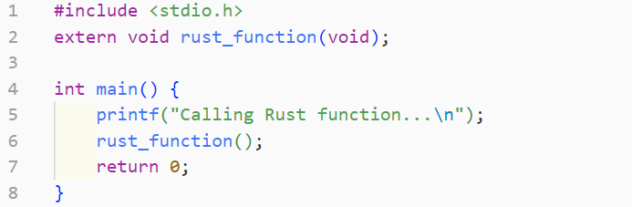
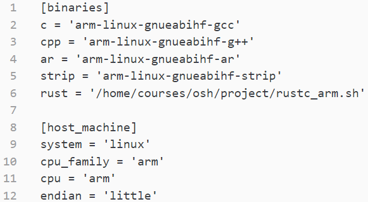
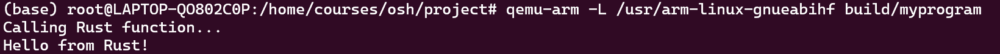
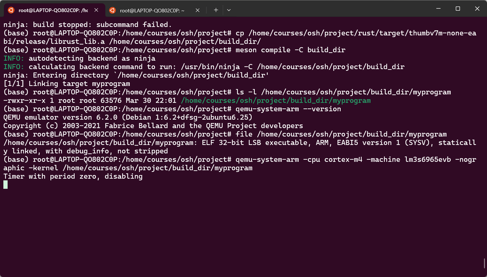

<!--这部分专门用来介绍Meson系统-->

## Meson构建系统

### Meson介绍

Meson是一个开源构建系统[^meson_system^]，其设计目标是提供极高的构建速度和尽可能友好的用户体验。Meson采用声明式配置，避免了传统构建系统复杂的配置过程，从而减少开发者在编写或调试构建定义上所耗费的时间。此外，Meson采用Ninja作为底层构建工具，使得构建过程高效且快速，显著减少了编译启动时的等待时间。

作为一个现代化的构建系统[^Wiki_Meson^]，Meson具备原生的Rust支持，可以直接调用`rustc`或`Cargo`进行构建，并能自动生成Ninja构建文件。其语法简洁且类似于Python，使得开发者更易上手，同时也降低了多语言项目的集成成本。与传统的SCons、CMake等构建系统相比，Meson的构建速度更快，尤其适用于CI/CD持续集成环境。此外，Meson的轻量级特性使其在嵌入式开发场景下表现出色[^embedded^]，不仅减少了系统开销，还提供了对多架构和交叉编译的良好支持[^RioTian^]。

在嵌入式系统开发中，构建系统的选择至关重要。Meson通过其简洁的配置方式、强大的多语言支持以及卓越的性能，成为嵌入式开发者值得考虑的方案。无论是针对资源受限的设备进行优化，还是实现高效的固件编译流程，Meson都能提供可靠的支持。

### 配置meson系统环境

我选择在WSL的Ubuntu22.04系统中配置meson系统。Meson需要python环境和Ninja环境[^meson_install^]，所以首先安装：

```bash
sudo apt-get install python3 python3-pip ninja-build
pip3 install --user meson # install meson through pip
```

这里显示安装成功，如果使用`meson --version`，发现仍然检测不到meson，这里还需要继续设置环境变量：

```bash
echo 'export PATH=$HOME/.local/bin:$PATH' >> ~/.bashrc
source ~/.bashrc
meson --version
```

到这里应该能正确输出Meson的版本，即已经正确安装Meson构建系统。下面为了测试在meson系统上联合编译Rust和C语言的可行性，我创建了一个简单的Meson项目来进行测试。首先需要安装一些必要的编译链工具和库文件，以便于支持交叉编译和运行。可以使用以下命令来安装这些工具：

```bash
snap install rustup --classic
sudo apt-get install gcc-arm-linux-gnueabihf
sudo apt install gcc-arm-none-eabi
sudo apt install g++-arm-linux-gnueabihf
rustup target add arm-unknown-linux-gnueabihf
apt install qemu-user
curl --proto '=https' --tlsv1.2 -sSf https://sh.rustup.rs | sh
rustup target add arm-unknown-linux-gnueabihf
```

### 创建Meson测试项目

创建一个新的目录来存放Meson项目，并在该目录下创建以下文件结构：

```
├── meson.build
├── my_cross_file.txt
├── rust
│   └── rust_lib.rs
├── rustc_arm.sh
└── src
    └── main.c
```

这里的c语言代码文件需要一些特殊的处理，如下图所示。



Rust代码中需要声明C语言函数的接口，以便于C语言调用Rust函数。Rust函数需使用`#[no_mangle]`和`extern "C"`属性，确保函数名不被修饰并符合C调用约定，如下图所示。


`meson.build`是Meson构建系统的核心配置文件，定义了项目的构建规则和依赖关系。这里只需要一句简单的`project('test_cross_compilation', 'c', 'rust')`，就能够实现项目的交叉编译，这是与其它构建系统相比的巨大优势。

在进行C语言和Rust语言的交叉编译时，还需要额外的配置文件和工具：

- `my_cross_file.txt`是交叉编译配置文件，指定了目标平台、编译器和系统库等信息，确保 Meson 在构建时能够正确使用交叉工具链。
- `rust_lib.rs` 是Rust语言编写的库文件，其中定义了供C语言调用的Rust函数，使用`#[no_mangle]`以保证函数符号不会被修改。
- `src/main.c` 是C语言编写的主程序文件，负责调用Rust代码，并进行必要的数据转换。
- `rustc_arm.sh`作为 Rust 编译器`rustc`的包装器，确保 Rust 代码能正确编译为目标架构的二进制文件。

在使用Meson进行交叉编译时，首先需要使用`meson setup`指定交叉编译配置文件，例如：

```
meson setup build --cross-file my_cross_file.txt
ninja -C build
```

这样，Meson 将自动检测并配置C和Rust的交叉编译工具链，最终生成适用于目标平台的可执行文件。

```bash
project('test_cross_compilation', 'c', 'rust')

# compile Rust static library
rust_lib = custom_target('rust_lib',
    input: 'rust/rust_lib.rs',
    output: 'librust_lib.a',
    command: ['/home/courses/osh/project/rustc_arm.sh', '--crate-type=staticlib', '-o', '@OUTPUT@', '@INPUT@']
)

# compile c executable file, and link it to Rust library
c_exe = executable('myprogram', 'src/main.c', link_with: rust_lib)
```

`rust_lib`通过`static_library`函数构建的Rust静态库，默认情况下使用Rust ABI来链接Rust和C代码。`custom_target`函数用于定义一个自定义的构建目标，这里我们指定了Rust源文件和编译命令。最后，`executable`函数用于编译C语言的可执行文件，并将Rust静态库链接到可执行文件中。但是因为Meson在处理Rust和C的缓和构建的时候，对目标类型有严格的限制，而Rust ABI的静态库只能与Rust目标链接，不能链接C目标，所以我们需要使用`custom_target`函数来创建一个自定义的构建目标，将Rust静态库编译为C语言可执行文件。

接下来是交叉编译的关键步骤，需要创建一个交叉编译配置文件`my_cross_file.txt`，该文件指定了目标平台、编译器和系统库等信息。图3是我们在测试时使用的配置。



- **C 语言编译器**：使用`arm-linux-gnueabihf-gcc`进行C语言的交叉编译。
- **C++ 语言编译器**：使用`arm-linux-gnueabihf-g++`进行C++代码编译。
- **静态库管理**：`arm-linux-gnueabihf-ar`用于管理静态库。
- **去除调试信息**：`arm-linux-gnueabihf-strip`用于精简二进制文件。
- **Rust 交叉编译**：由于Rust交叉编译需要额外的配置，使用脚本`rustc_arm.sh`代理`rustc`。

### 目标主机架构

- **system = 'linux'**：目标系统为Linux。
- **cpu_family = 'arm'**：目标CPU架构为ARM。
- **endian = 'little'**：采用小端存储格式。

执行下面的指令可以构建这个项目并编译。这里Meson本身并不直接编译代码，而是生成构建文件并交给Ninja来完成具体工作。最后使用qume测试生成的可执行文件。

```bash
# start
meson setup build --cross-file my_cross_file.txt
meson compile -C build
# test on qume
qemu-arm -L /usr/arm-linux-gnueabihf build/myprogram
```

如下图所示，成功运行了C语言调用Rust函数的测试程序。



### 可能存在的问题

因为我们小组打算最后在stm32开发板上测试改写后的系统，开发板使用的是ARM Cortex-M4F处理器。以上的测试使用的是CortexA系列的处理器。同样我也进行了测试，结果发现Meson在配置阶段对Rust编译器进行健全性检查时失败，报错`can't find crate for std`，因为默认的`sanity.rs`文件依赖标准库std，而目标`thumbv7m-none-eabi`是一个bare-metal环境，不支持std库。尝试设置环境变量`MESON_RUST_SANITY_RS`指定自定义的`rust_sanity.rs`文件（包含`#![no_std]`和`panic_handler`），但发现Meson未正确使用。

最终选择绕过Meson的直接Rust编译，改用Cargo构建Rust代码，避开了健全性检查问题，最后再使用Meson链接Rust的静态库和C代码。这中途还需要手动将Rust编译出的静态库文件手动复制到cargo文件夹中。测试结果如下图，因为不能使用std库，所以写了一个死循环。



[^meson_system^]: 