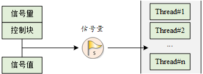
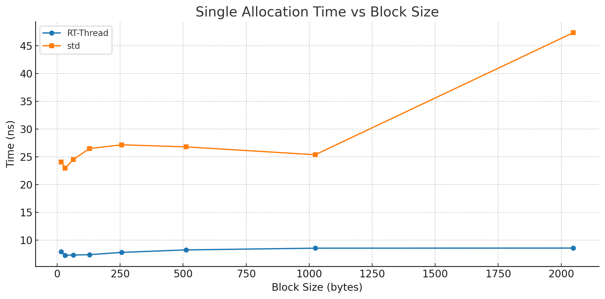

# 用 Rust 重构 RT-Thread 系统——RusT-Thread 结题报告
## 目录
- [用 Rust 重构 RT-Thread 系统——RusT-Thread 结题报告](#用-rust-重构-rt-thread-系统rust-thread-结题报告)
  - [目录](#目录)
  - [项目背景](#项目背景)
  - [小组成员及分工](#小组成员及分工)
  - [项目总览](#项目总览)
    - [系统架构设计](#系统架构设计)
    - [技术路线](#技术路线)
  - [分模块介绍](#分模块介绍)
    - [内核服务层](#内核服务层)
    - [硬件抽象层](#硬件抽象层)
    - [进程调度层](#进程调度层)
    - [内存管理层](#内存管理层)
    - [线程通信层](#线程通信层)
    - [时钟控制层](#时钟控制层)
  - [创新技术实现](#创新技术实现)
    - [1. 多级反馈队列调度算法](#1-多级反馈队列调度算法)
    - [2. 内联汇编](#2-内联汇编)
    - [3. 利用 Rust 的语言特性简化代码实现](#3-利用-rust-的语言特性简化代码实现)
    - [4. 动态+静态数据分离](#4-动态静态数据分离)
    - [5. RTintrFreeCell](#5-rtintrfreecell)
  - [性能与验证](#性能与验证)
    - [内存性能测试](#内存性能测试)
      - [内存分配效率](#内存分配效率)
      - [内存安全性能测试](#内存安全性能测试)
    - [模块验证测试](#模块验证测试)
      - [单元测试](#单元测试)
      - [集成测试](#集成测试)
    - [性能基准测试](#性能基准测试)
      - [中断延时测试](#中断延时测试)
      - [响应时间测试](#响应时间测试)
      - [上下文切换时间测试](#上下文切换时间测试)
      - [线程启动时间测试](#线程启动时间测试)
  - [与 RT-Thread 性能对比](#与-rt-thread-性能对比)
  - [遇到的困难与解决方案](#遇到的困难与解决方案)
    - [1. 硬件的初始化与对接](#1-硬件的初始化与对接)
    - [2. 调试时无简洁方式](#2-调试时无简洁方式)
    - [3. 汇编代码和 Rust 联合编译调试困难](#3-汇编代码和-rust-联合编译调试困难)
    - [4. 静态全局变量的unsafe 块——RTIntrFreeCell + lazy\_static](#4-静态全局变量的unsafe-块rtintrfreecell--lazy_static)
  - [代码质量分析](#代码质量分析)
    - [代码行数统计](#代码行数统计)
      - [原项目nano内核代码量展示](#原项目nano内核代码量展示)
      - [Rust-Thread内核代码量展示](#rust-thread内核代码量展示)
    - [Rust代码质量分析](#rust代码质量分析)
  - [项目未来可拓展方向](#项目未来可拓展方向)
    - [功能扩展计划](#功能扩展计划)
      - [更丰富的软件包支持](#更丰富的软件包支持)
      - [更人性化的异常反馈](#更人性化的异常反馈)
    - [生态建设愿景](#生态建设愿景)
      - [更广泛的芯片支持](#更广泛的芯片支持)
      - [更清晰的文档支持](#更清晰的文档支持)
  - [总结](#总结)
    - [项目总结](#项目总结)
    - [对RT-Thread社区的贡献](#对rt-thread社区的贡献)
    - [开发过程的感悟](#开发过程的感悟)
  - [回顾中期报告](#回顾中期报告)
    - [中期目标](#中期目标)
    - [已完成部分及其实现](#已完成部分及其实现)
    - [未完成部分及其原因](#未完成部分及其原因)
  - [参考文档](#参考文档)

## 项目背景

随着物联网和嵌入式系统的快速发展，对实时操作系统（RTOS）的安全性、可靠性和性能要求越来越高。传统的 C 语言实现的操作系统在内存安全、并发安全等方面存在诸多挑战，容易导致系统崩溃、安全漏洞等问题。RT-Thread 作为国产优秀的实时操作系统，在嵌入式领域得到了广泛应用，然而其 C 语言实现在面对日益复杂的应用场景时，暴露出内存安全、并发控制等方面的局限性。

基于当前技术发展趋势和实际需求，本项目的立项具有重要意义：首先，传统 C 语言操作系统存在缓冲区溢出、野指针等安全隐患，亟需内存安全保障；其次，多线程环境下的数据竞争和死锁问题日益突出，需要更好的并发安全机制；同时，Rust 的类型系统和错误处理机制能够显著提升代码质量和可维护性；此外，微软、谷歌等科技巨头正在推进 Rust 在系统软件中的应用，这一技术发展趋势为项目提供了强有力的支撑。

Rust 作为一门系统级编程语言，以其独特的所有权模型、零开销抽象和内存安全保证，为操作系统开发提供了新的可能性。因此，本项目旨在使用 Rust 语言重构 RT-Thread 实时操作系统，通过利用 Rust 的内存安全和并发安全特性消除常见的系统级漏洞，在确保重构后系统性能不低于原 C 语言版本的同时，保持 RT-Thread 的全部核心功能和 API 兼容性，并设计模块化架构以便于后续功能扩展和维护，最终实现对多种硬件平台的移植和适配支持。

## 小组成员及分工

| 姓名 | 学号 | 负责模块 |
| --- | --- | --- |
| 罗浩民 | PB23111599 | 内核服务层、进程调度、整体协调 |
| 陈琳波 | PB23111658 | 中断管理，线程切换，时间性能测试 |
| 赵于洋 | PB23061293 | 内存管理层、分配器实现、内存性能对比测试 |
| 李丁 | PB23111595 | 线程服务、线程通信层 |
| 刘时 | PB23030750 | 时钟服务层，硬件测试尝试 |

## 项目总览

### 系统架构设计


在 RusT-Thread 项目的架构设计中，我们并未局限于 RT-Thread 的原有架构，而是积极融入了以下关键设计原则：

- **安全性** ：借助 Rust 的所有权系统与借用检查机制，从编译阶段就彻底消除内存安全隐患。同时，通过其严格的并发模型有效防止数据竞争，显著提升系统的并发安全性。
- **可扩展性** ：采用模块化设计思路，使系统具备良好的扩展性。这种设计便于后续便捷地添加各类模块，如设备驱动、文件系统以及网络协议栈等，以满足不同应用场景的多样化需求。
- **高性能** ：充分利用 Rust 的零成本抽象特性，在确保系统安全性的基础上，对调度算法和内存管理机制进行深度优化，从而全面提升系统的整体性能表现。
- **易移植性** ：通过分层设计策略并构建清晰的硬件抽象层，极大简化了系统对不同芯片架构的适配过程。目前，该系统已成功支持 ARM Cortex-M4 芯片架构，并计划逐步扩展对更多类型芯片的支持范围。

### 技术路线

在技术选型方面，我们着重考虑了以下几点：

- **选择 Rust 语言** ：随着嵌入式系统对安全性和可靠性要求的不断提升，以及考虑到 Rust 语言在内存管理、并发安全机制和丰富的现代语言特性等方面所展现出的显著优势，我们果断选择 Rust 作为项目开发语言。这一选择旨在弥补传统 C 语言在应对复杂系统开发时存在的诸多不足。
- **参考 RT-Thread** ：鉴于 RT-Thread 是一个成熟且被广泛认可的开源实时操作系统，拥有丰富的功能集和宝贵的实践经验，我们决定以它作为重构的基础。在保留其部分经典接口以降低原有 RT-Thread 用户学习成本的同时，我们着力对系统的性能和安全性进行优化改进。
- **纯 Rust 实现** ：一改常见的 C 与 Rust 混合开发模式，我们采用纯 Rust 语言来编写操作系统内核。这种做法不仅实现了真正的原生系统结构，还彻底规避了 C 语言中裸指针可能引发的风险。通过充分利用 Rust 的语言特性，我们成功提升系统的安全性和可维护性，为项目的长期发展奠定坚实基础。

在我们的实际重构过程中，主要步骤如下：

1. **需求分析与设计规划** ：深入剖析 RT-Thread 的功能特性及其架构设计，并紧密结合 Rust 语言的独特优势，明确 RusT-Thread 系统的架构布局和模块划分方案。基于此，制定出详尽且具有可操作性的开发计划，为项目的顺利推进提供清晰指引。
2. **核心模块开发** ：依次开展线程管理、内存管理、定时器系统、中断处理以及硬件抽象层等核心功能模块的开发工作。在开发进程中，充分挖掘和运用 Rust 语言的特性，对 RT-Thread 原有的内核服务组件进行合理替代与优化升级，以契合 RusT-Thread 的设计目标和性能要求。
3. **系统集成与测试验证** ：完成各核心模块的开发后，将其进行有效的系统集成。随后，借助单元测试、集成测试以及性能测试等多层次、多角度的测试手段，全面检验系统的功能完整性、运行稳定性以及性能表现。根据测试结果，持续对系统进行优化调整和问题修复，确保 RusT-Thread 系统能够在 QEMU 模拟器环境以及 STM32F405 硬件平台上实现稳定可靠地运行。

## 分模块介绍

### 内核服务层

内核服务层作为 RusT-Thread 操作系统的核心基础，是连接硬件底层与上层应用的关键桥梁，其核心功能及在 Rust 中的实现方案如下：

- **错误处理机制**：采用 Rust 的 `Option` 和 `Result` 枚举类型替代传统错误码，通过模式匹配清晰表达函数执行结果。在编译期对错误处理逻辑进行严格检查，避免因错误处理不当引发的问题，确保系统稳定运行。
- **内存操作函数**：利用 Rust 标准库中的 `Core::alloc` 模块，结合自定义的内存分配策略和数据结构，实现高效灵活的内存分配与回收机制，优化内存使用效率，确保操作的正确性和安全性。
- **字符串操作函数**：借助 Rust 内置的 `String` 和 `str` 类型及其操作方法，实现功能强大且安全高效的字符串处理功能，有效防止缓冲区溢出等问题，满足系统对文本处理的需求。
- **格式化输出功能**：结合 `cortex_m_semihosting` 工具库和 Rust 的格式化字符串宏（`format!`、`println!` 等），实现数据格式化输出功能。在 QEMU 模拟器环境下，通过半宿主功能将输出数据发送至宿主机控制台，支持多种数据类型和输出格式，满足调试和信息展示的需求。
- **调试和断言功能**：借助 Rust 的 `Debug` 和 `Display` 特性以及 `assert!`、`debug_assert!` 等宏，实现完善的调试和断言功能。为自定义数据类型实现相关特质，以便在调试输出时展示详细信息；通过断言条件检查及时暴露问题，提高开发效率。
- **链表实现**：利用 Rust 的 `Vec` 等标准容器类型，结合手动指针操作和数据结构管理逻辑，构建高效的链表结构。通过存储节点指针模拟链接关系，实现节点的动态操作，同时借助所有权系统和借用检查机制确保操作的安全性和正确性。

在 RusT-Thread 中，我们对原本在 RT-Thread 中实现的内核服务功能进行了重新设计和优化，找到了成熟的 Rust 替代方案。此外，我们还单独添加了 cell 模块，以更好地适配 Rust 的语言特性。

其中，Cell 模块实现了一个**中断安全的共享数据容器** `RTIntrFreeCell<T>`，这是 RT-Thread 实时操作系统中的核心内核服务组件之一。其核心目的就是在多线程和中断环境下提供安全的共享数据访问机制，通过自动禁用和启用中断来防止数据竞争，具体体现在以下三个方面：

**1. 中断安全性**：

- 在访问共享数据时自动调用 `rt_hw_interrupt_disable()` 禁用中断。
- 访问结束后自动调用 `rt_hw_interrupt_enable()` 恢复中断。
- 确保临界区代码能够原子性地执行，避免数据不一致的问题。

**2. RAII 资源管理**：

- 使用 `RTIntrRefMut` 作为智能指针，利用 Rust 的 `Drop` 特质实现自动资源释放。
- 当 `RTIntrRefMut` 超出作用域时，自动恢复中断级别，降低了手动管理资源的风险。

**3. 灵活的访问方式**：

- 提供 `exclusive_access()` 方法获取独占访问权限。
- 提供 `exclusive_session()` 方法在闭包中执行临界区代码。
- 提供 `as_ptr()` 和 `as_mut_ptr()` 方法获取原始指针，方便底层操作。
- 提供 `field_ptr()` 和 `field_mut_ptr()` 方法获取结构体字段的原始指针，增强灵活性。

该模块主要用于 RT-Thread 内核中那些需要在中断上下文和线程上下文之间共享的关键数据结构，例如线程控制块、调度器状态、定时器链表和内存管理数据结构等。通过提供中断安全的访问机制，`RTIntrFreeCell<T>` 确保了实时系统在高并发场景下的数据一致性和系统稳定性，是构建可靠实时操作系统的基础设施之一。

在 Rust 语言环境下，内核服务层充分利用其强大的类型系统、内存安全特性以及丰富的标准库资源，对各功能模块进行了精心优化，为系统的稳定运行和上层功能的实现奠定了坚实的基础。

### 硬件抽象层

硬件抽象层(hardware)是 RusT-Thread 操作系统在 Cortex-M4 架构下的底层硬件支持模块，主要负责 CPU 端口、上下文切换、异常处理和中断管理等功能，为上层系统提供与硬件紧密相关的基础服务。

硬件抽象层是操作系统的核心组成部分，通过这些模块，RusT-Thread 能够实现高效、可靠的硬件资源管理和任务调度，为上层应用提供稳定的运行环境。

模块内容如下：
```bash
hardware
├── context.rs      # 线程上下文切换，使用内联汇编实现线程上下文保存与恢复
├── cpuport.rs      # CPU 接口-Cortex-M4，定义了异常栈帧、栈帧、CPU 关机、CPU 重启
├── exception.rs    # 异常处理相关函数
├── irq.rs          # 中断管理模块，提供了中断嵌套计数、钩子设置、使能/禁用中断等功能
└── mod.rs          # 统合上述模块，提供对外接口
```

 **上下文切换模块 ([context.rs]())**
 
负责线程上下文的切换机制，主要功能包括：
- 线程上下文的保存与恢复
- PendSV 中断处理（实际执行上下文切换）
- 提供`rt_hw_context_switch`、`rt_hw_context_switch_interrupt`和`rt_hw_context_switch_to`等函数
- 实现线程间的高效切换，是多线程调度的核心机制

**CPU 端口模块 ([cpuport.rs]())**

提供与 CPU 硬件直接相关的底层支持：
- 定义异常栈帧(ExceptionStackFrame)和栈帧(StackFrame)结构
- 实现线程栈初始化函数`rt_hw_stack_init`
- 提供 CPU 关机`rt_hw_cpu_shutdown`和重启`rt_hw_cpu_reset`等功能
- 可选的 FPU 支持（浮点运算单元）

 **中断管理模块 ([irq.rs]())**

实现中断处理相关的功能：
- 中断嵌套计数管理
- 提供中断使能/禁用函数`rt_hw_interrupt_disable/enable`
- 中断进入/退出处理`rt_interrupt_enter/leave`
- 支持中断钩子函数设置（通过特性开关控制）
- 获取中断嵌套层数`rt_interrupt_get_nest`

 **异常处理模块 ([exception.rs]())**

负责处理系统运行中的各种异常：
- 提供硬件错误处理（HardFault、MemManage、BusFault、UsageFault）
- 异常信息收集与输出
- 支持异常钩子机制`rt_hw_exception_install`
- 详细的故障跟踪与诊断功能

### 进程调度层

进程调度层作为 RusT-Thread 操作系统的核心组件之一，主要承担线程的调度与管理职责，确保系统中多个线程能够高效、合理地共享处理器资源，实现高效并发执行。其核心功能和职责如下：

- **任务调度** ：依据预设调度策略，决定处理器执行权的分配，保障高优先级任务的及时响应，同时兼顾任务的公平执行。支持多种调度算法，具备灵活适应不同应用场景和实时性要求的能力。
- **调度算法选择** ：提供优先级调度算法（如优先级 + 时间片轮转）和多级反馈队列调度算法等，用户可根据实际需求灵活选择调度算法，满足不同任务对实时性和资源分配的需求。
- **线程 API 接口** ：为用户提供了一系列丰富的接口，使用户能够更加便捷地对线程状态进行调整和控制，例如创建、删除、挂起、恢复线程等操作，同时提供了获取和设置线程属性的接口，方便用户根据实际需求对线程进行精细化管理。


在 Rust 语言环境下，我们充分利用其并发安全特性、零成本抽象以及灵活的类型系统等优势，对进程调度层进行了高效、可靠的实现。

- **调度策略抽象** ：通过定义 `SchedulingPolicy` 特质，将多种调度算法封装和抽象。以优先级调度算法为例，实现了相应的结构体，包含线程优先级队列管理和时间片分配与轮转机制；对于多级反馈队列调度算法，设计了多级队列数据结构，实现了任务根据执行时间动态调整队列级别的逻辑。基于特质的抽象方式使调度策略切换灵活，用户在初始化时指定调度策略后，调度器即可根据具体实现执行调度操作。

```rust
/// 调度策略 trait
pub trait SchedulingPolicy: Send + Sync {
    /// 选择下一个要运行的线程
    ///
    /// # 参数
    /// * `current_thread` - 当前运行的线程
    ///
    /// # 返回值
    /// * `Option<(Arc<RtThread>, bool)>` - (选中的线程, 是否需要将原线程重新插入就绪队列)
    fn select_next_thread(
        &self,
        current_thread: &Option<Arc<RtThread>>,
    ) -> Option<(Arc<RtThread>, bool)>;
    /// 获取策略名称
    fn get_policy_name(&self) -> &'static str;
}

```

- **调度算法优化** ：引入位图 + FFS（Find First Set）算法提升调度效率。位图标识各优先级队列的线程就绪状态，通过 FFS 算法快速定位最高优先级队列中的首个就绪线程。FFS 算法借助预计算查找表，将复杂位运算转化为简单数组访问，实现 O(1) 时间复杂度的最高优先级线程查找，显著提升调度器响应速度和实时性能，确保系统及时响应高优先级任务。

```rust
#[cfg(feature = "tiny_ffs")]
const __LOWEST_BIT_BITMAP: [u8; 37] = [
    0, 1, 2, 27, 3, 24, 28, 32, 4, 17, 25, 31, 29, 12, 32, 14,
    5, 8, 18, 32, 26, 23, 32, 16, 30, 11, 13, 7, 32, 22, 15, 10,
    6, 21, 9, 20, 19
];

#[cfg(feature = "tiny_ffs")]
pub fn __rt_ffs(value: u32) -> u8 {
    if value == 0 {
        return 0;
    }
    __LOWEST_BIT_BITMAP[((value & (value - 1) ^ value) % 37) as usize]
}

```

该算法利用预计算查找表和数学运算避免复杂位运算循环，实现了快速最低有效位查找。它专为嵌入式环境优化，在资源受限设备上也能快速执行，满足实时系统低延迟要求。能快速确定线程就绪队列中最高优先级线程，确保调度器及时响应高优先级任务，提升系统实时性和性能。

- **多级反馈队列调度实现** ：在多级反馈队列调度算法中，引入老化机制，使长期未被调度的线程逐渐升高优先级，防止低优先级线程饥饿，增强调度算法公平性和适应性。实现过程中，借助 Rust 语言零成本抽象特性，优化代码实现，提升系统稳定性和可维护性。
### 内存管理层

在 RusT-Thread 中，我们实现了原本 RT-Thread 中的小内存分配器，同时并支持了库实现的 buddy_system allocator 和 good_memory allocator，可供用户在实际场景中自由选择，下面将对小内存分配器作具体分析：

RusT-Thread 中的小内存分配器主要体现在如下几个文件中：

- small_mem_impl.rs：核心算法实现

- small_mem_allocator.rs、allocator.rs：分配器接口与适配

- object.rs、safelist.rs：辅助对象和安全链表

- oom.rs：内存溢出处理


表示内存块的结构体：


小内存分配算法的原理是通过维护一块连续的内存池，将其划分为带有头部信息的内存块，并用链表管理空闲和已用块。分配时遍历空闲链表，找到足够大的块后分割并标记为已用；释放时将块标记为空闲，并尝试与相邻空闲块合并以减少碎片。整个过程包含边界检查和中断保护，确保分配、释放的安全性和原子性。

除了实现基本的小内存算法外，我们还有如下亮点：

+ 边界检查与安全性提升

  

  + C 代码主要依赖 RT_ASSERT 等宏进行运行时断言，且大量裸指针操作，容易出现悬垂指针、越界、重复释放等问题，这些断言如果被关闭，代码安全性大幅下降

  

  

  + Rust 利用类型系统和所有权机制，天然防止了大部分内存安全问题，同时 rt_smem_free、rt_smem_alloc 等函数在操作前都做了空指针和边界检查
  + Rust 的 debug_assert! 只在 debug 模式下生效，release 下可关闭，但类型系统和生命周期机制依然提供了额外的安全保障

  - 许多辅助函数（如 mem_is_used、mem_pool 等）都用 inline 和类型安全的方式实现，减少了手动错误

+ 中断保护

  

  + C 语言通过 rt_hw_interrupt_disable/rt_hw_interrupt_enable 手动保护关键区，防止并发破坏堆结构

    

  + Rust 同样调用 rt_hw_interrupt_disable/rt_hw_interrupt_enable，但更易于用 RAII（资源自动释放）等机制进行封装，减少人为失误

  + 并且 Rust 代码结构更清晰，便于后续用 RAII 或作用域自动恢复中断，提升健壮性

### 线程通信层

进程间通信（IPC）是多任务操作系统中各个任务之间进行数据交换和协同工作的重要手段。我们的 RusT - Thread 提供了信号量机制，而消息队列、邮箱等作为拓展，我们尚未支持。

信号量工作示意图如下图所示，每个信号量对象都有一个信号量值和一个线程等待队列，通过信号量的值是否为零，决定线程是否可以访问临界区的资源，当信号量实例数目为零时，再申请该信号量的线程就会被挂起在该信号量的等待队列上，等待可用的资源。



在 RT-Thread 中，信号量相关操作有以下函数——创建、删除、获取、释放，我们实现的思路和 C 类似，先实现 ipc 的基础操作，如`_ipc_list_suspend`挂起线程，`_ipc_list_resume`唤醒线程等等，然后，通过信号量的值，选择不同的操作，实现信号量的相关操作即可。


### 时钟控制层

 **时间与时钟节拍**

时间是操作系统中十分重要的概念，线程的延时，时间片轮转调度，定时器的超时都需要时间的参与。操作系统中时间的最小单位是时钟节拍（OS Tick），时钟节拍在操作系统中就是特定的周期性中断。这个中断可以看做是系统心跳，中断之间的时间间隔取决于不同的应用，一般是 1ms–100ms，时钟节拍率越快，系统的实时响应越快，但是系统的额外开销也就越大。

本部分将介绍 Rust-Thread 中的时钟节拍的产生，时钟中断的管理以及定时器的管理。

**时钟节拍的产生**

时钟节拍由配置为中断触发模式的硬件定时器产生，当中断到来时，将调用一次：rt_tick_increase() 函数，通知操作系统已经过去一个系统时钟；不同硬件定时器中断实现都不同，Rust_Thread 的中断函数是在 qemu 模拟器上的 stm32 系列单片机上实现的，具体的，程序中将使用 #[exception] 标记一个中断处理函数 SysTick()，在其中调用 rt_tick_increase() 函数。
在 Rust-Thread 系统中，使用常数 RT_TICK_PER_SECOND 控制时钟周期长度。本系统中默认主频是 16MHZ，是通过 qume 模拟芯片内部高速振荡器实现的，默认 RT_TICK_PER_SECOND=1000，即一个时钟周期 16000 个硬件周期。

 **时钟中断的管理**

时钟中断管理核心函数 rt_tick_increase() 主要完成以下工作：
1. 将全局变量 RT_TICK 自增，这个变量记录了系统从初始化到当前经过了多少个时钟周期，叫	做系统时间。
	2. 检查当前线程的时间片是否到期，若到期，则触发线程调度。
	3. 检查是否有定时器到期，如果有，触发定时器超时函数。
时钟管理中还包括系统时间的读取和设定函数，毫秒数和时钟周期数的转换函数等功能函数。

 **定时器的管理**

RT-Thread 的定时器由定时器控制块 RtTimer 控制，定时器控制块全部在运行时动态分配内存并按照超时时间升序挂载在动态数组 TIMERS 中。定时器的管理主要包括定时器的创建，激活，修改，超时与停止。
1. 定时器的创建：按照指定的参数（名称，单次定时/周期定时，超时函数，定时时间等）为定时器控制块分配内存空间。定时器的创建是通过为定时器控制块实现 new 方法实现的，这里也体现了面向对象的编程思想。
2. 定时器的激活：将定时器控制块复制，根据当前系统时间和定时时间计算超时时间并赋给复制后的定时器控制块，最后把复制后的控制块挂载到 TIMERS 中，具体挂载方法是根据终止时间二分查找到指定位置，并将控制块插入动态数组。
3. 定时器的修改：修改定时器的状态（单次定时/周期定时，定时时间等），并让修改在下一次激活时生效。这里使用枚举覆盖所有修改操作，更符合 Rust native 语法，也更利于用户随需求加入新的修改操作。
4. 定时器的超时：根据当前系统时间查询 TIMERS 队列，二分查找出超时定时器的位置，依次调用所有超时定时器的超时函数并根据其状态（是否周期定时）决定重新激活该定时器还是回收该定时器。
5. 定时器的停止：将一定时器控制块从 TIMERS 中摘除并回收其空间。


## 创新技术实现

### 1. 多级反馈队列调度算法

```rust
pub struct MultiLevelFeedbackQueuePolicy;

impl SchedulingPolicy for MultiLevelFeedbackQueuePolicy {
    fn select_next_thread(
        &self,
        current_thread: &Option<Arc<RtThread>>,
    ) -> Option<(Arc<RtThread>, bool)> {
        // 实现多级反馈队列调度逻辑
        // 当前线程：优先级还原为初始优先级
        if let Some(current_thread) = current_thread {
            let init_priority = current_thread.inner.exclusive_access().init_priority.clone();
            rt_thread_set_priority(current_thread.clone(), init_priority);
            // hprintln!("MFQ: current_thread: {} init_priority: {}", current_thread.thread_name(), init_priority);
        }

        // 其它线程：优先级-1
        RT_THREAD_PRIORITY_TABLE.exclusive_access().batch_aging();
        // output_priority_table();

        // 使用优先级调度作为基础
        let priority_policy = PrioritySchedulingPolicy;
        priority_policy.select_next_thread(current_thread)
    }

    fn get_policy_name(&self) -> &'static str {
        "Multi-Level Feedback Queue"
    }
}

```

我们在 RT-Thread 实时系统中对传统的多级反馈队列算法（Multi-Level Feedback Queue，MLFQ）进行了改进和创新，形成了独特的多级反馈队列调度策略。以下是该策略的核心原理和优势：

- **老化机制（Aging Mechanism）**
    
    ```rust
    // 其它线程：优先级-1
    RT_THREAD_PRIORITY_TABLE.exclusive_access().batch_aging();
    
    ```
    
    每次调度时，所有等待线程的优先级提升 1（数值减 1），防止低优先级线程饥饿。
    
    同时，我们优化了传统 MLFQ 的老化机制，采用批量处理线程优先级变化：
    
    - **避免并发问题** ：防止遍历过程中数据结构被修改。
    - **提高效率** ：减少系统调用次数，提升处理效率。
    - **保证原子性** ：确保操作完整性和一致性。
- **优先级恢复机制**
    
    ```rust
    // 当前线程：优先级还原为初始优先级
    if let Some(current_thread) = current_thread {
        let init_priority = current_thread.inner.exclusive_access().init_priority.clone();
        rt_thread_set_priority(current_thread.clone(), init_priority);
    }
    
    ```
    
    当前线程被调度出去时，其优先级恢复到初始值，避免长期占用高优先级。
    
- **与优先级调度的混合策略**
    
    ```rust
    // 使用优先级调度作为基础
    let priority_policy = PrioritySchedulingPolicy;
    priority_policy.select_next_thread(current_thread)
    
    ```
    
    多级反馈队列负责动态调整优先级，而优先级调度负责具体线程选择，实现策略模块化与复用。
    

**主要作用**

- **解决饥饿问题** ：纯优先级调度中，低优先级线程可能永远得不到执行。通过老化机制逐步提升等待线程的优先级，有效解决了这一问题。
- **平衡响应性和公平性** ：既保证高优先级线程的快速响应，又确保长时间等待的线程能获得足够资源。
- **适应性调度** ：根据线程的运行历史动态调整优先级，防止线程长期占用高优先级资源。

**实时系统优化**

- **确定性** ：每次调度的时间复杂度可预测，保证了系统的实时性。
- **低开销** ：批量处理减少了系统调用，降低了资源消耗。
- **稳定性** ：异常处理机制增强了系统在复杂环境下的稳定运行能力。

**适用场景**

1. **混合负载系统** ：适用于既有实时任务又有批处理任务的复杂系统。
2. **交互式系统** ：既能响应用户操作，又能保证后台任务的正常执行。
3. **多任务嵌入式系统** ：资源受限但需要公平调度的嵌入式环境。
4. **防饥饿要求严格的系统** ：不能容忍任何线程长期得不到执行的场景。

这种改进的多级反馈队列调度算法在保持传统 MLFQ 核心优势的同时，针对嵌入式实时系统的特殊需求进行了优化，提高了在资源受限环境下的执行效率和系统性能，具备广泛的应用前景。

### 2. 内联汇编

内联汇编技术允许将汇编代码直接嵌入 Rust 程序中，在保持高级语言编程便捷性的同时获得汇编语言的底层控制能力。这种技术在嵌入式系统开发中尤为重要，它不仅简化了编译链接流程，避免了分离汇编文件的复杂性，还能让汇编代码直接访问 Rust 变量和上下文，确保类型安全性。同时，由于内联汇编由 Rust 编译器统一处理，既提升了跨平台可移植性，又便于编译器进行整体优化，最终实现代码集中维护和简化调试的目标。

 **代码示例分析**

从`context.rs`中可以看到`rt_hw_context_switch`函数是一个很好的内联汇编应用示例：

```rust
#[inline]
pub fn rt_hw_context_switch(from_sp: *mut u32, to_sp: *mut u32) {
    update_thread_vars(from_sp, to_sp);
    
    unsafe {
        asm!(
            "ldr r0, ={nvic_int_ctrl}",
            "ldr r1, ={nvic_pendsvset}",
            "str r1, [r0]",
            nvic_int_ctrl = const NVIC_INT_CTRL,
            nvic_pendsvset = const NVIC_PENDSVSET,
            out("r0") _,
            out("r1") _,
            options(nostack, preserves_flags)
        );
    }
}
```

**代码分析：**

1. **紧密集成**：该函数将 Rust 代码(`update_thread_vars`调用)与 ARM 汇编指令紧密结合，在同一函数中完成线程切换的全部逻辑

2. **常量传递**：通过`nvic_int_ctrl = const NVIC_INT_CTRL`语法将 Rust 常量直接传递给汇编代码，避免了跨文件定义常量的麻烦

3. **寄存器使用声明**：通过`out("r0") _`告知编译器该段汇编会修改 r0、r1 寄存器，使编译器能做正确的优化

4. **优化提示**：通过`options(nostack, preserves_flags)`提供编译器优化提示，指明此汇编代码不使用栈且不改变状态标志

5. **内联优化**：`#[inline]`指令提示编译器在调用点内联此函数，进一步减少函数调用开销

**与传统方法对比**

如果使用传统的分离汇编文件方式，上述功能需要：

1. 创建单独的`.s`汇编文件
2. 在 Rust 中声明外部函数接口
3. 通过编译器特定属性关联函数名
4. 在汇编文件中单独定义所需常量
5. 编写构建脚本确保正确编译链接

这不仅增加了构建复杂性，还可能引入跨文件命名和接口匹配错误，以及平台特定的链接问题。

>内联汇编通过将这些关键操作集中在单一 Rust 源文件中，大幅简化了开发流程，提高了代码的可维护性和可靠性，同时保留了对底层硬件的精确控制能力。

### 3. 利用 Rust 的语言特性简化代码实现

**原理分析**

Rust 作为一门现代语言拥有很多高级语言特性，比如类似于接口的 trait，比如很多其他语言也有的 stl 库等等。而不同于 C++ 等语言，Rust 拥有零成本抽象的能力，可以让开发人员在使用这些高级语言特性的同时避免额外的运行时开销，具体是通过编译器把高级抽象在编译时展开为等价的底层代码实现的，这里不过多展开。在 no_std 环境中，在实现了 allocator 分配器后，开发人员就可以随意使用 stl 库中的高级数据结构，这让代码在不损失性能的前提下简单清晰了很多，给开发者和使用者都带来了极大的便利。
下面以定时器管理的实现举例说明具体的优化点。

**举例说明**

在定时器管理中，由于定时器控制块是按照超时时间升序排布的，因此在插入和超时检查时都需要对超时时间的搜索过程。
在 c 语言中，由于定时器控制块是在运行时动态分配的，因此没法使用数组等静态结构，只能使用链表来组织定时器控制块。但是链表的搜索时间是 O(n)，这在定时器较多时会带来较大的延迟，在实时系统中是没法接受的。
所以 Rt-Thread 采取了跳表的算法，具体方法是在一层链表上再加入几层链表，上层链表是随机选取下层链表中的几个节点复制后串联而成，搜索时从上层链表往下层链表搜索，这样就可以一次性跳过好几个节点，最后的期望时间复杂度能达到 O(logn)。（见下方图一）但是从上面的分析可以看出，跳表算法一是需要额外的存储空间，二是效果依赖于随机选取的过程，所以其实在是在性能需求下的折衷选择。

在 Rust-Thread 中，我们采取了动态数组来代替链表，这样就可以采取二分查找来代替不稳定的跳表算法，最后，我们仅需 13 行 Rust 代码就能代替原来 35 行的 C 代码，而且我们的代码远比 C 源代码简单清晰，这就是用 Rust 开发的独特优势。
```RusT
//插入定时器的过程
unsafe {
        if let Some(ref timers_mutex) = TIMERS {
            let mut timers = timers_mutex.lock();// 获取定时器数组锁
            let mut timer_locked = timer.lock();// 获取定时器锁
            timer_locked.parent.flag |= RT_TIMER_FLAG_ACTIVATED;// 设置定时器激活状态
            timer_locked.timeout_tick = timer_locked.init_tick.wrapping_add(rt_tick_get());// 设置定时器超时时间
            let timeout_tick = timer_locked.timeout_tick;// 获取定时器超时时间
            drop(timer_locked); // 释放定时器锁

            // 使用定时器超时时间进行二分查找
            let pos = timers.binary_search_by(|probe| {
                 let probe_locked = probe.lock();
                 probe_locked.timeout_tick.cmp(&timeout_tick)
            })
                .unwrap_or_else(|e| e);
            timers.insert(pos, timer);// 将定时器插入到timers数组中
        }
    }
```
### 4. 动态+静态数据分离

以 `RtThread` 结构体为例，我们采用了动态 + 静态数据分离的设计方式：

```rust
pub struct RtThread {
    /// 静态数据
    pub name: [u8; RT_NAME_MAX],
    pub object_type: u8,

    /// 内部可变状态
    pub inner: RTIntrFreeCell<RtThreadInner>,

    pub cleanup: Option<fn(*mut RtThread)>,
}

pub struct RtThreadInner {
    /// 可变字段
    pub error: isize,
    pub stat: ThreadState,
    pub entry: usize,
    pub remaining_tick: usize,
    pub timer: Option<TimerHandle>,
    pub kernel_stack: KernelStack,
    pub stack_pointer: u32,
    //......
}

```

- **静态数据直接定义** ：像 `name` 和 `object_type` 这类在线程创建后一般不会改变的数据，直接作为 `RtThread` 的成员变量定义。它们在线程的生命周期内保持稳定，无需频繁修改，这种定义方式清晰直观，访问效率高。
- **可变数据封装于 inner** ：对于那些在线程运行过程中会频繁变化的数据，例如线程的错误码 `error`、状态 `stat`、剩余时间片 `remaining_tick` 等，将它们封装在 `RtThreadInner` 结构体中，并通过 `RTIntrFreeCell` 进行包裹。`RTIntrFreeCell` 是我们设计的中断安全的共享数据容器，能够确保在多线程和中断环境下对这些可变数据的安全访问。

优势：

- **增强并发安全性** ：通过将可变数据封装在 `RTIntrFreeCell` 中，利用其自动禁用和恢复中断的机制，防止了在并发场景下对共享数据的争夺。当对 `RtThreadInner` 中的数据进行修改时，`RTIntrFreeCell` 会确保操作的原子性，避免数据不一致的问题，有效防止数据竞争和潜在的系统崩溃风险。
- **提升代码可维护性** ：这种分离方式使代码结构更加清晰，将不变的静态数据和易变的动态数据明确区分，便于开发者理解和维护。当需要对可变数据进行修改或扩展时，只需关注 `RtThreadInner` 部分，而不必担心对静态数据的误操作，提高了代码的可靠性和可扩展性。
- **优化性能** ：合理地区分静态和动态数据，减少了在线程运行过程中对不需要频繁修改的数据的不必要的保护开销。对于静态数据，可以直接快速访问；而对于动态数据，则通过高效的中断保护机制确保安全的同时，尽量降低了对性能的影响，保证了系统的实时性和响应速度。

### 5. RTintrFreeCell
为了更好地适应 Rust 的并发模型和内存管理机制，我们设计了 `RTIntrFreeCell<T>`，其核心代码如下：

```rust
/// 中断安全的Cell
pub struct RTIntrFreeCell<T> {
    /// inner data
    inner: RefCell<T>,
}

unsafe impl<T> Sync for RTIntrFreeCell<T> {}

/// 与RTIntrFreeCell配套的RefMut
/// 可以更方便地访问和修改共享资源
pub struct RTIntrRefMut<'a, T> {
    inner: Option<RefMut<'a, T>>,
    level: u32,
}

impl<T> RTIntrFreeCell<T> {
    /// 创建一个中断安全的Cell
    pub unsafe fn new(value: T) -> Self {
        Self {
            inner: RefCell::new(value),
        }
    }

    /// 获取一个中断安全的RefMut
    pub fn exclusive_access(&self) -> RTIntrRefMut<'_, T> {
        let level = rt_hw_interrupt_disable();
        // let level = 0;
        RTIntrRefMut {
            inner: Some(self.inner.borrow_mut()),
            level,
        }
    }

    /// 在独占访问期间执行一个闭包
    pub fn exclusive_session<F, V>(&self, f: F) -> V
    where
        F: FnOnce(&mut T) -> V,
    {
        let mut inner = self.exclusive_access();
        f(inner.deref_mut())
    }
impl<'a, T> Drop for RTIntrRefMut<'a, T> {
    fn drop(&mut self) {
        self.inner = None;
        rt_hw_interrupt_enable(self.level);
    }
}
```

`RTIntrFreeCell<T>` 是一个中断安全的共享数据容器。它利用 `RefCell<T>` 来实现内部可变性，允许在运行时进行借用检查。通过 `exclusive_access` 方法获取数据的独占访问权时，会调用 `rt_hw_interrupt_disable` 禁用中断，防止其他中断处理程序干扰数据访问。获取到的 `RTIntrRefMut` 对象在使用完毕后，其 `Drop` 特质实现会自动调用 `rt_hw_interrupt_enable` 恢复中断，确保中断状态的正确恢复。

**优势** ：`RTIntrFreeCell<T>` 为嵌入式系统中的共享数据提供了一种安全、便捷的访问方式。在多线程和中断频繁的环境下，它能够有效防止数据竞争和并发错误，确保数据的一致性和系统的稳定性。同时，它的使用简化了中断保护的代码编写，使得开发者可以更专注于业务逻辑的实现，而不是底层的同步细节。

## 性能与验证

### 内存性能测试

原生的 Rt-Thread 官方并没有给出一些具体的有关内存性能的数据，所以这里我们参照标准的 std 库来比较分析 RusT-Thread 的性能。

由于 Rust-Thread 是一个用 Rust 实现的原生操作系统，其运行环境主要面向 Cortex-M 系列等嵌入式芯片。这类平台通常不支持 Rust 标准库（std），因此无法直接使用如打印、文件操作等标准功能，也无法直接运行常规的性能测试工具（如 Criterion）。这为内存管理模块的性能测试带来了较大挑战。

在最初的尝试中，我们考虑通过条件编译等方式，将测试代码适配到不同平台（如嵌入式和 PC），但由于平台差异较大，且嵌入式环境下缺乏必要的测试和输出手段，这种方法实现起来非常复杂且不直观。

为了解决这一问题，我们采用了更为直接有效的方案：在 Linux（x86_64）平台下，使用 Rust 重新实现了 RusT-Thread 的完全相同的内存管理模块，并对其进行了适当的封装，并使其接口与原系统保持一致。这样，我们就可以在支持 std 库和 Criterion 基准测试框架的环境下，对内存分配、释放等核心操作进行高效、可重复的性能测试，并与 Rust 标准库分配器进行公平对比。

通过这种方式，我们不仅解决了工具链和平台兼容性的问题，还保证了测试结果的可比性和可复现性，为后续的算法优化和系统移植提供了可靠的数据支持。

- 测试代码使用 Criterion 框架实现，测试内容包括小块分配、混合分配、碎片处理、内存利用率等多种典型场景
- 通过统一的适配器接口，测试代码可以无缝切换不同分配器（如自定义分配器和标准库分配器），保证了测试的公平性和科学性
- 这种方法虽然不能完全反映嵌入式平台的绝对性能，但可以有效比较不同分配算法的相对性能，为实际部署和优化提供有价值的参考

具体测试结果如下：

#### 内存分配效率


该图展示了 RusT-Thread 与标准分配器在进行小块内存分配和混合内存分配时的性能表现：

- Small Allocations 中，RusT-Thread 平均耗时约为 24.6µs，明显优于`std`的 77.7µs，表明 RusT-Thread 在频繁的小对象分配中具有更低的管理开销
- Mixed Allocations 中，标准分配器表现优异，耗时仅约 5.7µs，而 RusT-Thread 则为 31.4µs，可能是由于 RusT-Thread 对变长内存块的处理不如标准库灵活高效

RusT-Thread 在固定小块内存操作中具有优势，但在面对内存尺寸变化复杂的情况时性能下降。不过这同时也崭展现出不同应用场景中，RusT-Thread 中小内存分配算法的性能更加稳定



该图展示了在逐步增加内存块大小的条件下，RusT-Thread 和标准分配器的单次分配耗时变化趋势：

- RusT-Thread 的分配时间基本稳定在 7~8ns 范围内，说明其设计对小中等大小块分配进行了优化处理，性能几乎不受块大小影响
- 标准分配器的耗时随着块大小增加而变化更为剧烈，例如从 16B 的约 24ns 上升到 2048B 时超过 47ns，说明其可能使用了更复杂的分配策略或存在内存对齐开销

可见，RusT-Thread 分配器的响应速度更稳定，适用于内存块尺寸变化不大的嵌入式任务场景


本图对比了在进行批量内存分配（10、100、1000 次）时，两种分配器的平均耗时：

- RusT-Thread 在 10~100 次批量分配中仅需 17µs 左右，而标准分配器耗时逐步上升到 60µs 以上
- 差距在批量操作中进一步放大，表明 RusT-Thread 的批处理性能更优，内部结构对频繁申请释放有较强的适应性

可以看出，RusT-Thread 分配器在多次重复分配的密集型任务中更具优势，特别适用于任务频繁上下文切换或数据缓冲场景。


该图展示了常见四种内存重分配路径（如 64→128, 128→64, 64→256, 256→64）下的耗时比较：

- 所有场景中 RusT-Thread 的耗时都远低于标准分配器，例如 128→64 仅约 12.95ns，而标准库约 89.6ns
- 表明 RusT-Thread 分配器可能采用就地扩展或快速搬迁机制，避免了额外的复制和元信息更新开销

所以，RusT-Thread 对 reallocation 操作进行了优化，在需要动态改变内存块大小的场景中表现更加出色，这使得对于真实环境中的复杂情况的处理会更加优秀

#### 内存安全性能测试


本图展示了 RusT-Thread 与标准库分配器在两项内存安全性指标下的性能表现：空指针检测与内存泄漏检测。由于两者的测试时间跨度差异较大（纳秒到微秒），图中采用对数坐标以呈现更直观的对比效果:

- 空指针检测方面，RusT-Thread 表现极为出色，耗时仅约 **6.4 ns**，相比标准库的 **26.9 ns** 快近 **4.2 倍**。这表明其内部对于非法地址的快速检测机制更加轻量与高效
- 内存泄漏检测方面，标准库的检测速度略快，为 900.99 ns，RusT-Thread 则为 1.207 µs，慢约 34%。这可能是由于 RusT-Thread 的检测机制中涉及了更多的元数据检查或回溯策略，提升了安全性但也带来额外开销

整体来看，RusT-Thread 分配器在空指针处理方面具有显著优势，内存泄漏检测方面也在合理可接受范围内

### 模块验证测试
测试部分代码结构如下

```rust
RusT-thread/src/test
├── README.md
├── comprehensive_example.rs
├── example.rs
├── example_mfq.rs
├── integration_test.rs
├── mod.rs
├── performance_test.rs
├── switch_time_test.rs
├── test_all.rs
├── test_cell.rs
├── test_excp.rs
├── test_interupt.rs
├── test_ipc.rs
├── test_mem.rs
├── test_scheduler.rs
├── test_small_mem.rs
├── test_thread.rs
└── test_timer.rs
```
#### 单元测试

我们为各个模块编写了详细的单元测试用例，对模块的功能进行充分验证。例如，对线程管理模块，测试了线程的创建、启动、挂起、恢复、删除等基本操作，以及不同调度策略下的线程切换和优先级管理；对内存管理模块，测试了内存的分配、释放、重分配等操作以及对标准 alloc 的容器支持；对定时器模块，测试了定时器的创建、启动、停止、重启等操作，以及定时器回调函数的执行等。

通过运行这些单元测试用例，我们能够及时发现模块中的问题和缺陷，确保每个模块的功能正确性和稳定性。

#### 集成测试

在模块间集成测试中，我们重点关注各模块协作及系统整体功能正确性，设计了以下典型测试场景：

- 并发性测试
    - **并发线程创建** ：多线程同时创建 RT-Thread 线程，验证线程管理安全性。
    - **优先级调度验证** ：创建不同优先级线程并记录执行顺序，确保调度器优先级语义正确。
    - **内存碎片化测试** ：模拟复杂内存分配释放场景，验证内存管理器健壮性。
- 压力测试
    - **大规模线程创建** ：创建 100 个线程同时运行，测试系统高负载稳定性。
    - **内存分配压力测试** ：进行 1000 次随机大小内存分配释放，验证内存管理器性能。
    - **定时器密集测试** ：创建 50 个定时器同时运行，测试时钟系统处理能力。
- 边界条件和错误处理
    - **边界值测试** ：测试最小 / 最大优先级、最小内存分配、零大小分配等边界情况。
    - **错误场景模拟** ：测试重复启动线程、重复挂起线程、无效线程 ID 等异常处理。
    - **资源耗尽测试** ：模拟内存不足等资源耗尽场景，验证系统错误处理机制。
- 系统稳定性测试
    - **长时间运行测试** ：验证系统长期稳定性。

### 性能基准测试

为验证 RusT-Thread 的实时性能，我们设计了针对 RTOS 核心指标的性能基准测试体系。测试重点关注**时间确定性**和**系统响应的可预测性**，这是实时操作系统区别于通用操作系统的关键特征。我们选择了四项核心指标进行评估：**中断延时测试**验证系统对外部事件的响应速度，**响应时间测试**评估任务调度的实时性，**上下文切换时间测试**衡量线程切换效率，**线程启动时间测试**检验系统资源分配性能。这些测试不仅帮助我们发现性能瓶颈和优化空间，更重要的是为系统的实时性保证提供了量化依据，确保 RusT-Thread 能够满足嵌入式和工业控制应用的严格时间要求。

#### 中断延时测试

#### 响应时间测试

#### 上下文切换时间测试

#### 线程启动时间测试

## 与 RT-Thread 性能对比

## 遇到的困难与解决方案

### 1. 硬件的初始化与对接

**困难描述：**

嵌入式系统开发需要精确控制内存布局和硬件资源分配，传统上这通常依赖于：

1. **自定义链接器脚本（linker script）**：定义各内存区域的大小、位置和用途
2. **硬编码的内存地址**：直接操作特定硬件寄存器和内存映射设备
3. **启动代码**：设置堆栈指针、初始化硬件等关键步骤

在 Rust 环境下实现这些功能面临挑战：
- Rust 的安全机制限制了对任意内存地址的直接访问
- 需要与 ARM Cortex-M 系列处理器的特定启动序列和异常处理机制兼容
- 要确保内存布局符合实时操作系统的需求

**解决方案：**

我们采用了 Rust 生态系统中的专用库来解决这些问题：

1. **Cortex-M 库**：
   - 提供对 ARM Cortex-M 核心外设的安全抽象
   - 封装了常用的 ARM 指令（如 WFI、CPSID 等）为安全 Rust 函数
   - 提供内存屏障、原子操作等底层硬件功能

2. **Cortex-M-RT 库**：
   - 提供预配置的链接器脚本模板，适用于各种 Cortex-M 芯片
   - 通过属性宏（如`#[entry]`、`#[exception]`）简化启动代码和异常处理
   - 实现了符合 ARM 架构的中断向量表管理

3. **结合内联汇编**：
   - 对于需要直接访问特定内存地址的操作，使用`unsafe`块和内联汇编实现
   - 通过 Rust 的抽象机制，将底层操作封装为类型安全的接口

这种方案避免了手写复杂链接器脚本的需要，同时保持了对硬件的精确控制，使我们能够在享受 Rust 安全特性的同时，满足实时操作系统对底层硬件的直接访问需求。

### 2. 调试时无简洁方式

调试时，缺乏简洁打印方式输出调试信息。我们基于半宿主（semihosting）的打印方式，在 QEMU 模拟器环境下将调试信息输出到宿主机控制台，便于查看和分析系统运行状态和问题。

### 3. 汇编代码和 Rust 联合编译调试困难

**困难描述：**

在实时操作系统开发过程中，传统做法是将底层硬件操作（如上下文切换、异常处理）通过汇编语言实现，然后与 C 语言进行联合编译。将此模式迁移至 Rust 时，我们面临以下挑战：

1. **编译链接复杂**：需要配置单独的汇编编译过程，并确保与 Rust 编译器产生的目标文件兼容
2. **符号解析问题**：Rust 的符号名称修饰（name mangling）机制与 C/汇编不同，导致外部符号解析困难
3. **调试体验差**：跨语言调试时，调试器难以在 Rust 代码和汇编代码间无缝切换（如：需调试某段汇编指令，由于汇编代码和 Rust 代码分离，无法在需要的地方输出调试信息）
4. **构建系统依赖**：需要额外的构建脚本和工具链配置，增加项目复杂性

**解决方案：**

我们采用了 Rust 的**内联汇编**特性完全替代分离的汇编文件，具体实现：

1. 利用 Rust 的`asm!`宏直接在 Rust 代码中嵌入 ARM 汇编指令
2. 使用 Rust 的类型系统和生命周期机制确保汇编与 Rust 代码间接口安全
3. 通过注解（如`#[no_mangle]`）控制符号导出，避免符号名称修饰问题
4. 利用`options()`参数向编译器提供优化提示

以线程切换的汇编代码为例讲解如何调试：
```rust
    unsafe {
        asm!(
            // 保存中断状态
            "mrs r2, PRIMASK",
            "cpsid i",      // 关闭中断
            
            // 获取切换标志
            "ldr r0, =SWITCH_FLAG",
            "ldr r1, [r0]",
            "cbz r1, 2f",         // 如果标志为0，跳到退出

            // 清除切换标志
            "mov r1, #0",
            "str r1, [r0]",
            
            // 获取当前线程栈指针
            "ldr r0, =SWITCH_FROM_THREAD",
            "ldr r1, [r0]",    
            "cbz r1, 1f",         // 如果为0，跳到恢复目标线程

            // 保存当前线程上下文
            "mrs r1, psp",        // 获取PSP
        );
    }
```

这段汇编代码的第五条指令会进行一个跳转判断，如果想知道是否在此处发生了跳转，就可以加入调试输出，如下：

```rust
unsafe{
    asm!(
        ···
        "cbz r1, 2f"         // 如果标志为0，跳到退出，2是一个标签，
    );
   
    hprintf!("未跳转");

    asm!(
        // 清除切换标志
        "mov r1, #0",
        ···
    )
}
```

这样就可以根据有无输出判断是发生了跳转，不过值得注意的一点是，`hprintf`本身是一个调用宿主机的接口，其在翻译成汇编代码时会有一定的长度，如果在跳转指令和标签之间频繁使用`hprintf`或是打印内容过长就有可能使跳转指令要跳转的标签的地址超出了跳转范围就会报错。

此外，如果想要查看某一条汇编指令执行后，某个寄存器的值是否是我们期望的，可以这样写：
```rust

let temp: u32;

asm!(
      // 更新线程栈指针
      "ldr r0, [r0]",
      "str r1, [r0]",

      // 切换到目标线程
      "1:",
      "ldr r1, =SWITCH_TO_THREAD",
      "ldr r1, [r1]",        
      "ldr r1, [r1]",        // 此时r1保存的是栈顶的地址 
      "mov {r0}, r1"    // 这条指令将r1的值传入r0，该条指令是调试用指令，并非原程序所需要的
      out(reg) temp
    );

hprintf!("r1: {}", temp);

```

这样利用内联汇编可以直接和 rust 代码交互的特点，可以轻松地输出调试信息，找出汇编代码的 bug，注意：r0 是 Cortex-m 用来传递参数的寄存器，所以通常用 r0 来跟 rust 代码交互

内联汇编显著简化了构建流程，提升了代码可维护性和可调式性，并保持了与传统方法相当的性能。通过单一语言环境，我们获得了更好的开发体验和更强的代码一致性。

### 4. 静态全局变量的unsafe 块——RTIntrFreeCell<T> + lazy_static

在 Rust 中，`unsafe` 块用于执行不安全操作，如直接内存访问、解除引用裸指针等。在开发 RusT-Thread 时，因底层功能实现需要使用 `unsafe` 块，但其存在潜在风险，可能导致内存安全问题和未定义行为。

为降低风险，我们将 `unsafe` 操作封装在安全接口中，严格限制其使用范围，并借助 Rust 类型系统和编译时检查尽可能减少潜在风险。例如，定义的 `RTIntrFreeCell<T>` 将 `unsafe` 操作进行了封装，提供安全的共享数据访问机制。同时，我们采用 `lazy_static` 宏来安全初始化静态全局变量：

例如：

```rust
lazy_static! {
    /// 就绪优先级表
    pub static ref RT_THREAD_PRIORITY_TABLE: RTIntrFreeCell<ThreadPriorityTable> = unsafe { 
        RTIntrFreeCell::new(ThreadPriorityTable::new()) 
    };
}
```

通过 `lazy_static`，我们确保静态全局变量在第一次使用时才初始化，避免了静态变量初始化顺序的问题，同时也减少了 `unsafe` 操作的使用范围。

## 代码质量分析
### 代码行数统计

#### 原项目nano内核代码量展示

可以看到 Rt-Thread nano 内核总共用 9600+ 行代码，5300+ 行注释，包含了基础内核的全部实现

#### Rust-Thread内核代码量展示

可以看到我们的 Rust 项目 Rust-Thread 在实现 nano 内核的全部功能的前提下，代码量仅有 5500+ 行，注释有 1000+ 行。虽然 Rust 语句的功能密度可能比 C 语言要更大，但是不可否认的，我们小组在通读并分析 Rt-Thread 内核的基础上，重构设计了 Rust-Thread 内核，其工作量和成效都是比较显著的。当然我们的内核还存在注释不够完善的问题，这也是我们后续需要改进的方向。

### Rust代码质量分析
Cargo 工具链提供了非常详尽的代码质量检查及分析工具，本项目通过了下面提到的一些代码质量检查工具的测试。
1. `cargo check` 这是最基础的测试，可以快速进行类型检查和编译器警告检测，不生成可执行文件，适合在开发时设置成保存时自动执行，能让开发者在编码过程中迅速发现错误。
2. `cargo clippy` 这是官方提供的高级代码风格和潜在 bug 检查工具，可以检查出代码是否有不必要的 clone(),是否出现不符合 Rust 习惯的代码，是否有存在性能提升潜力的代码等等。
3. `cargo audit` 这个指令能检测项目使用的库中是否存在已知漏洞，并提供详细了路径依赖供开发者检查。
4. `cargo bloat` 这是一个用于分析 Rust 编译后可执行文件大小组成的工具，可以分析出哪个函数/依赖项占用了最多的空间，哪个 crate 生成了多少机器码，并借此帮助你分析出如何优化最终生成的二进制大小。
本项目的 cargo bloat 结果与解析如下：
```
File  .text    Size                   Crate Name
0.8%  21.1%  4.4KiB               [Unknown] SysTick
0.3%   6.8%  1.4KiB             RusT_thread RusT_thread::rtthread_rt::thread::thread_priority_table::ThreadPriorityTable::remove_thread
0.3%   6.8%  1.4KiB             RusT_thread <RusT_thread::rtthread_rt::thread::scheduling_policy::PrioritySchedulingPolicy as RusT_thread::rtthread_rt::thread::scheduling...
0.2%   5.8%  1.2KiB                     std core::char::methods::<impl char>::escape_debug_ext
0.2%   4.8%   1014B                     std compiler_builtins::mem::memmove
0.2%   4.0%    838B                     std core::ptr::drop_in_place<alloc::vec::Vec<alloc::collections::vec_deque::VecDeque<alloc::sync::Arc<RusT_thread::rtthread_rt::th...
0.2%   3.8%    810B                     std <&T as core::fmt::Debug>::fmt
0.1%   3.1%    666B                     std alloc::sync::Arc<T,A>::drop_slow
0.1%   3.0%    624B                     std alloc::sync::Arc<T,A>::drop_slow
0.1%   2.8%    590B                     std <&T as core::fmt::Debug>::fmt
0.1%   2.8%    586B                     std <core::fmt::builders::PadAdapter as core::fmt::Write>::write_str
0.1%   2.5%    534B                     std core::fmt::Formatter::pad_integral
0.1%   2.3%    496B                     std <&T as core::fmt::Debug>::fmt
0.1%   2.1%    454B                     std compiler_builtins::mem::memcpy
0.1%   2.1%    444B                     std alloc::raw_vec::finish_grow
0.1%   1.9%    406B                    spin spin::once::Once<T,R>::try_call_once_slow
0.1%   1.8%    388B                     std core::fmt::write
0.1%   1.7%    370B                     std core::str::slice_error_fail_rt
0.1%   1.7%    368B                    std? <alloc::vec::Vec<T,A> as core::fmt::Debug>::fmt
0.1%   1.5%    324B buddy_system_allocator? <buddy_system_allocator::LockedHeap<_> as core::alloc::global::GlobalAlloc>::alloc
0.7%  17.0%  3.5KiB                         And 57 smaller methods. Use -n N to show more.
4.0% 100.0% 20.7KiB                         .text section size, the file size is 513.5KiB
```
最后的结果说明我们调试时使用的 hprintf 函数可能占据了很大的空间。虽然 hprintf 通过与 qemu 交互可以模拟外设的串口打印出数据，但是其会占用比较大的嵌入式代码空间，在后续优化中可以考虑使用更轻量级的打印宏代替。

## 项目未来可拓展方向

### 功能扩展计划

#### 更丰富的软件包支持

在现有基础内核上，计划系统化移植 ​​RT-Thread 社区核心软件包​​（如网络协议栈、文件系统、GUI 组件等），并构建 ​​标准化 Rust-C 编译层接口​​。该接口将为软件包提供统一的 Rust 绑定规范和跨语言调用支持，降低社区已有 C 语言资源的复用成本。

#### 更人性化的异常反馈

当前的 RusT-Thread 系统仅支持透传 RT-Thread 底层错误码，计划将它升级为​​结构化错误处理体系​​：
- 集成分级​​日志模块​，支持错误溯源、堆栈追踪和上下文记录​（灵感来源于 Hexarch 组）
- 定义 ​​Rust-native 错误类型​​，实现对底层错误的语义化封装
- 提供错误转换中间件，兼容 RT-Thread 原始错误码与 Rust 错误类型的双向映射

### 生态建设愿景

#### 更广泛的芯片支持
当前我们已验证 ​​Cortex-M4​​ 内核的完整支持，新增架构适配仅需重构 Hardware 模块的相关硬件驱动，计划未来能够拓展至 ​​Cortex-M0+/M7/RISC-V​​ 架构，覆盖主流物联网芯片平台。

#### 更清晰的文档支持
构建​​多级结构化文档系统​​

- ​代码级​​：维护符合 rustdoc 规范的 API 注释（含代码示例与安全性说明）
- ​模块级​​：编写硬件抽象层、驱动移植指南等​模块​架构设计文档​​
- ​生态级​​：开发利于 RusT-Thread 系统软件开发者使用系统 API 接口的学习文档，降低软件开发成本。


## 总结

### 项目总结
RusT-thread 是我们团队基于 Rust 语言实现的轻量级实时操作系统内核，希望为嵌入式开发者提供一个高效、安全的系统平台。
通过借鉴 RT-Thread 操作系统的设计理念，我们完成了线程管理、内存管理、定时器系统、中断处理和硬件抽象层等关键模块。
同时，基于 Rust 的现代特性，我们重构了 RT-Thread 的架构，使之模块化，更加贴合现代操作系统特质。
经过 QEMU 模拟器验证，我们的系统在 ARM Cortex-M4 架构下得到了有效的运行，并同时也为今后扩展支持更多芯片提供了基础。

### 对RT-Thread社区的贡献
首先，它为 RT-Thread 引入了 Rust 语言的优势，提供了一个不同的技术栈，这将丰富社区对实时操作系统的选择。
其次，通过模块化设计和 no_std 环境的支持，我们的系统不仅易于扩展和移植，还能为嵌入式开发者带来更高的安全性与效率。
同时，通过保持原有系统 API 接口，能为 RT-Thread 软件开发者带来更多的便利。
我们希望通过引入 Rust 语言的特性，提升系统的内存安全与并发安全，更利于嵌入式开发者使用更新的语言特性。
未来，通过搭建起更完善的文档系统，营造更好的 RusT-Thread 社区环境。

### 开发过程的感悟
在开发 RusT-thread 过程中，我们深刻体会到 Rust 在嵌入式系统开发中的独特优势：
其内存安全特性（如所有权系统和借用检查）能显著减少传统 C 语言中常见的内存泄漏和并发问题，并确保高效执行，
但这要求在嵌入式系统开发过程中，要尽可能减少 unsafe 块的含量和其带来的风险，使用更精确的资源管理和优化以应对有限资源限制，避免高依赖和内存占用；
在项目开发过程中，我们不仅提升了自己的技术能力，还积累了宝贵的团队协作和项目管理经验。
我们相信，随着 Rust 语言在嵌入式领域的不断发展和普及，RusT - Thread 将具有广阔的应用前景。我们现在的这份工作，也算是为推动嵌入式技术的发展贡献了自己的一份力量。

## 回顾中期报告

### 中期目标

- 用 Rust 改写 RT-Thread Nano 内核，保留其轻量级、高实时性、低功耗等核心特性
- 提供 Rust-native 的 API 和工具链，允许开发者用 Rust 编写应用程序和驱动
- 提升系统安全性与可靠性，减少内存泄漏、悬空指针等 C 语言常见问题
- 拓展用户生态，降低嵌入式开发门槛，吸引更多 Rust 开发者参与

### 已完成部分及其实现

1. **最小内核功能移植（单核）**
   - **线程管理与调度**  
     - 用 Rust 实现了线程控制块（rt_thread）、优先级调度、时间片轮转等核心机制
     - 采用位图算法实现 O(1) 优先级查找，保证调度实时性
     - 线程创建、启动、挂起、恢复、删除等 API 与 C 版保持一致，便于移植
        - **内存管理**  
       - 实现了小内存分配算法（small memory），支持动态分配与释放，自动合并空闲块，减少碎片
       - 利用 Rust 的所有权和生命周期机制，防止内存泄漏和重复释放
       - 提供了分配统计、碎片率等监控接口，便于调优和分析
        - **时钟与定时器**  
       - 实现了系统时钟节拍（tick）管理，支持毫秒级定时
       - 定时器采用跳表算法优化超时查找，支持单次/周期定时，API 与 C 版兼容。
        - **同步与通信机制**  
       - 实现了基础的信号量、互斥量、事件等同步原语，支持优先级继承，防止优先级反转
       - 采用 Rust 的类型系统和 trait 抽象，接口安全且易于扩展
        - **中断与原子操作**  
       - 封装了中断开关、嵌套计数等底层操作，保证临界区安全。
       - 利用 Rust 的原子类型和 RAII 机制，减少死锁和遗漏风险。
        - **系统启动与移植**  
       - 兼容 RT-Thread 启动流程，支持裸机和 QEMU 仿真环境
       - 适配了部分主流 MCU 的启动文件和板级初始化，便于后续扩展

2. **Rust-native API 与工具链**
   - **API 设计**  
     - 所有内核对象（线程、信号量、定时器等）均提供 Rust 风格的构造、方法和 trait 接口，支持面向对象和泛型编程
     - 保持与 RT-Thread C API 一致的命名和参数风格，方便 C 项目平滑迁移
     - 提供 Option/Result 等 Rust 标准错误处理方式，提升健壮性
   - **工具链与构建**  
     - 支持 Cargo 作为主构建工具，自动管理依赖和交叉编译
     - 兼容 SCons 等嵌入式主流构建系统，可与 C 代码混合编译
     - 提供了详细的构建、移植和集成文档，降低上手难度
   - **文档与示例**  
     - 编写了详细的 API 文档和典型应用示例（如 LED 闪烁、定时器、线程同步等）
     - 提供 QEMU 仿真和实际板级运行的测试用例，便于验证和学习

### 未完成部分及其原因

1. **多核（SMP）支持尚未实现**
   - 当前仅支持单核任务调度，未实现多核下的任务分配、负载均衡、跨核同步与中断分发
   - 原因：多核调度涉及更复杂的调度算法、核间通信和同步机制，需要重新设计和大量测试，超出当前阶段工作量

2. **高级功能与扩展模块未完善**
   - 高级内存管理（如 slab、memheap）、动态对象池、消息队列、邮箱等 IPC 机制尚未全部移植
   - 设备驱动框架、文件系统、网络协议栈等外围模块未纳入当前 Rust 重构范围
   - 原因：优先保障最小可用内核的稳定性，部分功能需结合实际需求和社区反馈逐步完善

3. **生态与工具链拓展待加强**
   - Rust-native 驱动和中间件生态尚在建设，部分外设和第三方库的适配工作仍在进行
   - 调试支持（如 GDB 集成、板级 BSP 包、性能分析工具等）有待进一步完善
   - 原因：生态建设和工具链完善需要长期投入和社区协作，目前以内核功能为主

4. **性能与资源占用优化空间**
   - 部分 Rust 抽象可能带来轻微的性能损耗或代码体积增加，需后续针对嵌入式场景进一步优化
   - 需持续监控和分析在实际硬件上的运行效率和资源占用，确保不影响轻量级和实时性目标


## 参考文档
[1] [RT-Thread 文档中心](https://www.rt-thread.org/document/site/) https://www.rt-thread.org/document/site/

[2] Steve Klabnik, Carol Nichols. The Rust Programming Language. No Starch Press, 2018

[3]  陈渝, 尹霞, 张峰. Rust语言机制与安全性. 软件学报, 2019

[4]  尹霞, 张峰, 陈渝. Rust安全编程模式. 软件学报, 2019
