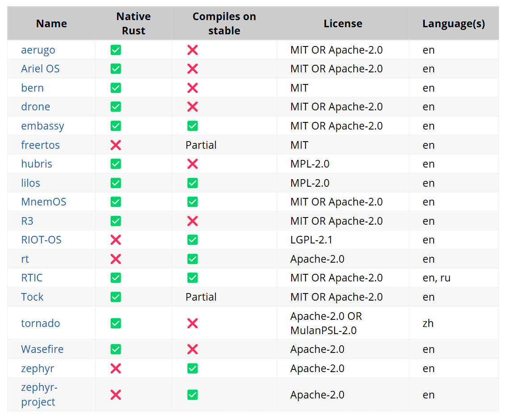

# 项目背景

## RT-thread介绍

RT-thread 是一个开源的针对嵌入式操作系统和物联网设备的实时操作系统[^Wikipedia_2023b]。它由中国的 RT-Thread 开发团队开发，旨在改变中国目前在微控制器领域没有得到良好使用的开源实时操作系统。RT-Thread 采用轻量级内核，支持抢占式多任务调度、动态和静态内存管理、设备驱动框架、文件系统、网络协议栈及图形用户界面（GUI）等核心功能，能够满足从资源受限的低功耗设备到复杂嵌入式应用的广泛需求。RT-thread 的设计目标是提供高性能、低功耗和可扩展性，适用于各种嵌入式应用场景。截至 2020 年 8 月，RT-Thread 在贡献者数量最多的 RTOS 列表中排名第三（仅次于 Zephyr 和 Mbed）。

RT-Thread 采用 C 语言编写，模块化设计良好，支持单核和多核架构，并支持多种架构（如 ARM Cortex-M、RISC-V）。此外，RT-Thread 提供了 RTOS 内核和组件化扩展框架，其中内核部分轻量精简，适用于资源受限设备，而组件部分允许开发者根据需求选择文件系统、TCP/IP 网络协议栈、GUI 界面、AI 计算库等功能，从而适应更复杂的应用场景。

## RT-Thread的局限性

C/C++ 由于缺乏内置的内存安全机制，使得操作系统面临诸多内存安全问题，包括空指针解引用、缓冲区溢出、Use-After-Free 等[^2023rust]。这些问题不仅影响系统的稳定性，还可能成为安全漏洞，导致攻击者利用系统缺陷进行权限提升或远程代码执行。尽管 RT-Thread 提供了一定的调试工具和运行时检查机制，但这些手段仅能在特定情况下发现问题，无法从根本上杜绝由于 C 语言特性带来的内存安全漏洞。

同时，C 语言的低级特性导致操作系统开发者需要手动管理内存、同步机制和错误处理，这使得内核代码通常复杂且冗长。从而导致 RT-Thread 的代码复杂且维护成本较高。例如，在 RT-Thread 的动态内存管理机制中，开发者需要手动申请和释放内存，而稍有不慎就可能导致内存泄漏等问题，进而影响系统的长期稳定运行。

这些问题不仅影响 RT-Thread 在高安全性和高可靠性场景下的应用，也限制了其代码的可维护性、可扩展性和适应性。因此，探索更安全、更高效的编程语言来替代 C 语言，从而提高 RT-Thread 内核的安全性、稳定性和开发效率，成为值得研究的方向。

## Rust语言的优越性

Rust 是一门专为高性能、类型安全和并发编程设计的通用编程语言，尤其适用于系统级开发[^Wikipedia_2025]。与传统的 C 和 C++ 不同，Rust 在不依赖垃圾回收的情况下实现了内存安全，有效防止空指针解引用、缓冲区溢出和数据竞争等常见问题。

这一特性主要得益于 Rust 独特的所有权系统，其中包括所有权、借用和生命周期三大核心机制。Rust 通过借用检查器在编译期强制执行这些规则，确保所有引用始终指向有效的内存，并自动管理资源释放，避免了手动内存管理可能导致的泄漏和未定义行为。此外，Rust 的零成本抽象允许开发者编写既安全又高效的代码，而不会引入额外的运行时开销。

在并发编程方面，Rust 通过线程安全的类型系统提供强有力的保障，杜绝了数据竞争问题。它的 Send 和 Sync 机制确保数据在线程间传递时符合安全规则，而所有权和借用规则使得共享数据时无需加锁或额外的同步开销，从而提升并发性能。相比于传统的锁机制，Rust 还支持无数据竞争的并发模式，如基于消息传递的 Actor 模型和无锁数据结构，使得多线程编程更加安全高效。

正因为 Rust 在性能、内存安全和并发方面的独特优势，它成为了操作系统内核、嵌入式系统、WebAssembly、高性能计算等领域的热门选择[^sharma2023rust][^sharma2024rust]，并广泛应用于安全性要求极高的开发场景，如浏览器引擎（Firefox 的 Servo）、区块链（Solana）、云计算（AWS Firecracker）[^Zhang^]等。越来越多的公司和企业选择 Rust 语言来进行开发[^Lib.rs]。

{#fig1}

所以我们小组计划使用 Rust 语言对 Rt-Thread 系统的部分内核进行重构，以提升系统的安全性和性能，从而更好地满足嵌入式应用的需求。

## 当前Rust RTOS生态空缺

当前 Rust RTOS 生态中，主要有以下几个项目[^AreWeRTOSYet]：

{#fig2}

可以看出，Rust 原生实时操作系统的开发已取得一定进展，但相比于 RT-Thread 等成熟的嵌入式操作系统，其生态仍然相对不完善。因此，将 Rust 引入 RT-Thread 这样的成熟嵌入式操作系统，不仅能够提升系统的安全性和性能，还能为 Rust RTOS 生态的发展提供重要的参考和借鉴，进一步推动其成熟与完善。

### Rust改写Rt-thread内核的意义

+ **内存安全**：通过 Rust 的所有权模型和借用检查机制，从根本上解决 RT-Thread 的内存安全问题，防止空指针解引用、缓冲区溢出等常见错误，提高系统的稳定性和可靠性。

  **并发性能**：Rust 提供线程安全的并发模型，利用其 `Send` 和 `Sync` 特性，在编译期确保数据在多线程环境中的安全性，避免数据竞争问题，从而提升系统的并发性能，满足多线程编程的需求。

  **代码质量**：Rust 的现代化语言特性和强类型系统，使代码更易读、易维护。结合其包管理器 Cargo 和丰富的生态系统，可以提高代码的可维护性和可扩展性，降低长期维护成本。

  **生态完善**：将 Rust 引入 RT-Thread，有助于丰富嵌入式系统的开发生态，推动 Rust 在嵌入式领域的应用，为其他开发者提供更多安全、高效的开发工具和库支持。

[^RTThread]: [RT-Thread Documentation](https://www.rt-thread.org/document/site/#/) (Accessed: 2025-03-18)
[^Wikipedia_2025]: [Rust (programming language)](https://en.wikipedia.org/wiki/Rust_(programming_language)) (Accessed: 2025-03)
[^Wikipedia_2023b]: [RT-Thread](https://en.wikipedia.org/wiki/RT-Thread) (Accessed: 2023-12)
[^2023rust]: 胡霜, 华保健, 欧阳婉容, 樊淇梁. Rust 语言安全研究综述[J]. 信息安全学报, 2023, 8(6): 64-83.
[^sharma2023rust]: Sharma, Ayushi and Sharma, Shashank and Torres-Arias, Santiago and Machiry, Aravind. Rust for embedded systems: current state, challenges and open problems[J]. arXiv preprint arXiv:2311.05063, 2023.
[^sharma2024rust]: Sharma, Ayushi and Sharma, Shashank and Tanksalkar, Sai Ritvik and Torres-Arias, Santiago and Machiry, Aravind. Rust for Embedded Systems: Current State and Open Problems[C]. Proceedings of the 2024 on ACM SIGSAC Conference on Computer and Communications Security, 2024.
[^Zhang]: [Rust 2022 全球商业化应用盘点](https://rustmagazine.org/issue-1/2022-review-the-adoption-of-rust-in-business-zh/) (Accessed: 2025-03-22)
[^Lib.rs]: [Lib.rs Statistics](https://lib.rs/stats) (Accessed: 2025-03-22)
[^AreWeRTOSYet]: [Are We RTOS Yet?](https://arewertosyet.com/) (Accessed: 2025-03-22)