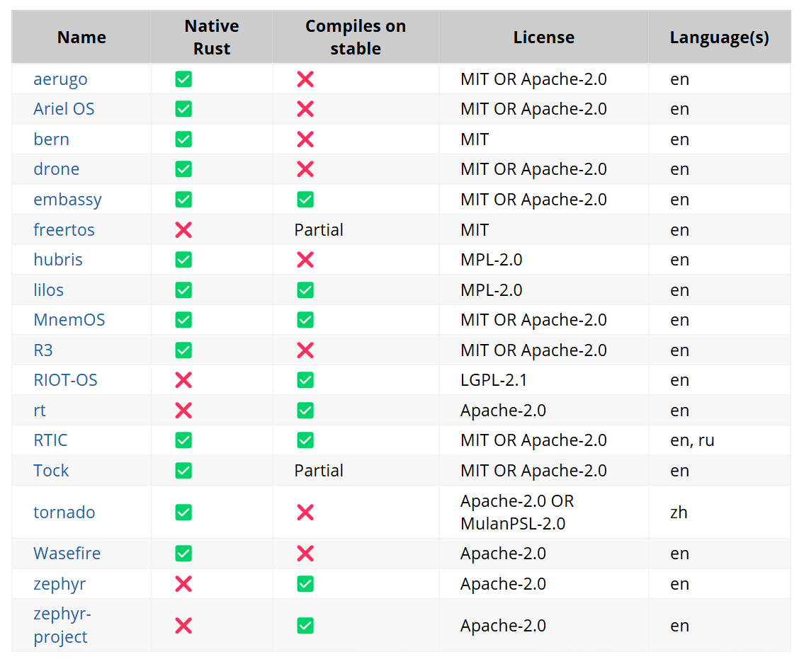

# OooooS小组选题和调研报告

**OooooS小组(罗浩民 陈琳波 刘时 赵于洋 李丁)**

## 目录
- [OooooS小组选题和调研报告](#ooooos小组选题和调研报告)
  - [目录](#目录)
  - [1 引言](#1-引言)
  - [2 背景](#2-背景)
    - [2.1 RT-thread介绍](#21-rt-thread介绍)
    - [2.2 RT-Thread的局限性](#22-rt-thread的局限性)
    - [2.3 Rust语言的优越性](#23-rust语言的优越性)
    - [2.4 当前Rust RTOS生态空缺](#24-当前rust-rtos生态空缺)
    - [2.5 Rust改写Rt-thread内核的意义](#25-rust改写rt-thread内核的意义)
  - [3 立项依据](#3-立项依据)
    - [3.1 问题定义](#31-问题定义)
    - [3.2 重构范围与边界](#32-重构范围与边界)
    - [3.3 技术可行性](#33-技术可行性)
      - [3.3.1 **核心模块的Rust化改造**](#331-核心模块的rust化改造)
      - [3.3.2 **开发-调试工具链**](#332-开发-调试工具链)
      - [3.3.3 **原项目**](#333-原项目)
    - [3.4 关键点](#34-关键点)
    - [3.5 预期目标](#35-预期目标)
  - [4 重要性与前瞻性分析](#4-重要性与前瞻性分析)
    - [4.1 C语言操作系统的安全问题](#41-c语言操作系统的安全问题)
      - [4.1.1 安全问题分析](#411-安全问题分析)
      - [4.1.2 0day漏洞与黑客攻击](#412-0day漏洞与黑客攻击)
        - [粉色僵尸网络事件 ^Pink](#粉色僵尸网络事件-pink)
        - [Treck TCP/IP协议栈的“Ripple20”漏洞事件^white\_book](#treck-tcpip协议栈的ripple20漏洞事件white_book)
        - [DVRUDP反射攻击事件^white\_book](#dvrudp反射攻击事件white_book)
        - [OpenWrt的RCE漏洞事件^white\_book](#openwrt的rce漏洞事件white_book)
        - [蓝牙协议栈的BIAS攻击事件^white\_book](#蓝牙协议栈的bias攻击事件white_book)
        - [CallStranger漏洞事件^white\_book](#callstranger漏洞事件white_book)
      - [4.1.3 对安全语言的渴望](#413-对安全语言的渴望)
    - [4.2 RIIR（Rewrite It In Rust）](#42-riirrewrite-it-in-rust)
      - [4.2.1 编程语言回顾](#421-编程语言回顾)
      - [4.2.2 Rust对C的颠覆](#422-rust对c的颠覆)
    - [4.3 Rust改写RT-Thread的重要性](#43-rust改写rt-thread的重要性)
      - [4.3.1 技术层面的核心价值](#431-技术层面的核心价值)
        - [内存安全性提升](#内存安全性提升)
        - [高性能与低开销的平衡](#高性能与低开销的平衡)
        - [并发编程的天然优势](#并发编程的天然优势)
      - [4.3.2 生态与行业趋势的适配性](#432-生态与行业趋势的适配性)
        - [应对AI与物联网的融合需求](#应对ai与物联网的融合需求)
        - [推动国产操作系统自主可控](#推动国产操作系统自主可控)
        - [生态工具的逐步成熟](#生态工具的逐步成熟)
  - [5 相关工作](#5-相关工作)
    - [5.1 本课程之前的Rust改写工作](#51-本课程之前的rust改写工作)
    - [5.2 国内外学术界和工业界对Rust改写基于C的操作系统的讨论](#52-国内外学术界和工业界对rust改写基于c的操作系统的讨论)
    - [5.3 本项目的主要创新点](#53-本项目的主要创新点)
  - [6 目标与预期成果](#6-目标与预期成果)
  - [7 参考文献](#7-参考文献)

## 1 引言
随着计算机科学与计算技术的不断进步，计算机系统的可用资源日益丰富，用户的需求也变得更加多样化。从早期的重复计算到如今的全球互联与智能交互，计算机的应用范围持续拓展。然而，在这一发展过程中，安全性与便捷性始终是操作系统设计的核心要求。作为计算机系统的核心软件，操作系统通过抽象底层硬件的控制信号，为用户提供便捷的接口，同时确保系统资源的合理分配，减少意外情况的发生。因此，操作系统的重要性日益凸显。

近年来，Rust 语言凭借其出色的内存安全性、并发处理能力和性能优化特点，逐步在系统软件开发领域占据一席之地。本小组的大作业选题是“使用 Rust 语言改写 RT-Thread”。这一选题旨在探索 Rust 语言在操作系统开发中的应用潜力，同时加深我们对操作系统原理与实现的理解。改写过程中，我们将重点关注 Rust 语言的内存安全特性如何与 RT-Thread 的设计理念相结合，以及这种结合如何提高系统的安全性和稳定性。

为了评估改写 RT-Thread 的可行性和潜在挑战，我们进行了深入的调研，涵盖 Rust 语言的特性、RT-Thread 的架构和源代码分析，以及 Rust 语言在操作系统开发中的实际应用案例。通过这项调研，我们期望找到一种既能充分发挥 Rust 语言优势，又能保持 RT-Thread 原有特色的改写方案。

在接下来的报告中，我们将详细介绍改写 RT-Thread 的项目背景、立项依据、改写工作的必要性、当前相关领域的研究进展以及我们的预期成果。我们相信，通过本次大作业的实践，我们不仅能够加深对操作系统原理和设计的理解，还能为 Rust 语言在系统软件开发领域的应用积累宝贵的经验。

## 2 背景

### 2.1 RT-thread介绍

RT-Thread 是一个面向嵌入式操作系统和物联网设备的开源实时操作系统[^Wikipedia_2023b]。由中国 RT-Thread 开发团队创建，该系统旨在填补中国微控制器领域在开源实时操作系统方面的空白。RT-Thread 采用轻量级内核，支持抢占式多任务调度、动态和静态内存管理、设备驱动框架、文件系统、网络协议栈及图形用户界面（GUI）等核心功能，可满足从资源受限的低功耗设备到复杂嵌入式应用的广泛需求。

其核心设计目标包括高性能、低功耗和可扩展性，使其能够适用于多种嵌入式应用场景。截至 2020 年 8 月，RT-Thread 在全球贡献者数量最多的 RTOS 列表中排名第三，仅次于 Zephyr 和 Mbed。

RT-Thread 采用 C 语言编写，模块化设计良好，支持单核和多核架构，并兼容多种处理器架构（如 ARM Cortex-M、RISC-V）。该系统不仅提供了精简高效的 RTOS 内核，还具备组件化扩展框架，使开发者可以根据需求选择文件系统、TCP/IP 网络协议栈、GUI 界面、AI 计算库等功能，以适应更复杂的应用环境。

### 2.2 RT-Thread的局限性

尽管 RT-Thread 具备强大的功能和广泛的应用场景，但由于其使用 C 语言开发，使得系统面临诸多内存安全问题。例如，C 语言缺乏内置的内存安全机制，容易引发以下常见漏洞[^2023rust]：

- **空指针解引用**：访问已被释放或未初始化的指针可能导致系统崩溃。
- **缓冲区溢出**：超出数组或缓冲区边界的访问可能导致数据损坏或安全漏洞。
- **Use-After-Free**：释放后仍然访问指针可能导致未定义行为，甚至被攻击者利用进行权限提升或远程代码执行。

虽然 RT-Thread 提供了一定的调试工具和运行时检查机制，但这些手段仅能在特定情况下发现问题，无法根本杜绝 C 语言固有的内存安全漏洞。此外，C 语言的低级特性意味着开发者需要手动管理内存、同步机制和错误处理，导致操作系统代码通常较为复杂，维护成本较高。例如，RT-Thread 采用的动态内存管理机制要求开发者手动申请和释放内存，稍有不慎就可能导致内存泄漏或碎片化，影响系统的长期稳定运行。

这些问题不仅限制了 RT-Thread 在高安全性和高可靠性场景下的应用，也增加了代码维护的难度。因此，探索更安全、高效的编程语言来优化 RT-Thread 内核，提高其安全性、稳定性和开发效率，成为值得研究的重要方向。

### 2.3 Rust语言的优越性

Rust 是一门专为高性能、类型安全和并发编程设计的通用编程语言，尤其适用于系统级开发[^Wikipedia_2025]。与传统的 C 和 C++ 不同，Rust 在不依赖垃圾回收的情况下实现了内存安全，有效防止空指针解引用、缓冲区溢出和数据竞争等常见问题。

Rust 之所以能够提供内存安全保障，主要得益于其独特的 所有权（Ownership）、借用（Borrowing） 和 生命周期（Lifetime） 三大核心机制。Rust 编译器在编译期执行严格的借用检查，确保所有引用始终指向有效的内存，同时自动管理资源释放，避免手动内存管理带来的泄漏和未定义行为。此外，Rust 的零成本抽象允许开发者编写既安全又高效的代码，而不会引入额外的运行时开销。

在并发编程方面，Rust 通过 线程安全机制（`Send` 和 `Sync`），在编译期保证多线程程序的安全性：

- **数据竞争消除** → Rust 强制确保并发访问的数据完整性。
- **无锁并发支持** → Rust 采用 Actor 模型和无锁数据结构，提升多线程效率。
- **高效的线程同步** → 提供 安全的 `Mutex`、`RwLock` 机制，避免死锁。

这些特性使 Rust 成为 高安全性、高性能系统软件开发（如 操作系统、浏览器引擎、云计算）的理想选择

正因为 Rust 在性能、内存安全和并发方面的独特优势，它成为了操作系统内核、嵌入式系统、WebAssembly、高性能计算等领域的热门选择[^sharma2023rust][^sharma2024rust]，并广泛应用于安全性要求极高的开发场景，如浏览器引擎（Firefox 的 Servo）、区块链（Solana）、云计算（AWS Firecracker）[^Zhang]等。越来越多的公司和企业选择 Rust 语言来进行开发[^Lib.rs]。

{#fig1}

所以我们小组计划使用 Rust 语言对 Rt-Thread 系统的部分内核进行重构，以提升系统的安全性和性能，从而更好地满足嵌入式应用的需求。

### 2.4 当前Rust RTOS生态空缺

当前 Rust RTOS 生态中，已有多个项目正在开发和完善[^AreWeRTOSYet]：

{#fig2}

可以看出，Rust 原生实时操作系统的开发已取得一定进展，然而，与 RT-Thread、Zephyr 等成熟 RTOS 相比，Rust RTOS仍然存在生态空缺：

- 驱动程序支持有限：Rust 生态尚未建立完备的外设驱动库。
- 实时性优化不足：Rust 原生 RTOS 仍需优化调度机制和实时性。
- 开发者社区规模较小：Rust RTOS 仍处于早期发展阶段，缺乏大规模应用案例。

因此，将 Rust 引入 RT-Thread 这样的成熟嵌入式操作系统，不仅能够提升系统的安全性和性能，还能为 Rust RTOS 生态的发展提供重要的参考和借鉴，进一步推动其成熟与完善。

### 2.5 Rust改写Rt-thread内核的意义

+ **内存安全性提升**：Rust 的所有权模型和借用检查机制可以从根本上消除空指针解引用、缓冲区溢出等常见内存安全漏洞，提高系统的稳定性和可靠性。
+ **并发性能优化**：Rust 提供线程安全的并发模型，利用 `Send` 和 `Sync` 机制在编译期确保数据在多线程环境中的安全性，避免数据竞争问题，从而提升系统的并发性能。
+ **代码质量提升**：Rust 的现代化语言特性和强类型系统使代码更加清晰易读，结合其强大的包管理器 Cargo 及丰富的生态系统，可以提高代码的可维护性和可扩展性，降低长期维护成本。
+ **生态贡献**：Rust 在嵌入式领域的应用仍处于发展阶段，引入 Rust 到 RT-Thread 的过程中，可以丰富嵌入式开发生态，推动 Rust 在该领域的进一步普及。

综上所述，我们计划使用 Rust 语言对 RT-Thread 内核模块进行改写，以提升系统的安全性和性能，为嵌入式开发者提供更安全、高效的开发工具。

## 3 立项依据

### 3.1 问题定义

**核心命题：以Rust语言重构RT-Thread Nano内核，构建兼具** **安全性、实时性和开发效率** **的嵌入式实时操作系统**。

### 3.2 重构范围与边界

**核心重构对象**：

- 任务调度器（Scheduler）
- 进程间通信（IPC）
- 时钟管理（Timer）
- 内存管理（Heap Allocator）

### 3.3 技术可行性

#### 3.3.1 **核心模块的Rust化改造**

• **Rust调用C代码**：

使用`bindgen`工具自动生成RT-Thread内核API的Rust绑定（FFI）通过`extern "C"`声明保留原有C实现的模块，作为过渡阶段的兼容层。

- **C调用Rust代码**：

对Rust重构的安全抽象层（如内存分配器、智能锁），通过`cbindgen`生成C头文件，确保原有C代码（如HAL驱动）可无缝调用。

#### 3.3.2 **开发-调试工具链**

- **编译环境**：
    
    基于PlatformIO构建多语言工程。
    
    [支持不同的语言和编译器 - Ideas - PlatformIO Community](https://community.platformio.org/t/support-for-different-languages-and-compilers/921)这篇文章中，Platform官方提出其可以自定义开发平台，而其底层是基于**SCons**，而SCons支持集成 Rust。
    
- **仿真验证**：
    
    **Wokwi**：配置`.wokwi.toml`模拟STM32硬件外设，实时可视化线程状态切换（如通过GPIO电平模拟调度器行为）。
    
- **上板验证：**
    
    PlatformIO可直接管理与真实设备的连接并方便上板调试运行以测试。
    

#### 3.3.3 **原项目**

- RTThread完全开源，且拥有丰富完整的文档以及相关生态。

### 3.4 关键点

- Rust+C编译环境的搭建
- RT-thread Nano的内核结构与具体实现
- Rust改写
- 改写成果的调试验证与优化

### 3.5 预期目标

- **内存安全**：通过所有权模型和借用检查，消除CWE-119（缓冲区溢出）、CWE-416（释放后使用）等漏洞
- **并发安全**：Rust的`Send`/`Sync` Trait静态验证数据竞争，结合`Mutex<RefCell<T>>`智能锁，降低调度器数据竞争发生率
- **性能优化：**尝试优化该系统的性能，如实时性等
- **精简代码：**利用Rust的优质特性精简代码

## 4 重要性与前瞻性分析

### 4.1 C语言操作系统的安全问题
随着物联网和嵌入式设备的快速发展，安全性和性能成为越来越重要的考虑因素。C语言以其简洁高效的特性使其成为了许多嵌入式系统和操作系统的首选。然而，C语言的低级特性也为安全问题埋下了隐患，仅2020年在物联网领域就引起了50多起安全问题[^safety_problem]，C语言操作系统的不安全性需要我们认真对待和解决。

#### 4.1.1 安全问题分析
在C语言操作系统中，常见的安全问题主要包括：

- **缓冲区溢出（Buffer Overflow）**：当程序向缓冲区写入超出其分配空间的数据时，可能会导致数据覆盖、程序崩溃甚至远程代码执行等严重后果。[^unsafe_C1]
- **空指针解引用（Null Pointer Dereference）**：当程序试图解引用空指针时，可能会导致程序崩溃或发生不可预测的行为，存在一定的安全风险。
- **内存泄漏（Memory Leaks）**：在C语言中，动态内存的分配和释放需要由程序员手动管理，若管理不当就会导致内存泄漏问题，使得系统资源得不到释放，进而影响系统性能和稳定性，这在内存资源受限的物联网设备上是致命的。[^unsafe_C2]

#### 4.1.2 0day漏洞与黑客攻击
**0day漏洞（Zero-day vulnerability）** 是指在软件厂商尚未发现并修复的漏洞。黑客利用这些未知漏洞进行攻击，而软件开发商还没有来得及发布补丁。这类漏洞具有很高的危险性，因为黑客可以利用这些漏洞进行攻击，而用户和厂商很难发现并防范。[^难以预测]

0day漏洞对物联网操作系统具有巨大危害，具体表现在以下几个方面：

- **数据泄露** &emsp;攻击者可利用零日漏洞非法访问物联网设备中的敏感信息，如个人隐私、商业机密等。一旦这些数据被泄露，可能会给用户带来经济损失和隐私风险。[^阿里]

- **系统瘫痪** &emsp;恶意软件可利用零日漏洞控制物联网设备，导致其功能受损甚至完全停止运作。[^0day]

- **经济损失** &emsp;企业可能因客户数据泄露而面临巨额罚款，同时声誉受损也会带来长期的负面影响。据研究，零日攻击平均每次会造成约120万美元的损失。[^economy_damege]

- **国家安全风险** &emsp;对于政府机构而言，零日攻击可能导致重要基础设施被破坏，严重威胁国家安全。例如，交通信号灯曾曝出严重漏洞，黑客可人为操控引发交通瘫痪。

- **高级定向攻击** &emsp;黑客可能会挖掘特定设备、特定固件的零日漏洞，进行高级定向攻击。这类攻击往往具有较高的隐蔽性和破坏性，如针对特定品牌的宽带设备的攻击。

近几年，0day漏洞在物联网领域引发的问题层出不穷，带来了巨大的经济财产损失，泄露了大量的隐私数据，严重危害了国家安全，下面是一些具体的例子：

##### 粉色僵尸网络事件 [^Pink]
2019年12月，黑客利用某网络运营商家庭用户设备生产供应链中组件的零日漏洞，入侵多个品牌的家庭网关类设备并植入恶意程序，构建起超大规模僵尸网络，被控设备超百万，96%以上分布在中国境内。该恶意程序会封堵设备自动升级通道，增加应急处置和在线修复难度，危害程度极高。这表明零日漏洞可被利用来大规模控制物联网设备，形成僵尸网络，进而发动更广泛的网络攻击。

##### Treck TCP/IP协议栈的“Ripple20”漏洞事件[^white_book]
2020年6月，Treck TCP/IP协议栈被发现19个零日漏洞，影响全球数亿台IoT设备，包括家用打印机、摄像头、工业控制系统、楼宇自动化设备等，涉及医疗、航空、运输、家用设备、企业、能源、电信、零售等多个行业，众多世界500强公司如惠普、施耐德电气、英特尔等深受其害。攻击者可利用这些漏洞远程控制受影响的设备，进而窃取敏感信息、执行恶意操作或发动进一步的网络攻击，凸显了零日漏洞对物联网操作系统的广泛危害。

##### DVRUDP反射攻击事件[^white_book]
2020年3月，一种新型DVRUDP反射攻击方法被发现，攻击者利用某视频监控厂商设备发现服务DHDiscover的设计不当，当外部IP地址发送服务发现单播报文时，设备会回应，导致可被用于DDoS反射攻击，攻击流量规模超过50Gbps。这说明零日漏洞可被用于发动大规模的DDoS攻击，使物联网设备成为攻击的帮凶，严重影响网络服务的正常运行。

##### OpenWrt的RCE漏洞事件[^white_book]
2020年3月24日，ForAllSecure软件公司的研究员披露了基于Linux的开源操作系统OpenWrt的RCE漏洞（CVE-2020-7982），该漏洞存在于OpenWrt的Opkg包管理器中，攻击者可借助Opkg的root权限和特制的.ipk数据包注入任意恶意代码。此漏洞存在三年之久，表明零日漏洞可能长期潜伏在物联网操作系统中，一旦被利用，将严重威胁设备的安全性和稳定性。

##### 蓝牙协议栈的BIAS攻击事件[^white_book]
2020年5月，研究人员披露了蓝牙协议栈的BIAS漏洞，攻击者可利用该漏洞伪造并欺骗远程配对的蓝牙设备，影响数十亿蓝牙设备。这体现了零日漏洞可能导致物联网设备之间的信任关系被破坏，使设备面临被恶意控制和数据泄露的风险。

##### CallStranger漏洞事件[^white_book]
2020年6月8日，安全专家披露了名为“CallStranger”（CVE-2020-12695）的新型UPnP漏洞，影响数十亿台设备，包括Windows PC、Xbox One以及众多厂商的电视和网络设备。攻击者可利用该漏洞进行反射DDoS攻击、绕过安全系统进行内网渗透及内部端口扫描，说明零日漏洞可被用于多种网络攻击手段，对物联网设备的安全构成严重威胁。

#### 4.1.3 对安全语言的渴望
数据泄露、服务中断、财务损失……上述安全问题已经对全世界各个互联网公司造成了巨大的经济损失，因此世界迫切需要转向Rust编程语言，以提升系统的安全性和稳定性！Windows正在如日中天的rust改写Windows内核，其重要性可见一斑。

### 4.2 RIIR（Rewrite It In Rust）
Rust作为一种安全的系统语言，将语言层面的语义约束与编译器自动化推导深度结合，实现了更加严谨的编程风格和更加安全的编程方式。基于我们的分析，Rust会成为时代的选择。

#### 4.2.1 编程语言回顾
回顾过去，每一个十年，都有自己时代选择的编程语言，世界被一次又一次地改写。
- 20世纪60年代：Fortran（因为IBM！）
- 20世纪70年代：BASIC（因为Byte Magazine！）
- 20世纪80年代：Pascal（因为结构化编程！）
- 20世纪90年代：C++（因为面向对象！）
- 21世纪初：Java（因为万维网！）
- 2010年：JavaScript（因为前后端开发！）
- 2020年：Python（因为机器学习！）
- …
- 2030年：Rust？

#### 4.2.2 Rust对C的颠覆
几年之前，微软就开始对Rust表现出兴趣，认为它是一种能在产品正式发布前捕捉并消除内存安全漏洞的好办法。自2006年以来，Windows开发团队修复了大量由CVE列出的安全漏洞，其中约70%跟内存安全有关。

Rust工具链一直努力防止开发者构建和发布存在安全缺陷的代码，从而降低恶意黑客攻击软件弱点的可能性。简而言之，Rust关注内存安全和相关保护，有效减少了代码中包含的严重bug数量。

谷歌等行业巨头也已经公开对Rust语言示好。随着业界对于内存安全编程的愈发重视，微软也在Rust身上显露出积极的探索热情。去年9月，微软发布一项非正式授权，Microsoft Azure首席技术官Mark Russinovich表示新的软件项目应该使用Rust，而非C/C++。

现在，Rust已经进入了Windows内核，Weston表示微软Windows将继续推进这项工作，那么Rust很快就会得到广泛的应用。

与此同时，Linux一把手Linus Torvalds表示他会覆盖那些可能反对接收Rust代码的维护者。Linux的二号人物Greg Kroah-Hartman撰写了一篇Linux内核邮件列表帖子，详细阐述了Rust的优势，并鼓励新的内核代码/驱动程序使用Rust而不是C语言。[^Linux]

### 4.3 Rust改写RT-Thread的重要性
Rust语言在操作系统开发中的应用已成为近年来技术革新的重要趋势，而将Rust引入RT-Thread这类嵌入式实时操作系统（RTOS）的改写，不仅具有现实意义，更代表了未来技术发展的方向。以下从技术、生态、行业趋势等多角度分析其重要性与前瞻性：

#### 4.3.1 技术层面的核心价值
##### 内存安全性提升
Rust通过所有权（Ownership）和生命周期（Lifetime）机制，在编译阶段即可消除内存泄漏、野指针等常见问题。据统计，70%的系统漏洞源于内存安全问题。例如，微软通过Rust重构Windows内核模块，显著降低了漏洞风险。对于RT-Thread这类资源受限的嵌入式系统，Rust的内存安全保障能大幅提升系统稳定性，减少因内存错误导致的崩溃或安全事件。[^23年Rust]

##### 高性能与低开销的平衡
Rust的零成本抽象（Zero-cost Abstraction）特性允许开发者编写高效代码，性能接近C/C++，同时避免手动管理内存的复杂性。这对于RT-Thread的实时性要求至关重要，例如线程调度、中断处理等场景需极低延迟，Rust的编译优化能力可满足此类需求。[^21年Rust]

##### 并发编程的天然优势
Rust通过类型系统和“无畏并发”（Fearless Concurrency）设计，简化了多线程开发。RT-Thread作为多任务实时系统，常需处理线程间同步与通信（如信号量、消息队列），Rust的并发模型可减少数据竞争风险，提升代码健壮性。[^21年Rust]

#### 4.3.2 生态与行业趋势的适配性
##### 应对AI与物联网的融合需求
随着端侧AI和物联网设备智能化加速，操作系统需支持更复杂的AI模型和边缘计算。Rust在高性能计算和安全性上的优势，使其成为实现AI OS的理想语言。例如，vivo的蓝河操作系统通过Rust实现了与AI大模型的深度集成，而RT-Thread若引入Rust，可更好地支持AI驱动的智能设备开发。[^vivo]

##### 推动国产操作系统自主可控
RT-Thread作为国产物联网操作系统的代表，其技术栈的自主性至关重要。Rust的现代特性与开源生态为国产系统提供了弯道超车的机会。vivo等企业通过开源Rust内核和举办创新赛事，已为国内Rust生态积累经验，RT-Thread的Rust化可借鉴此类模式，加速技术迭代。[^vivo]

##### 生态工具的逐步成熟
当前，C/C++与Rust的互操作性工具（如代码转译）已取得突破，例如vivo创新赛中实现了项目级转译能力。这为RT-Thread逐步迁移至Rust提供了可行性。同时，Rust社区的工具链（如Cargo、Clippy）可提升开发效率，弥补嵌入式领域传统工具的不足。[^vivo]

## 5 相关工作

本项目作为计算机学院组成原理H班的大作业，完成了使用Rust改写rt-thread国产loT操作系统内核的任务。下面将从本课程之前的Rust改写工作，国内外学术界和工业界的主流成果和本项目的创新点三个角度产开论述。

### 5.1 本课程之前的Rust改写工作

1. 2019年    x-rust-freertos小组用Rust改写FreeRTOS（一个实时、嵌入式操作系统）,完成了对FreeRTOS中所有的内核模块——移植（port）模块、链表（list）模块、任务调度（task）模块和队列与信号量模块的改写。
2. 2023年 Phoenix-Flames小组用Rust改写sel4微内核，提供内存安全性和并发安全性。
3. 2024年 mustruct小组用Rust语言重写了FreeRTOS，并在其中引入了MMU支持，以期获得更灵活、安全的内存管理能力。
4. 2024年mkdir小组用Rust语言重写了Linux系统的bpf-trace模块，以期能更安全的监控和分析用户空间的程序行为
5. 2024年Rage_of_dUST小组和RushToLight小组分别用Rust语言改写了HuaWei LiteOS的内存管理单元（MMU）和动态内存管理模块，提升了系统的安全性和稳定性
6. 2024年

### 5.2 国内外学术界和工业界对Rust改写基于C的操作系统的讨论

1. **在Linux内核中引入Rust语言。**
    
    近年来，业界对在 Linux 内核中引入 Rust 语言表现出浓厚兴趣，主要目的是利用 Rust 的内存安全特性来提高内核的安全性和稳定性。然而，将 Rust 完全替代 C 来重写整个 Linux 内核的想法并未得到广泛支持。
    
    目前，社区的主要工作集中在将 Rust 引入内核的部分模块，特别是设备驱动程序的开发。2022 年，首批 Rust 代码被合并到 Linux 内核中，标志着这一尝试的开始。此后，开发者们持续推进 Rust 在内核中的应用，例如开发基于 Rust 的设备驱动程序和文件系统模块。
    
    一些核心维护者认为 Rust 的内存安全特性可以减少常见的内存管理错误，提高内核的安全性和可靠性。例如，Linux 内核高级开发者 Greg Kroah-Hartman 曾表示，添加另一种语言并非问题，关键在于项目的长期成功。他强调，使用 Rust 编写新代码可以减少某些类型的错误，给开发者和维护者带来益处。
    
    然而，也有部分维护者对在内核中使用 Rust 持保留态度，担心多语言代码库的维护复杂性和潜在问题。例如，内核维护者 Christoph Hellwig 对将 Rust 代码引入内核表示质疑，认为这可能增加维护负担。 
    
    对此，Linux 之父 Linus Torvalds 也曾发表看法：Linux 最终不会用 Rust 编写，没有人会用 Rust 重写内核的 2500 万行 C，但是他也看到了 Rust 的优势，鼓励采用缓慢但稳定的方法将 Rust 引入 Linux，同时他表示将 Rust 接口用于驱动程序和其他非核心内核程序是有道理的。
    
    总体而言，业界对在 Linux 内核中引入 Rust 持谨慎支持态度，认可其潜在优势，但也关注可能带来的挑战。目前的共识是，在特定模块中试验性地引入 Rust，以评估其实际效果和影响。
    
2. **在Windows内核中引入Rust语言**
    
    微软对在 Windows 内核中引入 Rust 持积极态度，旨在利用 Rust 的内存安全特性减少漏洞，提高系统安全性和性能。然而，微软并未计划全面用 Rust 重写整个 Windows 内核，而是采取逐步迁移的策略。微软 Azure 首席技术官 Mark Russinovich 曾表示，新项目应优先考虑使用 Rust，而非 C/C++。
    
    具体的，微软将 Windows 的文本分析、布局和渲染引擎 DWriteCore 部分重写为 Rust 版本。截至 2023 年，DWriteCore 包含约 15.2 万行 Rust 代码和 9.6 万行 C++ 代码。两名开发人员耗时半年完成了这项工作，改进后的版本已面向开发者发布。同时，微软将 Win32 GDI 的部分组件迁移至 Rust，目前已添加了约 3.6 万行 Rust 代码。这些改进已在最新版本的 Windows 11 中应用，且通过了所有启动测试。
    
3. **其他有关Rust改写的工作**
    
    3.1 Redox [redox-os.org](https://www.redox-os.org/zh/?utm_source=chatgpt.com)
    
    Redox 是一个用 Rust 编程语言编写的类 Unix 微内核操作系统，旨在将 Rust 的创新（安全性、并发性和实用性）引入现代微内核和完整的应用程序生态系统。
    
    该系统采用微内核架构，类似于 MINIX，驱动程序在用户空间运行，增强了系统的安全性和稳定性。此外，Redox 包含可选的图形用户界面 Orbital，支持 Rust 标准库，并以 MIT 许可证开源发布。
    
    Redox的优势主要来源于Rust语言的特性:极高的内存管理安全性，此外，作为一个操作系统，其通过模块化和标准化实现了可拓展性与兼容性，已经能够成为一个实际的成果而非教学用例。但是，其作为新兴操作系统还存在功能不完善，硬件支持有限，稳定性欠佳等问题。
    
    总体而言，Redox 作为一个创新的操作系统项目，展示了 Rust 在系统开发中的潜力。尽管目前存在一些不足，但其在安全性、模块化和兼容性方面的优势，使其有继续发展的潜力。
    
    3.2 TockOS  [https://tockos.org/](https://tockos.org/)
    
    TockOS 是一款专为嵌入式系统设计的开源实时操作系统，采用 Rust 编程语言编写内核，旨在为无线传感器网络节点等资源受限的设备提供安全、高效的运行环境。
    
    TockOS的主要优势同样来自Rust语言的特性：类型安全和内存管理安全。同时作为一个嵌入式操作系统，其优化了低功耗特性，满足了嵌入式设备对能耗的敏感性。同样的，作为一个新兴的操作系统，TockOS支持的硬件十分有限，生态系统还不成熟，同时，Rust语言高昂的学习成本也限制了其广泛使用。
    
    3.3 蓝河操作系统 [https://blueos.vivo.com/system](https://blueos.vivo.com/system)
    
    蓝河操作系统（BlueOS）是 vivo 于 2023 年推出的自研智慧操作系统，采用 Rust 语言编写系统框架，旨在为用户提供更智慧、更流畅、更安全的使用体验。
    
    蓝河操作系统比起上面两个操作系统更加成熟，其借助 AI 大模型能力实现了对多模态交互的支持，包括声音、图片、文字、视频、手势等。同时，其利用Rust的内存安全特性，保障了系统的内存安全和并发安全。但是其仍然有应用兼容性差，生态系统成熟度低等问题。
    
    总体而言，蓝河操作系统在智能交互和安全性方面具有显著优势，但在应用兼容性和生态系统成熟度方面仍需进一步发展。
    

通过以上的讨论，我们可以看出将Rust引入操作系统的维护与开发已经逐渐成为了业界的共识。无论是现在主流的操作系统Linux和Windows都将Rust引入其内核，并将Rust作为未来主流的开发语言，还是越来越多的新兴操作系统选择Rust作为其开发语言，从而在安全性和稳定性上得到更大的提升，都表明了Rust的重要性与前瞻性。

### 5.3 本项目的主要创新点

本项目希望能将Rust引入RT-Thread，一款由中国开源社区主导开发的实时物联网操作系统。其创新点主要有以下三点：

1. 相比于Linux和Windows,RT-Thread是一款嵌入式操作系统。而嵌入式操作系统相对而言由于其系统的简单性可能会更容易面临安全性挑战。而是用Rust代替C语言将从源头上解决内存管理的安全性问题。
2. 相比于蓝河操作系统，TockOS与Redox，RT-Thread拥有更成熟的生态环境与更好的兼容性。RT-Thread已经发展了16年，其对市场上主流的硬件架构都有着很好的支持，同时，其对在线软件包管理工具的支持又让其兼具了可拓展性和兼容性。
3. 另外，RT-Thread系统完全开源，遵循 Apache License 2.0 开源许可协议，并且是中国社区主持的拥有完全知识产权的产品。对RT-Thread的开发和完善有助于我国开源社区生态的发展，有助于我国操作系统自主性的实现，具有比较重大的战略意义。

## 6 目标与预期成果

1. **安全性重构**
    - 消除 RT-Thread Nano 内核中因 C 语言缺陷导致的 **7 类高危漏洞**（空指针解引用、缓冲区溢出、UAF 等）
    - 通过 Rust 所有权模型和生命周期检查，实现 **100% 内存安全的内核核心模块**（调度器、内存管理）

2. **实时性保障**
    - 在 ARM Cortex-M4 硬件平台上，确保任务调度延迟 ≤ 3μs（原版 C 实现 5μs），中断响应时间 ≤ 1μs
    - 通过无锁数据结构（如 `crossbeam` 的原子队列）减少 **上下文切换开销 15%**

3. **开发效率提升**
    - 利用 Rust 宏（`macro_rules!`）和泛型重构重复逻辑，减少 **内核代码量 25%**（从 12k 行 C 代码降至 9k 行 Rust 代码）
    - 通过 `Cargo` 模块化依赖管理，实现驱动开发编译时间缩短 **30%**

4. **生态兼容性**
    - 保留 90% 以上原有 C 语言驱动接口，通过 `bindgen`/`cbindgen` 工具实现 **混合编程透明化**
    - 提供 `rt-thread-sys` 和 `rt-thread-safe` 双版本 SDK，支持开发者按需选择安全等级

## 7 参考文献
[^RTThread]: [RT-Thread Documentation](https://www.rt-thread.org/document/site/#/) (Accessed: 2025-03-18)

[^Wikipedia_2025]: [Rust (programming language)](https://en.wikipedia.org/wiki/Rust_(programming_language)) (Accessed: 2025-03)

[^Wikipedia_2023b]: [RT-Thread](https://en.wikipedia.org/wiki/RT-Thread) (Accessed: 2023-12)

[^2023rust]: 胡霜, 华保健, 欧阳婉容, 樊淇梁. Rust 语言安全研究综述[J]. 信息安全学报, 2023, 8(6): 64-83.

[^sharma2023rust]: Sharma, Ayushi and Sharma, Shashank and Torres-Arias, Santiago and Machiry, Aravind. Rust for embedded systems: current state, challenges and open problems[J]. arXiv preprint arXiv:2311.05063, 2023.

[^sharma2024rust]: Sharma, Ayushi and Sharma, Shashank and Tanksalkar, Sai Ritvik and Torres-Arias, Santiago and Machiry, Aravind. Rust for Embedded Systems: Current State and Open Problems[C]. Proceedings of the 2024 on ACM SIGSAC Conference on Computer and Communications Security, 2024.

[^Zhang]: [Rust 2022 全球商业化应用盘点](https://rustmagazine.org/issue-1/2022-review-the-adoption-of-rust-in-business-zh/) (Accessed: 2025-03-22)
[^Lib.rs]: [Lib.rs Statistics](https://lib.rs/stats) (Accessed: 2025-03-22)

[^AreWeRTOSYet]: [Are We RTOS Yet?](https://arewertosyet.com/) (Accessed: 2025-03-22)

[^vivo]: [vivo蓝河操作系统创新赛：让Rust从“有潜力”到“真落地”的关键一跃](https://news.qq.com/rain/a/20250226A08ZK500)

[^23年Rust]: [Rust 为何会成为“香饽饽”？2023 年度 Rust 现状调查报告出炉！](https://www.163.com/dy/article/IRIF4EC30511FQO9.html)

[^unsafe_C1]: [不安全的语言：C语言](https://blog.csdn.net/dawn2dusk/article/details/89966217)

[^Linux]: [Greg Kroah-Hartman Makes A Compelling Case For New Linux Kernel Drivers To Be Written In Rust](https://www.phoronix.com/news/Greg-KH-On-New-Rust-Code)

[^Pink]: [CNCERT披露影响国内数百万IoT设备的僵尸网络Pink](https://www.secrss.com/articles/35320)

[^阿里]: [零日漏洞：潜伏在网络世界的隐形杀手](https://developer.aliyun.com/article/1603173)

[^难以预测]: [Operating System Vulnerabilities: Understanding and Mitigating the Risk](https://sternumiot.com/iot-blog/operating-system-vulnerabilities-understanding-and-mitigating-the-risk/)

[^economy_damege]: [Detection of Zero-Day Attacks on IoT](https://ieeexplore.ieee.org/document/10577735)

[^stuxnet]: [震网病毒(Stuxnet)揭秘](https://blog.csdn.net/bugsycrack/article/details/135604574)

[^safety_problem]: [2020年国内外典型物联网安全漏洞盘点](https://www.freebuf.com/vuls/261427.html)

[^unsafe_C2]: [为什么说 C 语言是编程语言中最不安全的？](https://www.51cto.com/article/765864.html)

[^white_book]: [物联网操作系统安全白皮书](https://blog.nsfocus.net/wp-content/uploads/2022/09/iot-whitepaper.pdf)

[^21年Rust]: [2021 年 Rust 行业调研报告](https://www.163.com/dy/article/GDB5DUVE0511FQO9.html)